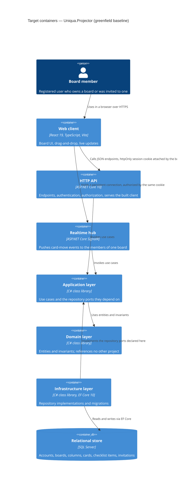

# Architecture map — Uniqua.Projector

> The **target foundation** (`mode: greenfield-bootstrap`), decided with the owner in the survey
> foundation session on 2026-09-20 — not a scan of existing code, because at `16bba53` the repository
> contains no source. Every path below is a **target path** that `/sdd:scaffold` creates; the citations
> are marked accordingly and become real anchors once the skeleton is materialized. Refresh with
> `survey` after scaffold so the map reflects what exists.

## Stack

- Language / runtime: C# on .NET 10 (LTS) for the server; TypeScript 5 / React 19 for the client.
  **Confirmed at scaffold on 2026-09-22:** SDK 10.0.301 is installed and every project targets
  `net10.0`, set once in `Directory.Build.props`. The .NET 8 fallback this map allowed was not needed.
- Frameworks: ASP.NET Core 10 (HTTP API + static file hosting), ASP.NET Core Identity (accounts),
  ASP.NET Core SignalR (the persistent push channel), Entity Framework Core 10 (persistence and
  migrations); Vite (client build), Tailwind CSS (styling), shadcn/ui (component source copied into
  the repository), TanStack Query (server-state cache), dnd-kit (card drag-and-drop).
- Build / test / lint: `dotnet build Uniqua.Projector.slnx` · `dotnet test Uniqua.Projector.slnx` ·
  `dotnet format --verify-no-changes`; the client adds `npm --prefix src/Uniqua.Projector.Web run build`
  and `npm --prefix src/Uniqua.Projector.Web run lint`. The solution file is `.slnx` — the XML
  solution format `dotnet new sln` produces by default on .NET 10 — not the classic `.sln` this map
  assumed before scaffold. Package versions are centralised in `Directory.Packages.props`.
- Licensing: every dependency above is permissively licensed (MIT / Apache-2.0 / BSD-style). No
  copyleft component is part of this foundation, and none may be introduced without replacing it.

## C4 — system as it is

## Module inventory

All paths are targets created by `/sdd:scaffold`; none exist at `16bba53`.

| Module | Path | Layers | Wired at | Responsibility |
|---|---|---|---|---|
| Domain | `src/Uniqua.Projector.Domain/` | domain | no references by design | Entities (board, column, card, checklist item, invitation, membership) and the rules that guard them |
| Application | `src/Uniqua.Projector.Application/` | app / ports | referenced by Api and Infrastructure | Use cases; declares the repository and clock ports it needs |
| Infrastructure | `src/Uniqua.Projector.Infrastructure/` | infra | `src/Uniqua.Projector.Api/Program.cs` (target) | EF Core context, repository implementations, migrations, Identity store |
| Api | `src/Uniqua.Projector.Api/` | ports / composition | entry point | HTTP endpoints, SignalR hub, authentication and authorization, dependency wiring, serving the built client |
| Web | `src/Uniqua.Projector.Web/` | ui | built output served by Api | React client: board screen, card dialog, invitation flow |

Project reference direction is the load-bearing rule: `Api → Application → Domain` and
`Infrastructure → Application → Domain`. Domain references nothing. Api references Infrastructure
only to register implementations at startup.

## Conventions (cited — the rules a new feature must match)

Citations are target files; `/sdd:scaffold` creates them and a post-scaffold `survey` turns them into
real anchors.

- **Module wiring / registration:** each layer exposes one `AddXxx(IServiceCollection)` extension,
  called from `Program.cs` — `src/Uniqua.Projector.Api/Program.cs` (target)
- **Error handling:** every failure response is an RFC 9457 `ProblemDetails` produced by one exception
  handler; endpoints never build an ad-hoc error shape — `src/Uniqua.Projector.Api/ProblemDetailsSetup.cs` (target)
- **IDs:** application-generated GUID version 7 (`Guid.CreateVersion7()`), time-ordered so the clustered
  index does not fragment and so record counts are not leaked — `src/Uniqua.Projector.Domain/Ids.cs` (target)
- **Persistence / DB access:** EF Core only, behind repository ports declared in Application; no `DbContext`
  reaches Api or Domain — `src/Uniqua.Projector.Infrastructure/AppDbContext.cs` (target)
- **Migrations:** EF Core migrations, generated from the model, one per schema change, applied on startup
  in development and by an explicit step in deployment — `src/Uniqua.Projector.Infrastructure/Migrations/` (target)
- **Domain rules live in Domain:** an invariant such as "a card cannot move to a column of another board"
  is enforced by the entity, not by a use case or an endpoint. Without this rule the four-project split
  degrades into ceremony, which is the failure mode this foundation is most exposed to.
- **Tests:** the floor is narrow and real — integration tests that boot the application through
  `WebApplicationFactory` against a SQL Server container, covering registration and sign-in, a
  non-member being refused a board over both HTTP and the push channel, and a card move; plus unit tests
  on Domain invariants only — `tests/Uniqua.Projector.Api.IntegrationTests/` (target)
- **Inter-module communication:** direct in-process calls; there is no message broker and none is planned
- **UI / styling:** Tailwind utility classes, with shadcn/ui component sources copied into the repository
  under `src/Uniqua.Projector.Web/src/components/ui/`; exactly one styling approach — detail in
  §Frontend / UI foundation below

## Datastores

| Store | Engine | Accessed via | Notes |
|---|---|---|---|
| Primary relational store | SQL Server | EF Core 10 from `Uniqua.Projector.Infrastructure` | Holds accounts, boards, columns, cards, checklist items, memberships and invitation tokens. Hosting is not yet chosen and is the top open question — the deploy date is fixed at week 2 and SQL Server has no broad free tier, so the Azure SQL free offer must be verified before then. |

## Frontend / UI foundation

- **Component library / design system:** shadcn/ui, vendored as source rather than installed as a
  dependency — `src/Uniqua.Projector.Web/src/components/ui/` (target)
- **Design tokens:** Tailwind theme plus CSS custom properties for colour, spacing and typography —
  `src/Uniqua.Projector.Web/src/index.css` and `tailwind.config.ts` (target)
- **Styling approach:** Tailwind utility classes. This is the only styling mechanism in the repository;
  a second one (CSS modules, styled-components, inline style objects) is a review finding, not a preference
- **Shared primitives:** Button, Input, Dialog, DropdownMenu, Card, Avatar from the vendored set;
  board-specific primitives (BoardColumn, TaskCard, ChecklistItem) live alongside them and are composed,
  never duplicated — `src/Uniqua.Projector.Web/src/components/` (target)
- **State / data-fetching:** TanStack Query owns all server state; a push event invalidates or patches the
  cached board rather than maintaining a second copy of it. No global client-state library is introduced
  until something actually needs one — `src/Uniqua.Projector.Web/src/api/` (target)
- **Drag-and-drop:** dnd-kit, used only on the board screen — `src/Uniqua.Projector.Web/src/features/board/` (target)
- **Closest UI precedent:** none yet; the first board screen built becomes the precedent every later screen
  is measured against, so it is worth building it carefully

## Where things live / closest precedents

- A new server-side capability → an entity and its invariants in `Domain`, a use case in `Application`,
  a repository implementation in `Infrastructure`, an endpoint in `Api`. Four files, in that order.
- A new screen or UI component → composed from the vendored primitives in
  `src/Uniqua.Projector.Web/src/components/ui/`, never written from scratch and never styled by a
  second mechanism.
- A schema change → an EF Core migration generated from the model, reviewed as SQL before it is applied.

## Constraints & known tech-debt

- **Hosting is undecided while the deploy date is fixed.** The first production deploy is week 2 and the
  chosen store has no broad free tier. This is the single decision in this map most likely to force a
  revision, and it must be resolved in week 1.
- **Cookie authentication ties the deployment shape.** The client and the API must share an origin, so
  splitting them across two free hosts is not available. The API serves the built client.
- **The SQL Server test container is heavy.** The integration floor above pays a slow container start on
  every local run and in CI — the accepted cost of the store choice.
- **The owner has declared that a schedule slip is absorbed by tests and finish, not by features.** The
  test floor in the conventions above is the agreed lower bound; going below it contradicts the audience
  this project is built for.
- **The .NET 10 assumption is unverified** — confirm the installed SDK at scaffold and record the actual
  target framework here.
- **The repository is named `Uniqua.Projector`**, which does not describe a Kanban board. Renaming is free
  before scaffold and expensive after.

## Reconciliation with the authored architecture doc

No authored architecture doc exists; this map is the current reference. It is derived from
`docs/idea-brief.md` (the product intent and its constraints) plus the five foundation decisions recorded
in `docs/adr/0001`–`0005`.
