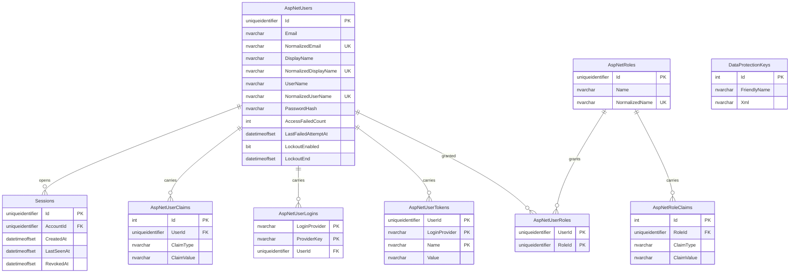

# Data model — accounts-and-sessions

> **Conventions followed, not invented.** Every choice below is derived from `docs/architecture-map.md`
> (§Conventions: EF Core migrations generated from the model, `Guid.CreateVersion7()` identifiers,
> SQL Server via EF Core 10) and from the Accepted ADRs `0002`, `0003`, `0008`, `0009`, `0010`.
> Where the repository was silent — it holds no source at this commit — the choice was confirmed with
> the owner; those four confirmations are marked **[confirmed 2026-09-21]** at the point where they bite.
>
> **Migrations are staged, not live.** The SQL under `migrations/` is the reviewable statement of intent.
> The live migration is an EF Core migration generated from the model at `implement` time — see
> [Promotion](#promotion) below.

## ER diagram

`DataProtectionKeys` stands apart on purpose: it is operational state owned by the framework, related
to nothing in the domain, and ADR 0009 asks that it be kept visibly separate from the domain tables.

## Entities

Three aggregates. **Account** (`AspNetUsers` and its six Identity satellites) is the root the whole
product resolves against; **Session** is a second root that *references* an account rather than being
owned by its object graph, because a session is created, expired and revoked on its own schedule and is
read on every request without loading the account; **the data-protection key ring** is not a domain
aggregate at all.

### `AspNetUsers` — the account

Table and column names are ASP.NET Core Identity's defaults, unchanged **[confirmed 2026-09-21 — the
full default Identity schema is kept rather than trimmed to the tables this feature uses]**. The four
columns at the bottom of the table are this feature's own additions to the Identity user.

| Column | Type | Constraints | Notes |
|---|---|---|---|
| `Id` | `uniqueidentifier` | PK, app-generated | `Guid.CreateVersion7()` per architecture-map §Conventions. Time-ordered, so the clustered index does not fragment and no record count leaks. This is the single stable identity AC-13 promises — allocated once, never reused, never reassigned |
| `Email` | `nvarchar(256)` | NULL, per Identity's default | The address exactly as the person typed it. Shown back to them, never to other members (CONTEXT: *display name* NOT *email*) |
| `NormalizedEmail` | `nvarchar(256)` | NULL per Identity's default; **UNIQUE** (`EmailIndex`, filtered `WHERE NormalizedEmail IS NOT NULL`) | The comparison key. AC-03: an email address identifies exactly one account. Identity's default index here is non-unique — making it unique is this feature's deliberate change |
| `UserName` / `NormalizedUserName` | `nvarchar(256)` | UNIQUE (`UserNameIndex`) | Identity's own login column, filled with the email address. It is *not* the display name **[confirmed 2026-09-21]** |
| `PasswordHash` | `nvarchar(max)` | NULL, per Identity's default | Identity's hasher, parameters tuned to ≥ 100 ms per verification (spec §6). Never a readable form |
| `SecurityStamp`, `ConcurrencyStamp` | `nvarchar(max)` | NULL | Identity's defaults. The security stamp is **not** the revocation mechanism here — it is account-wide, and AC-08 requires per-session revocation (ADR 0008) |
| `AccessFailedCount` | `int` | NOT NULL | Identity's consecutive-failure counter, reused by ADR 0010 |
| `LockoutEnabled` | `bit` | NOT NULL | Identity's default. **Set to `0` in application configuration**: ADR 0010 switched the framework's lockout off, and the schema cannot enforce that — only the QG-1 regression test can |
| `LockoutEnd` | `datetimeoffset` | NULL | Identity's default column, left unused and always NULL. Deliberately *not* repurposed as the failure-reset marker **[confirmed 2026-09-21]** |
| `EmailConfirmed`, `PhoneNumber`, `PhoneNumberConfirmed`, `TwoFactorEnabled` | Identity defaults | | Present because the default schema is kept; unused — spec §3 rules address verification, recovery and second factors out of the product |
| `DisplayName` | `nvarchar(50)` | NOT NULL | *This feature's addition.* 50 is bound from AC-01 («a display name of at most 50 characters»). The label other board members see |
| `NormalizedDisplayName` | `nvarchar(50)` | NOT NULL, **UNIQUE** (`DisplayNameIndex`) | *This feature's addition.* AC-11 / AC-11b: a display name identifies exactly one account to the people who see it |
| `LastFailedAttemptAt` | `datetimeoffset` | NULL | *This feature's addition.* The time of the most recent failed sign-in. AC-12's «returns to zero after 15 minutes in which no failed attempt reached verification» is derived from this column on the next read, never from a timer — so a restart cannot lose it (sad §6 flow 6). **This is the one column ADR 0010 said would not be needed** — see the audit report |

**Aggregate root:** root.

**Normalisation [confirmed 2026-09-21].** This closes spec §8's third open question, the one due «before
`/sdd:data-model`». Both `NormalizedEmail` and `NormalizedDisplayName` are produced **in the application**,
by Identity's normalizer (trim, then invariant upper-case), and registration and sign-in call the identical
code path (sad §6 flow 4: «normalised the same way registration normalised it»). The database is not asked
to make `A` equal `a`: no column collation is overridden, so restoring the database onto a server with a
different default collation cannot silently change who counts as a duplicate. Accepted consequence — the
local part of an address is compared case-insensitively although the standard permits it to be
case-sensitive; that is what AC-03 wants here.

**Access patterns:** sign-in looks an account up by `NormalizedEmail` → `EmailIndex`; registration probes
both `NormalizedEmail` and `NormalizedDisplayName` before writing → the two unique indexes serve the probe
and the guarantee alike.

**Constraints:** UNIQUE on `NormalizedEmail`, `NormalizedDisplayName`, `NormalizedUserName`. No `CHECK`
constraint, no trigger and no database `DEFAULT`: password length (AC-02), address shape (AC-02b) and the
delay curve (AC-12) are refused before a row is ever written (sad §6 flow 3 postcondition — «nothing is
written unless the submission survives every check above»), and architecture-map §Conventions puts
invariants in the Domain entity rather than in the store.

**Delete strategy:** none. Spec §3 rules out account removal, so there is no soft-delete flag and no status
column — a row, once written, stays. Recorded as accepted debt in sad §11 (no erasure path).

**Audit columns:** none added. There is no `CreatedAt` on the account because nothing reads one, and the
version-7 identifier already carries the creation instant in a recoverable form. A column that costs every
write and serves no query is the anti-pattern this stage exists to avoid.

### `Sessions` — the session

New table, owned by this feature. One row per session, per ADR 0008 (server-side records rather than
self-contained cookie tickets).

| Column | Type | Constraints | Notes |
|---|---|---|---|
| `Id` | `uniqueidentifier` | PK, app-generated | `Guid.CreateVersion7()`. **This value is the opaque reference the session cookie carries** (sad §8). Time-ordered, so the clustered index does not fragment as sessions accumulate |
| `AccountId` | `uniqueidentifier` | NOT NULL, FK → `AspNetUsers(Id)` ON DELETE CASCADE | Which account this session recognises the browser as. Indexed below |
| `CreatedAt` | `datetimeoffset` | NOT NULL | When the session was opened. AC-07b: no session is recognised more than 90 days after this instant, however actively it is used. Also the cleanup sweep's first filter (sad §6 flow 7) |
| `LastSeenAt` | `datetimeoffset` | NOT NULL | The last request made on this session's behalf. AC-07: the session ends after 14 days without one. **Written at most once an hour** — that is what keeps an ordinary read inside the 30 ms budget, and it spends exactly the 1 hour of slack spec §6 allows on expiry accuracy (sad §6 flow 5) |
| `RevokedAt` | `datetimeoffset` | NULL | Set when the account signs out (AC-08). NULL means live. A revoked row is kept, not deleted, so that AC-10 («refuses regardless of what their browser still holds») is answered by a record rather than by an absence; the sweep removes it 14 days later |

**Aggregate root:** root. It references the account but is not loaded through it — recognition reads a
session by primary key and never materialises the account graph, which is the whole point of the ≤ 30 ms
budget in spec §6.

**Access patterns:**

- Recognise a session on an ordinary request → **primary-key lookup, no secondary index** (sad §6 flow 5;
  sad §11 names this read as ADR 0008's cost and confirms it is by primary key).
- Sweep rows opened more than 90 days ago → `IX_Sessions_CreatedAt`.
- Sweep rows revoked more than 14 days ago → `IX_Sessions_RevokedAt` (filtered).
- Cascade-delete an account's sessions → `IX_Sessions_AccountId`.

**Constraints:** FK to `AspNetUsers(Id)` with `ON DELETE CASCADE`. No `CHECK` on the ordering of the three
timestamps: the 14-day and 90-day rules live on the `Session` entity in Domain (sad §5 — «the rule that a
session is expired … lives on the Session entity in Domain, not in the handler»), and restating them as
database constraints would put one rule in two places that can disagree.

**Delete strategy:** hard delete, by the cleanup sweep only (sad §7). Expiry itself is *not* a delete — an
expired row is refused at recognition time and removed later, because «cleanup is hygiene, never
enforcement».

**Expected size:** low thousands at invited-reviewer scale; re-measure the recognition read above roughly
100k live rows (sad §7).

### `DataProtectionKeys` — the key ring (ADR 0009)

Not a domain entity. The table shape is **fixed by `Microsoft.AspNetCore.DataProtection.EntityFrameworkCore`**
and cannot be chosen: the package reads and writes exactly these three columns.

| Column | Type | Constraints | Notes |
|---|---|---|---|
| `Id` | `int` | PK, `IDENTITY(1,1)` | **Deliberate divergence** from the `Guid.CreateVersion7()` convention — the framework owns this shape. Flagged in the audit report rather than diverged from silently |
| `FriendlyName` | `nvarchar(max)` | NULL | Written by the framework |
| `Xml` | `nvarchar(max)` | NULL | The key material. **Enough at rest to mint a session for any account** (spec §6.1) — readable only by the identity the application runs as, which is why a copy of the database is a full compromise rather than a partial one |

**Aggregate root:** none — operational state.

**Access patterns:** a full table read at application start and on key-ring refresh. No index beyond the
primary key, and none is justified: the table holds single-digit rows.

**Why it exists at all:** spec §6 and KPI 3 commit to 100% of unexpired sessions surviving a redeploy. The
framework's default key ring is per-instance and would silently break that on the first deployment.

### Identity satellite tables

`AspNetRoles`, `AspNetUserRoles`, `AspNetUserClaims`, `AspNetRoleClaims`, `AspNetUserLogins` and
`AspNetUserTokens` are created at their Identity defaults and are **expected to stay empty**: spec §3 rules
out third-party sign-in, password recovery and address verification, and spec §6.1 states that no
account-level role exists — membership belongs to a board. They are present because the full default schema
was kept **[confirmed 2026-09-21]**, so that a framework capability can later be switched on in
configuration without a migration. Each carries an FK to its parent with `ON DELETE CASCADE` and an index
on that FK, per the defaults.

## Indexes

Every row below is justified by a concrete query from a sad §6 flow or by a foreign key that a cascade
walks. No index is added speculatively.

| Index | Table | Columns | Unique | Query it serves |
|---|---|---|---|---|
| `EmailIndex` | `AspNetUsers` | `NormalizedEmail`, filtered `WHERE NormalizedEmail IS NOT NULL` | **yes** | Flow 4: «Find the account for this address, normalised the same way registration normalised it». Also the physical guarantee behind AC-03. Identity's default for this index is non-unique — this feature makes it unique |
| `DisplayNameIndex` | `AspNetUsers` | `NormalizedDisplayName` | **yes** | Flow 1: «Is the address or the display name already taken». The physical guarantee behind AC-11 / AC-11b |
| `UserNameIndex` | `AspNetUsers` | `NormalizedUserName` | yes (Identity default) | Identity's own login lookup. Filtered `WHERE NormalizedUserName IS NOT NULL`, as Identity generates it |
| `IX_Sessions_AccountId` | `Sessions` | `AccountId` | no | FK hygiene: the `ON DELETE CASCADE` from `AspNetUsers` finds a session's rows by this column, and without the index that is a table scan per delete |
| `IX_Sessions_CreatedAt` | `Sessions` | `CreatedAt` | no | Flow 7: «Delete sessions opened more than 90 days ago». The flow's own note names this column as wanting an index |
| `IX_Sessions_RevokedAt` | `Sessions` | `RevokedAt`, filtered `WHERE RevokedAt IS NOT NULL` | no | Flow 7: «… or revoked more than 14 days ago». Filtered because the overwhelming majority of rows are live and carry NULL here, so the index stays a fraction of the table's size and costs nothing on the common write path of opening a session |
| `RoleNameIndex`, `IX_AspNetUserClaims_UserId`, `IX_AspNetUserLogins_UserId`, `IX_AspNetUserRoles_RoleId`, `IX_AspNetRoleClaims_RoleId` | Identity satellites | per Identity defaults | per defaults | FK hygiene on the cascade paths; generated by Identity's own model configuration |

**Not indexed, deliberately:** `Sessions.Id` needs no secondary index — it is the primary key, and
recognising a session is a primary-key lookup (sad §6 flow 5, sad §11). `Sessions.LastSeenAt` is written on
the hot path and never filtered on: the 14-day rule is evaluated on a row already fetched by primary key,
so an index there would cost every write and serve no query.

## Seeds

**None — deliberately.**

- *Bootstrap:* no seeded account. Spec §6.1 handles address squatting «operationally by claiming the
  owner's and the demo addresses at first deployment» — that is, by registering them through the real
  registration path, which doubles as the first live exercise of AC-01. A seeded account would also mean a
  password hash committed to a migration file, which is exactly the thing not to put in version control.
- *Lookup data:* none. The only candidate would be roles, and spec §6.1 states there are none.
- *Test fixtures:* below, and **not** under `migrations/`.

## Test fixtures

Built as C# builders beside the integration tests (`tests/Uniqua.Projector.Api.IntegrationTests/`, per
architecture-map §Conventions), not as migration rows. **PII guard: every address is `example.test`.**

- `AnAccount()` — a registered account with `admin@example.test`, display name `Test User`, and a password
  hashed by the real hasher. Fluent overrides for address and display name, so AC-03 and AC-11b each get a
  second account that collides on exactly one field.
- `ALiveSession(account)` — `CreatedAt = now`, `LastSeenAt = now`, `RevokedAt = null`.
- `AnIdleSession(account)` — `LastSeenAt = now − 14 days − 1 hour − 1 minute`: the AC-07 boundary, measured 14 days plus the 1-hour activity-stamp slack after the last stamp (sad.md flow 5, `Session.IdleExpiryAfterLastStamp`).
- `AnAgedSession(account)` — `CreatedAt = now − 90 days − 1 minute`, `LastSeenAt = now`: the AC-07b
  boundary, where the session is actively used and must still be refused.
- `ARevokedSession(account)` — `RevokedAt = now`: AC-08 / AC-10.
- `AnAccountUnderGuessing(failures)` — sets `AccessFailedCount` and `LastFailedAttemptAt` directly, so the
  AC-12 delay curve and the 15-minute reset are exercised against a controllable clock without performing
  six real sign-in attempts.

All time-dependent fixtures take their instant from the injected `IClock` port (sad §5), never from
`DateTimeOffset.UtcNow` — the §6 expiry and delay rows are every one of them «integration test against a
controllable clock».

## Promotion

The `.up.sql` / `.down.sql` pairs under `docs/features/accounts-and-sessions/migrations/` are **staged, not
live**, and nothing was written into a live migrations tree.

This repository's convention (architecture-map §Migrations) is **EF Core migrations generated from the
model** — a C# migration class under `src/Uniqua.Projector.Infrastructure/Migrations/`, named
`<timestamp>_<Name>.cs`, with no sequence number to reserve and therefore no collision to avoid. So
`implement`, on each `layer: migration` task, does **not** copy these files anywhere. It:

1. declares the model — the `Account` and `Session` entities and their `AppDbContext` configuration;
2. runs `dotnet ef migrations add <Name>` in ordinal order — `CreateIdentitySchema`, `CreateSessions`,
   `CreateDataProtectionKeys`;
3. runs `dotnet ef migrations script` and **diffs the generated SQL against the staged file**. That diff is
   what these files exist for: they are the reviewed statement of what the model must produce. A difference
   is a finding — either the model is wrong or this document is, and the two are reconciled before the
   migration is applied.

The `.down.sql` files serve the same role for `dotnet ef database update <previous-migration>`.
