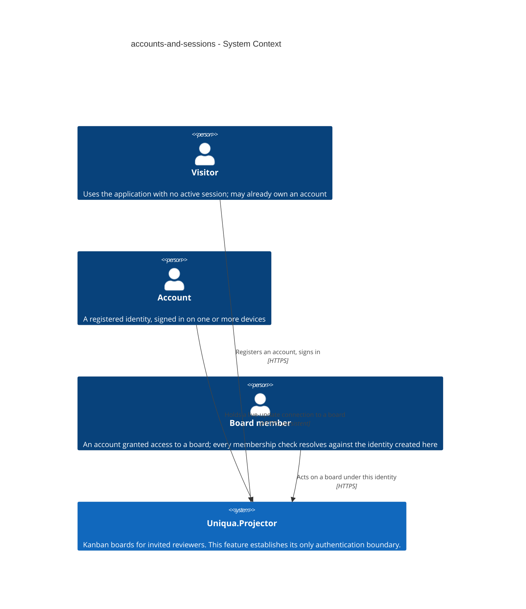
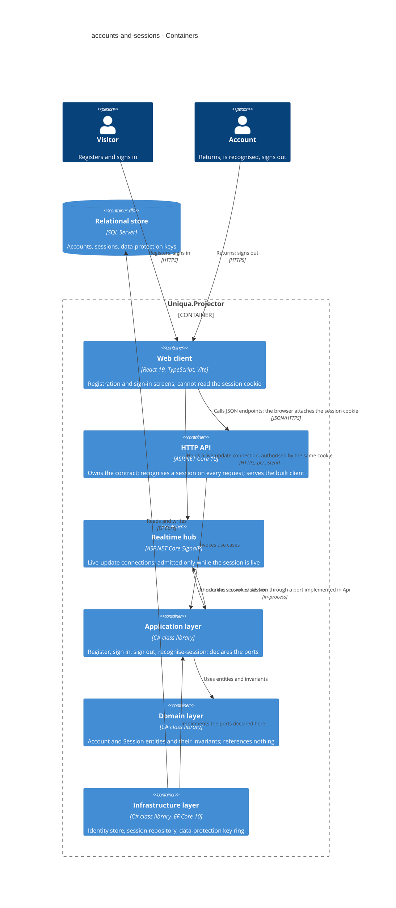
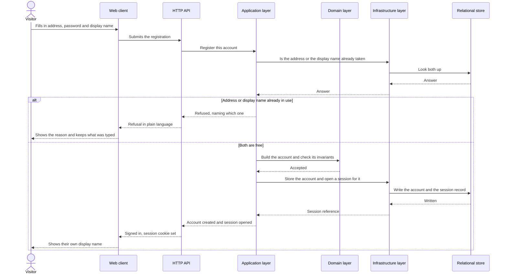
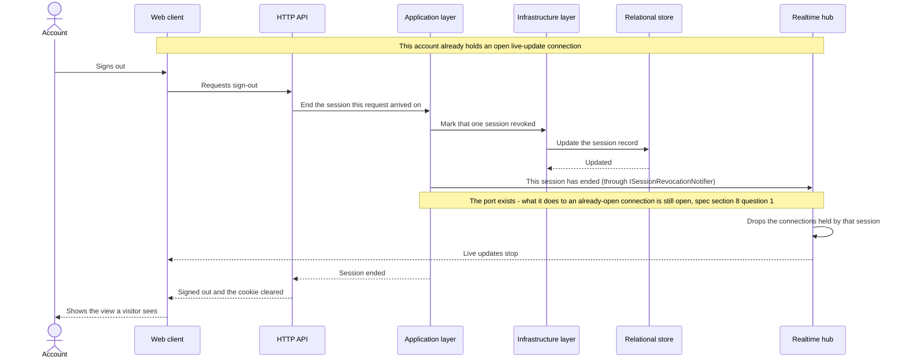

# Software Architecture Document — accounts-and-sessions

<!-- 12 Arc42 sections. Empty section → <!-- N/A: <one-line reason> -->. -->
<!-- C4 Context (L1) lives inline in §3. C4 Container (L2) lives inline in §5. -->
<!-- Numbers in §10 come VERBATIM from spec.md §6 NFR — no inventing, no rounding. -->

## 1. Introduction and goals

**Intent.** Establish the product's single authentication boundary: a stranger who opens the public link creates an account unaided, is signed in immediately, and is recognised again across days and devices — so that every later feature (boards, membership, invitations, the live-update connection) resolves against exactly one notion of who someone is. The rules that govern a session are stated in the repository and observable from outside it, because the spec's primary reader probes authentication and access control first.

**Top-3 quality goals (1-liners; full scenarios in §10):**

1. **Security of the single authentication boundary** — credentials never recoverable from the store, password guessing made progressively futile, and no enumeration channel beyond the two the spec deliberately accepts.
2. **Session continuity with a bounded lifetime** — a session survives a browser close and a redeploy of the instance, yet ends on a stated schedule: 14 days idle, 90 days absolute.
3. **Unattended reachability within the latency budget** — a visitor gets from the public link to a signed-in state with no intervention from the owner, inside the spec's p95 targets.

When these three conflict, security wins: this feature is the one the fifteen-minute read examines first.

**Stakeholders.**

| Role | Interest | Sign-off owner? |
|---|---|---|
| visitor | Registers and signs in unaided | No |
| account | Holds sessions; expects continuity and protection from guessing | No |
| board member | Downstream consumer — every membership check resolves against the account established here | No |
| reviewing engineer | Reads how authentication and access control are done, in fifteen minutes; spec §1's primary user | No |
| Tech Lead | SAD approval | Yes |
| Security Lead | §6.1 controls and the authentication boundary | Yes |

<!-- `reviewing engineer` is not a CONTEXT.md glossary role; it is kept because spec §1 names it the
     primary user. Candidate for `/sdd:glossary` rather than an invented definition here. -->

<!-- Decision overrides (¶4) — populated by the critic resolution loop, empty otherwise. -->

## 2. Constraints

**Technical.**
- C# on **.NET 10 (LTS)** — the target framework of the foundation. Unverified at this commit; see the §11 row, which carries the fallback to .NET 8 (LTS).
- **ASP.NET Core 10** — HTTP API, and it also serves the built client (one origin, per ADR 0003).
- **ASP.NET Core Identity** — the account store, password hashing and sign-in primitives.
- **ASP.NET Core SignalR** — the live-update connection (ADR 0004); authorised by the same cookie.
- **Entity Framework Core 10** — the only persistence mechanism; `DbContext` never reaches Api or Domain.
- **SQL Server** — the single relational store (ADR 0002).
- **TypeScript 5 / React 19** with Vite, Tailwind CSS, shadcn/ui (vendored as source) and TanStack Query.
- **Four-project layering:** `Api → Application → Domain` and `Infrastructure → Application → Domain`; Domain references nothing. Api references Infrastructure only to register implementations at startup.
- **One origin for client and API** (ADR 0003) — splitting them across two hosts is off the table, which also constrains §7.

**Organisational.**
- One developer (the owner); no second reviewer is available in-team.
- First public deployment is fixed at **week 2**; the overall schedule is 8–10 weeks (ADR 0004).
- This feature is sized **M**; it is the first feature after the skeleton and blocks every later one.
- A **security review is required** before it ships (spec §6.1) — it introduces the product's only authentication boundary and its first personal data.

**Conventions.**
- `docs/architecture-map.md` §Conventions is the convention file until `/sdd:scaffold` turns its target paths into real anchors.
- **IDs:** application-generated GUID version 7 (`Guid.CreateVersion7()`) — time-ordered, and it does not leak record counts.
- **Errors:** every failure response is an RFC 9457 `ProblemDetails` from one exception handler; endpoints never build an ad-hoc error shape.
- **Migrations:** EF Core migrations generated from the model, one per schema change, reviewed as SQL before they are applied.
- **Domain rules live in Domain** — an invariant is enforced by the entity, not by a use case or an endpoint.
- **Tests:** integration through `WebApplicationFactory` against a SQL Server container, plus unit tests on Domain invariants.
- **ADR numbering is one sequence across the whole repository.** This feature's ADRs live in `docs/features/accounts-and-sessions/adr/` but continue the numbering of `docs/adr/0001`–`0005`, starting at **0006**. This deliberately departs from the per-feature-from-0001 default, because the spec already cites «ADR 0003» and a second document with that number would make every bare reference ambiguous. Later features and `decide-adr` follow the same rule.
- **Licensing:** every dependency must be permissively licensed (MIT / Apache-2.0 / BSD-style). No copyleft (GPL / LGPL / AGPL) component is part of this foundation, and none may be introduced without replacing it.

**Regulatory / external.**
- **Data classification: confidential** — credentials plus the real email addresses of real people (spec §6.1).
- **Email address retained indefinitely** — spec §3 rules out an account-removal path, so there is no deletion route by design; recorded as accepted debt in §11.
- **Password never stored in a recoverable form**; **display name** is deliberately visible to other board members.
- **No password recovery, no address verification, no third-party identity** (spec §3; ADR 0003 rejected delegating identity).
- No formal compliance regime applies — the audience is a small set of invited reviewers rather than a user base, and deletion-on-request is deliberately out of scope rather than overlooked.

## 3. Context and scope

This feature is the product's front door and its only authentication boundary. A person arrives at the public link as a **visitor**, becomes an **account** by registering unaided, and is recognised again on later visits and on other devices; every later capability — board membership, invitations, the live-update connection — resolves authorisation against the identity established here rather than inventing a second one. The trust boundary is the application process: everything the browser sends (the session cookie included) is untrusted input until the request has been authenticated, and the cookie is unreadable by page scripts so that a cross-site scripting hole does not hand over a session.

<!-- brownfield: N/A — greenfield repo (no source at this commit; the foundation is the target
     described in docs/architecture-map.md, mode greenfield-bootstrap). -->

**External systems (in / out):**

| Actor or system | Type | Interaction |
|---|---|---|
| visitor | Person | Registers an account from the public link; signs in on return |
| account | Person (a registered identity) | Is recognised across days and devices; signs out; holds live-update connections |
| board member | Person | Downstream consumer — acts on a board under the identity established here; no board exists yet at this feature's close |
| — none — | System (external) | **Deliberate.** No identity provider (ADR 0003 rejected delegating identity), no mail service (spec §3 rules out password recovery and address verification, both of which would require one), no third-party of any kind. The feature has no outbound integration at all. |

**C4 Context (L1):**



## 4. Solution strategy

**Top strategic choices (the seeds for ADRs):**

1. **Build two surfaces — a backend service and a web front-end** (ADR 0006). The spec's first goal is that a stranger reaches a signed-in state *from the public link*, which is unreachable without registration and sign-in screens; the API owns the contract and also serves the built client from one origin, as ADR 0003 requires. `target_surfaces: [backend-service, web-frontend]` is recorded in this document's frontmatter and is read — never re-derived — by `api`, `sequences`, `tasks`, `screens`, `plan-tests` and `review`.
2. **Deliver the web surface as a client-side SPA** (ADR 0007). React 19 + Vite + TanStack Query is the foundation's client, and the board screen the next feature builds needs substantial client state (drag-and-drop, live updates) anyway; a second rendering mechanism for two forms would be a second way of doing the same thing. (The map forbids a second *styling* mechanism in those words; extending the same reasoning to rendering is this SAD's judgement, not a quotation from it.). The cost is that cross-site request-forgery protection is configured deliberately rather than inherited — §8 carries that row.
3. **Hold sessions as server-side records rather than self-contained cookie tickets** (ADR 0008). The framework's default cookie authentication encrypts the whole ticket into the cookie and reads no store to accept it, so signing out can only delete the browser's copy — which makes AC-10 («refuses … regardless of what their browser still holds») false and AC-09 (silencing an already-open live-update connection) unimplementable. Spec §6 already budgets ≤ 30 ms to «recognise a session on an ordinary read», which is the budget for exactly this lookup.
4. **Keep the cookie-protecting key material in the database, outside the application instance** (ADR 0009). Spec §6 and KPI 3 commit to 100% of unexpired sessions surviving a redeploy; the framework's default regenerates the key ring per instance, which would silently break that. Putting the key ring in the store that already exists means a container replacement or a move to another virtual machine carries it along, and the database backup covers it with no second thing to remember.

Each tactical decision in later sections should trace to one of these seeds. Tactical decisions that *contradict* a strategic choice are red flags — surface them in §11.

## 5. Building block view

The style is the **clean / layered split the foundation already fixes**: `Api → Application → Domain` and `Infrastructure → Application → Domain`, with Domain referencing nothing and Api referencing Infrastructure only to register implementations at startup. This feature introduces no new layering — it is the first real capability to travel through the existing one, so it sets the precedent every later feature is measured against. Two of the six containers below are this feature's declared **target surfaces** (the HTTP API and the web client); the rest are the layers behind them and the store.

The one placement that is not simply inherited is **session recognition**. It runs on every authenticated request, so it belongs in the request pipeline in `Api` — but it must read a session record, which only `Infrastructure` may do. It is therefore an Api-level authentication handler that calls an **Application port** (`ISessionReader`), implemented in Infrastructure. The rule that a session is expired — 14 days idle or 90 days old — lives on the **Session entity in Domain**, not in the handler, so that the handler asks the entity rather than re-deriving the arithmetic.

The same shape applies in the other direction. Signing out has to reach the live-update connections that session holds, but the hub lives in **Api**, and §2 fixes the reference direction as `Api → Application` — so a use case may not call the hub. `SignOut` therefore depends on an Application-declared port, `ISessionRevocationNotifier`, whose implementation sits in Api next to the hub and is registered at startup. This is the identical pattern Infrastructure already uses for the session and account ports: the use case never knows who fulfils them.

**Internal decomposition:**

```
src/Uniqua.Projector.Domain/Accounts/
├── Account.cs              # entity: email, display name, credential reference
├── Session.cs              # entity: owns IsExpired(now) - the 14-day and 90-day rules
└── AccountErrors.cs        # sentinel errors: address taken, display name taken, bad credentials

src/Uniqua.Projector.Application/Accounts/
├── RegisterAccount.cs      # use case: create + open a session in one step (AC-01)
├── SignIn.cs               # use case: verify, apply the progressive delay, open a session
├── SignOut.cs              # use case: revoke this session, then announce it through a port
└── Ports/                  # ISessionStore, ISessionReader, IAccountStore, IClock,
                           # ISessionRevocationNotifier - declared here, implemented in Api

src/Uniqua.Projector.Infrastructure/Accounts/
├── SessionStore.cs         # EF Core implementation of the session ports
├── IdentityAccountStore.cs # ASP.NET Core Identity behind IAccountStore
└── Migrations/             # accounts, sessions, data-protection keys

src/Uniqua.Projector.Api/Accounts/
├── AccountEndpoints.cs     # register, sign in, sign out
├── SessionAuthenticationHandler.cs  # recognises a session per request via ISessionReader
└── HubSessionRevocationNotifier.cs  # implements ISessionRevocationNotifier beside the hub

src/Uniqua.Projector.Web/src/features/auth/
├── RegisterScreen.tsx      # composed from the vendored shadcn/ui primitives
└── SignInScreen.tsx        # same; no new primitive is introduced by this feature
```

**C4 Container (L2):**



## 6. Runtime view

Two flows are seeded here — the one that carries the feature's primary goal, and the one that motivated ADR 0008. `/sdd:sequences` then covers every §5 acceptance criterion; participants below are §5 container names and no new ones are invented.

**Critical flow 1: register unaided and arrive signed in (AC-01, AC-03, AC-11b)**



**Critical flow 2: signing out withdraws access over every channel at once (AC-08, AC-09, AC-10)**



Sessions the same account holds on other devices are untouched — sign-out is per-session (AC-08, ADR 0008). A later request carrying the revoked cookie is refused because the session record says so, not because the browser stopped sending it (AC-10).

<!-- Further flows - sign in on return, recognise a session on an ordinary read, the progressive
     delay under guessing, expiry at 14 days idle and 90 days absolute - are covered by
     /sdd:sequences against the full AC list. -->

## 7. Deployment view

One instance on the owner's self-hosted host, behind a **reverse proxy** that terminates TLS for the registered domain and forwards the originating client address — that forwarded address is the **request source** the registration rate limit keys on (spec §6.1), and it is trusted only when the request arrives from the proxy itself. **SQL Server** runs alongside on the same host and holds all three of this feature's concerns: accounts, session records, and the data-protection key ring (ADR 0009). A single replica; because both the session store and the key ring are shared state in the database, a second replica would work without code change, but nothing calls for one.

**Expired-session cleanup.** A hosted background service inside the API process removes rows that can no longer be live — older than 90 days, or revoked more than 14 days ago — once a day and once at startup. The startup run matters because the daily timer does not survive a restart: a redeploy, a reboot of the host or a crash all reset it, and on a manually-operated instance those are the common case rather than the exception. Cleanup is **hygiene, not enforcement**: an expired row is refused at recognition time regardless, because the `Session` entity itself decides it is dead. It exists because a session row records when a named person signed in, and spec §3 rules out any data-deletion path — without cleanup the table is a permanent visit log.

**Monitoring:**
- Sign-in and registration p95, and session-recognition p95 on ordinary reads — the three spec §6 latency budgets.
- Count of live session records; count of rows removed by the last cleanup run, and when it last succeeded.
- Failed sign-in attempts per account per hour (the AC-12 progressive delay in action).
- Registrations refused by the rate limit, and the request source that triggered it.

**Alerts:**
- Session-recognition p95 above 30 ms sustained — the budget ADR 0008's per-request lookup spends.
- Live session count drops to zero immediately after a deployment — that is KPI 3 failing and means the key ring did not survive.
- Cleanup has not succeeded for more than 48 hours.

**Scaling thresholds:**
- Session rows grow with sign-ins rather than with time; at invited-reviewer scale the table stays in the low thousands.
- Above roughly 100k live rows, re-measure the per-request lookup against the 30 ms budget before assuming it still holds.

<!-- Hosting divergence: architecture-map.md still records hosting as undecided and names a managed
     SQL offer as the thing to verify before week 2. This SAD assumes the owner's self-hosted host,
     which is what makes ADR 0009's key ring and this cleanup service straightforward. Carried as a
     §11 row rather than silently resolved here; `survey` should refresh the map once it is settled. -->

## 8. Crosscutting concepts

Three of the rows below are inherited from `architecture-map.md` §Conventions verbatim — error handling, the ID strategy, and the structured-logging baseline. The rest are established by this feature or by its ADRs, because the map's own §Conventions bullets (module wiring, persistence, migrations, domain rules, tests, inter-module communication, UI styling) are project-wide rules this feature simply follows rather than crosscutting concerns it defines. Three rows are new obligations spec §6.1 imposes: cross-site request-forgery protection, the registration rate limit, and the logging rule about never recording an address on a failed sign-in.

| Concept | Convention | Where defined |
|---|---|---|
| Logging | Structured, `module=accounts`. **Never log an email address on a sign-in failure**, and never log the cookie, the session reference or any credential — otherwise the log becomes the account-enumeration oracle that AC-05b exists to close | architecture-map §Conventions + here |
| Authentication | Session cookie — httpOnly, secure, same-site — carrying an opaque reference, recognised on every request by an Api authentication handler against a session record | ADR 0003, ADR 0008, §5 |
| Authorization | None added by this feature. Membership belongs to a board, not to the account; there is no account-level role | spec §3, §6.1 |
| Cross-site request forgery | An antiforgery token is required on every state-changing request. The cookie alone is never sufficient proof of intent, because the browser attaches it automatically | ADR 0003 (negative consequence), ADR 0007 |
| Error handling | RFC 9457 `ProblemDetails` from one exception handler. A refusal carries exactly the plain-language reason its acceptance criterion specifies — no more (AC-05 must not reveal which of address or password was wrong) | architecture-map §Conventions |
| ID strategy | `Guid.CreateVersion7()` for account and session identifiers — time-ordered, and it leaks no record counts | architecture-map §Conventions |
| Password hashing | The Identity hasher, with parameters tuned so one verification costs ≥ 100 ms on the §6 reference machine; guarded by a unit test over the parameters | spec §6 |
| Guessing protection | A progressive per-account delay computed from Identity's consecutive-failure counter, with the framework's own lockout switched off | ADR 0010 |
| Rate limiting | No more than 5 registrations per minute per request source — the client address as reported by the reverse proxy, trusted only when the request arrives from the proxy | spec §6.1, §7 |
| Internationalisation | N/A — single language | — |
| Observability | The §7 metrics; server-side timing on the sign-in, registration and session-recognition paths | §7 |
| Secrets | The data-protection key ring lives in the database; this project has no secret manager, which is why the certificate-encrypted variant was rejected | ADR 0009, §11 |

## 9. Architecture decisions

| # | Title | Status | Section |
|---|---|---|---|
| 0006 | Build this feature as a backend service and a web front-end | Accepted | §4 |
| 0007 | Deliver the web surface as a client-side SPA | Accepted | §4 |
| 0008 | Store sessions as server-side records rather than self-contained cookie tickets | Accepted | §4 |
| 0009 | Keep the data-protection key ring in the database | Accepted | §4 |
| 0010 | Replace account lockout with a progressive per-account delay | Accepted | §8 |

ADR files live under `docs/features/accounts-and-sessions/adr/NNNN-<title>.md`. Numbering continues the repository-wide sequence that `docs/adr/0001`–`0005` started, per the §2 convention — there is no second «ADR 0003» in this project.

## 10. Quality requirements

Each of the three §1 goals expanded into a scenario. **Every number is copied verbatim from spec §6** — none is invented and none is rounded.

**QG-1. Security of the single authentication boundary**
- **When:** someone submits wrong passwords against one account repeatedly, or probes the sign-in form with addresses that own no account.
- **Then:** the 6th consecutive failure is delayed ≥ 2 s and the 10th ≥ 30 s; a correct password is never delayed; the failure count returns to zero after 15 min with no attempt; one password verification costs ≥ 100 ms per attempt; an address no account was registered with is refused in the same words and in a comparable time as a wrong password.
- **How verify:** integration test against a controllable clock for the delay curve and the reset; a unit test over the hashing parameters for the ≥ 100 ms floor; a timing-comparison test for AC-05b; **and a regression test asserting that an account with many recent failures still accepts the correct password immediately** — that is the test which catches someone re-enabling the framework lockout ADR 0010 deliberately switched off.

**QG-2. Session continuity with a bounded lifetime**
- **When:** a session goes unused for 14 days; a session reaches 90 days old however actively it is used; the instance is redeployed.
- **Then:** the session ends within 14 days plus at most 1 hour after the last activity; no session is recognised more than 90 days after it was opened; 100% of unexpired sessions survive a redeploy of the instance.
- **How verify:** integration tests against a controllable clock for the sliding window and the absolute ceiling; a post-deployment check for redeploy survival — **first verifiable at roadmap step 4**, when a real deployment exists. `plan-tests` records that third item as deferred, not as covered.

**QG-3. Unattended reachability within the latency budget**
- **When:** a visitor registers, signs in on return, or makes any ordinary authenticated read.
- **Then:** p95 ≤ 800 ms for registration; p95 ≤ 600 ms for sign-in, counting successful sign-ins only — attempts delayed by the guessing protection are excluded, since that delay is deliberate; p95 ≤ 30 ms to recognise a session on an ordinary read; ≥ 10 sign-ins/s.
- **How verify:** server-side timing sampled in the smoke run for the three p95 figures; throughput measured on the reference machine — a 2-vCPU virtual machine on the self-hosted host — with the same smoke test in CI counting only as a regression check, since the runner is not the reference machine.

<!-- AC-09 (sign-out silencing an already-open live-update connection) is a binding commitment that
     cannot be exercised until the channel arrives at roadmap step 8; spec §5 carries the same note. -->

## 11. Risks and technical debt

<!-- Severity literals: Low / Medium / High for regular risks; "Open question" for rows carried from
     an unresolved architectural decision. spec §8 carries four questions; ADR 0010 closed the fourth
     (the divergence from ADR 0003's lockout consequence), and the remaining three are the rows below.
     A fifth question - where the cookie-protecting key material lives - was closed during `clarify`
     and its row removed from the spec then, so it is not counted here. -->

| Risk / debt | Severity | Mitigation | Owner |
|---|---|---|---|
| The .NET 10 target is unverified — no SDK check has happened, because no skeleton exists yet | Medium | Confirm the installed SDK at scaffold; fall back to .NET 8 (LTS) and update `architecture-map.md`. No decision in this SAD depends on the difference — Identity, Data Protection and SignalR exist in both | Alex Korneiko |
| Hosting divergence — `architecture-map.md` still records hosting as undecided and names a managed SQL offer to verify, while this SAD assumes the owner's self-hosted host | Medium | Settle hosting in week 1 and refresh the map with `survey`. ADR 0009's key-ring table works on any host; only §6's reference machine and §7's topology would change | Alex Korneiko |
| One indexed session lookup on every authenticated request, against the ≤ 30 ms budget (ADR 0008's cost) | Medium | The lookup is by primary key; alert on sustained p95 above 30 ms; re-measure above roughly 100k live rows | Alex Korneiko |
| The framework's account lockout could be re-enabled by someone who assumes it is the safe default, silently breaking AC-12 | Medium | The QG-1 regression test asserts that an account with many recent failures still accepts the correct password immediately | Alex Korneiko |
| A 30-second guessing delay holds the request open, occupying a connection for its duration | Low | Harmless at invited-reviewer scale; revisit if the §6 delay curve is ever raised | Alex Korneiko |
| The SPA shows a blank page until its bundle loads, and spec §1's primary reader gives the link about one minute | Low | Keep the bundle small. The spec sets no number for first render, so this is watched rather than measured — it is a risk, not an NFR | Alex Korneiko |
| `ux-flows` was skipped, so `screens` will derive screen states from acceptance criteria and contract error responses rather than from a screen inventory | Low | Run `/sdd:ux-flows accounts-and-sessions` before `screens` if the error-state coverage looks thin | Alex Korneiko |
| The declared size **M** is tight and was classified before this design existed — two surfaces (ADR 0006 says so in its own consequences), a custom authentication handler, a background cleanup service, and three migrations rather than one | Medium | Judge it on real numbers rather than by eye: if `/sdd:tasks` emits more than roughly 12 tasks or more than about 3 days of work, re-run `/sdd:classify-size accounts-and-sessions`, which re-syncs `.size`, `.route` and the `feature_size` mirrors in both spec.md and sad.md | Alex Korneiko |
| Open architectural decision: how signing out reaches an already-open live-update connection | Open question | Resolve before roadmap step 8. ADR 0008 makes it possible — the session is server-side state the hub can consult — but does not implement the notification; spec §8 question 1 | Alex Korneiko |
| Open architectural decision: whether traffic on a live-update connection counts as activity for the 14-day sliding window | Open question | Resolve before roadmap step 8; the standing default is that it does not, so only a deliberate action renews a session; spec §8 question 2 | Alex Korneiko |
| Open architectural decision: what normalisation applies to an email address at registration versus at sign-in | Open question | Resolve before `/sdd:data-model`, which has to pick the column collation and the unique index; the standing default is identical normalisation before comparison; spec §8 question 3 | Alex Korneiko |

**Accepted debt (acceptable in v1, plan to fix later):**
- **The key ring shares the database with the accounts it protects** (ADR 0009). One database compromise yields both. Accepted because on a single self-hosted host whoever can read a key volume can usually read the database files beside it; the certificate-encrypted variant is additive later and costs one deployment.
- **Email addresses are retained indefinitely with no deletion path** (spec §3). Deliberate rather than overlooked — the audience is a small set of invited reviewers — but it means there is no way to honour an erasure request without a manual database edit.
- **A session row records when a named person signed in.** The §7 cleanup bounds how long that history lives, but there is no per-person erasure, for the same reason as above.
- **Account enumeration through the registration form is deliberate** (AC-03, AC-11b). The display-name uniqueness chosen during clarify widened it: the form now also reveals which display names are in use.
- **An unknown address at sign-in still costs a full password verification** (AC-05b), which makes the sign-in form a cheap way to consume processor time. The §6.1 rate limit covers registration only.

## 12. Glossary

Terms marked **[CONTEXT]** are canonical in the repository-root `CONTEXT.md` and are repeated here only for a reader of this document; the definitions there win on any conflict.

| Term | Meaning |
|---|---|
| account **[CONTEXT]** | A registered identity with an email, a password and a display name, which a person signs in as |
| visitor **[CONTEXT]** | A person using the application with no active session; may already own an account and simply not be signed in |
| session **[CONTEXT]** | The period during which a browser is recognised as a specific account, carried by a cookie that page scripts cannot read |
| board member **[CONTEXT]** | An account granted access to one board; the downstream consumer of the identity this feature establishes |
| display name **[CONTEXT]** | The label other board members see next to an account's actions. Unique across accounts as of this feature (AC-11, AC-11b) |
| live-update connection **[CONTEXT]** | The connection a board member's browser holds open to one board so that changes made by other members arrive without a reload |
| session record | The server-side row that *is* the session (ADR 0008): its identifier, the account, when it was opened, when it was last seen, and whether it has been revoked. The cookie carries only an opaque reference to it |
| request source | The client address as reported by this instance's reverse proxy, trusted only when the request arrives from the proxy. It is the key the registration rate limit counts against (spec §6.1) |
| key ring | The set of keys ASP.NET Core Data Protection uses to sign and encrypt the session cookie. Kept in the database so a redeploy does not end every session (ADR 0009) |
| reference machine | The machine the §6 throughput and hashing-cost figures are measured on — a 2-vCPU virtual machine on the self-hosted host. CI is not the reference machine |
| progressive delay | The growing refusal delay applied after repeated wrong passwords on one account, in place of locking the account (ADR 0010) |

<!-- Candidates for /sdd:glossary if they recur outside this feature: `session record`,
     `request source`, `reference machine`. They are feature-local for now, so they live here
     rather than in CONTEXT.md - the two-level contract says a term lives in exactly one place. -->
