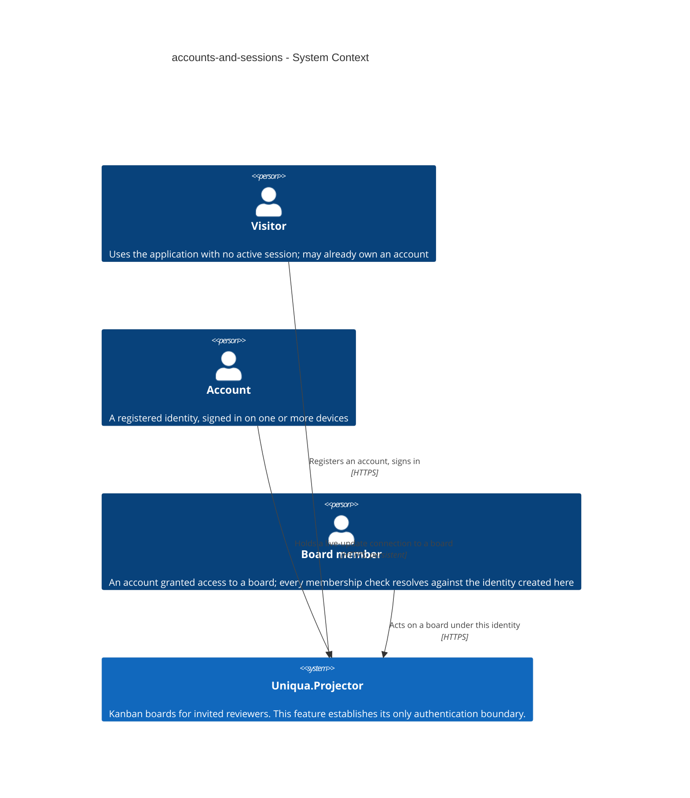
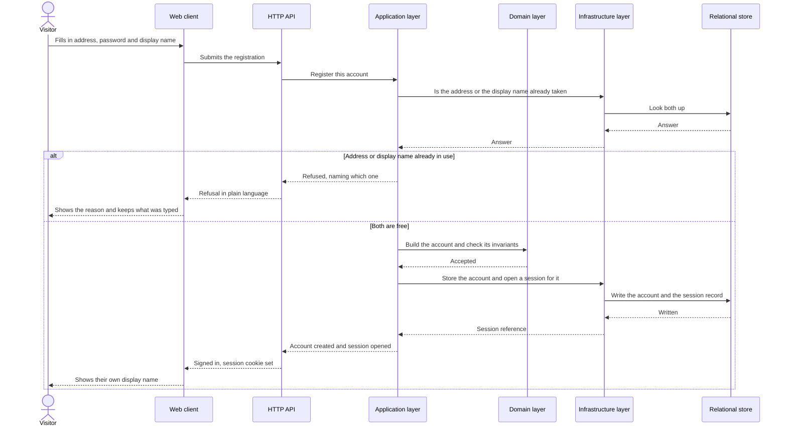
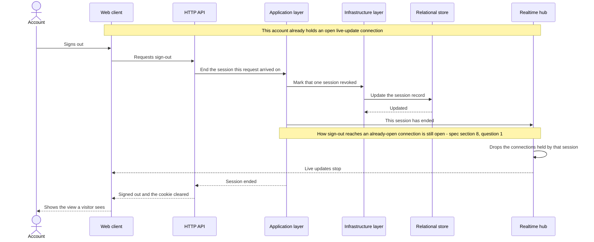

# Software Architecture Document — accounts-and-sessions

<!-- 12 Arc42 sections. Empty section → <!-- N/A: <one-line reason> -->. -->
<!-- C4 Context (L1) lives inline in §3. C4 Container (L2) lives inline in §5. -->
<!-- Numbers in §10 come VERBATIM from spec.md §6 NFR — no inventing, no rounding. -->

## 1. Introduction and goals

**Intent.** Establish the product's single authentication boundary: a stranger who opens the public link creates an account unaided, is signed in immediately, and is recognised again across days and devices — so that every later feature (boards, membership, invitations, the live-update connection) resolves against exactly one notion of who someone is. The rules that govern a session are stated in the repository and observable from outside it, because the spec's primary reader probes authentication and access control first.

**Top-3 quality goals (1-liners; full scenarios in §10):**

1. **Security of the single authentication boundary** — credentials never recoverable from the store, password guessing made progressively futile, and no enumeration channel beyond the two the spec deliberately accepts.
2. **Session continuity with a bounded lifetime** — a session survives a browser close and a redeploy of the instance, yet ends on a stated schedule: 14 days idle, 90 days absolute.
3. **Unattended reachability within the latency budget** — a visitor gets from the public link to a signed-in state with no intervention from the owner, inside the spec's p95 targets.

When these three conflict, security wins: this feature is the one the fifteen-minute read examines first.

**Stakeholders.**

| Role | Interest | Sign-off owner? |
|---|---|---|
| visitor | Registers and signs in unaided | No |
| account | Holds sessions; expects continuity and protection from guessing | No |
| board member | Downstream consumer — every membership check resolves against the account established here | No |
| reviewing engineer | Reads how authentication and access control are done, in fifteen minutes; spec §1's primary user | No |
| Tech Lead | SAD approval | Yes |
| Security Lead | §6.1 controls and the authentication boundary | Yes |

<!-- `reviewing engineer` is not a CONTEXT.md glossary role; it is kept because spec §1 names it the
     primary user. Candidate for `/sdd:glossary` rather than an invented definition here. -->

<!-- Decision overrides (¶4) — populated by the critic resolution loop, empty otherwise. -->

## 2. Constraints

**Technical.**
- C# on **.NET 10 (LTS)** — the target framework of the foundation. Unverified at this commit; see the §11 row, which carries the fallback to .NET 8 (LTS).
- **ASP.NET Core 10** — HTTP API, and it also serves the built client (one origin, per ADR 0003).
- **ASP.NET Core Identity** — the account store, password hashing and sign-in primitives.
- **ASP.NET Core SignalR** — the live-update connection (ADR 0004); authorised by the same cookie.
- **Entity Framework Core 10** — the only persistence mechanism; `DbContext` never reaches Api or Domain.
- **SQL Server** — the single relational store (ADR 0002).
- **TypeScript 5 / React 19** with Vite, Tailwind CSS, shadcn/ui (vendored as source) and TanStack Query.
- **Four-project layering:** `Api → Application → Domain` and `Infrastructure → Application → Domain`; Domain references nothing. Api references Infrastructure only to register implementations at startup.
- **One origin for client and API** (ADR 0003) — splitting them across two hosts is off the table, which also constrains §7.

**Organisational.**
- One developer (the owner); no second reviewer is available in-team.
- First public deployment is fixed at **week 2**; the overall schedule is 8–10 weeks (ADR 0004).
- This feature is sized **M**; it is the first feature after the skeleton and blocks every later one.
- A **security review is required** before it ships (spec §6.1) — it introduces the product's only authentication boundary and its first personal data.

**Conventions.**
- `docs/architecture-map.md` §Conventions is the convention file until `/sdd:scaffold` turns its target paths into real anchors.
- **IDs:** application-generated GUID version 7 (`Guid.CreateVersion7()`) — time-ordered, and it does not leak record counts.
- **Errors:** every failure response is an RFC 9457 `ProblemDetails` from one exception handler; endpoints never build an ad-hoc error shape.
- **Migrations:** EF Core migrations generated from the model, one per schema change, reviewed as SQL before they are applied.
- **Domain rules live in Domain** — an invariant is enforced by the entity, not by a use case or an endpoint.
- **Tests:** integration through `WebApplicationFactory` against a SQL Server container, plus unit tests on Domain invariants.
- **ADR numbering is one sequence across the whole repository.** This feature's ADRs live in `docs/features/accounts-and-sessions/adr/` but continue the numbering of `docs/adr/0001`–`0005`, starting at **0006**. This deliberately departs from the per-feature-from-0001 default, because the spec already cites «ADR 0003» and a second document with that number would make every bare reference ambiguous. Later features and `decide-adr` follow the same rule.
- **Licensing:** every dependency must be permissively licensed (MIT / Apache-2.0 / BSD-style). No copyleft (GPL / LGPL / AGPL) component is part of this foundation, and none may be introduced without replacing it.

**Regulatory / external.**
- **Data classification: confidential** — credentials plus the real email addresses of real people (spec §6.1).
- **Email address retained indefinitely** — spec §3 rules out an account-removal path, so there is no deletion route by design; recorded as accepted debt in §11.
- **Password never stored in a recoverable form**; **display name** is deliberately visible to other board members.
- **No password recovery, no address verification, no third-party identity** (spec §3; ADR 0003 rejected delegating identity).
- No formal compliance regime applies — the audience is a small set of invited reviewers rather than a user base, and deletion-on-request is deliberately out of scope rather than overlooked.

## 3. Context and scope

This feature is the product's front door and its only authentication boundary. A person arrives at the public link as a **visitor**, becomes an **account** by registering unaided, and is recognised again on later visits and on other devices; every later capability — board membership, invitations, the live-update connection — resolves authorisation against the identity established here rather than inventing a second one. The trust boundary is the application process: everything the browser sends (the session cookie included) is untrusted input until the request has been authenticated, and the cookie is unreadable by page scripts so that a cross-site scripting hole does not hand over a session.

<!-- brownfield: N/A — greenfield repo (no source at this commit; the foundation is the target
     described in docs/architecture-map.md, mode greenfield-bootstrap). -->

**External systems (in / out):**

| Actor or system | Type | Interaction |
|---|---|---|
| visitor | Person | Registers an account from the public link; signs in on return |
| account | Person (a registered identity) | Is recognised across days and devices; signs out; holds live-update connections |
| board member | Person | Downstream consumer — acts on a board under the identity established here; no board exists yet at this feature's close |
| — none — | System (external) | **Deliberate.** No identity provider (ADR 0003 rejected delegating identity), no mail service (spec §3 rules out password recovery and address verification, both of which would require one), no third-party of any kind. The feature has no outbound integration at all. |

**C4 Context (L1):**



## 4. Solution strategy

**Top strategic choices (the seeds for ADRs):**

1. **Build two surfaces — a backend service and a web front-end** (ADR 0006). The spec's first goal is that a stranger reaches a signed-in state *from the public link*, which is unreachable without registration and sign-in screens; the API owns the contract and also serves the built client from one origin, as ADR 0003 requires. `target_surfaces: [backend-service, web-frontend]` is recorded in this document's frontmatter and is read — never re-derived — by `api`, `sequences`, `tasks`, `screens`, `plan-tests` and `review`.
2. **Deliver the web surface as a client-side SPA** (ADR 0007). React 19 + Vite + TanStack Query is the foundation's client, and the board screen the next feature builds needs substantial client state (drag-and-drop, live updates) anyway; a second rendering mechanism for two forms would be a second way of doing the same thing, which `architecture-map.md` calls a review finding rather than a preference. The cost is that cross-site request-forgery protection is configured deliberately rather than inherited — §8 carries that row.
3. **Hold sessions as server-side records rather than self-contained cookie tickets** (ADR 0008). The framework's default cookie authentication encrypts the whole ticket into the cookie and reads no store to accept it, so signing out can only delete the browser's copy — which makes AC-10 («refuses … regardless of what their browser still holds») false and AC-09 (silencing an already-open live-update connection) unimplementable. Spec §6 already budgets ≤ 30 ms to «recognise a session on an ordinary read», which is the budget for exactly this lookup.
4. **Keep the cookie-protecting key material in the database, outside the application instance** (ADR 0009). Spec §6 and KPI 3 commit to 100% of unexpired sessions surviving a redeploy; the framework's default regenerates the key ring per instance, which would silently break that. Putting the key ring in the store that already exists means a container replacement or a move to another virtual machine carries it along, and the database backup covers it with no second thing to remember.

Each tactical decision in later sections should trace to one of these seeds. Tactical decisions that *contradict* a strategic choice are red flags — surface them in §11.

## 5. Building block view

The style is the **clean / layered split the foundation already fixes**: `Api → Application → Domain` and `Infrastructure → Application → Domain`, with Domain referencing nothing and Api referencing Infrastructure only to register implementations at startup. This feature introduces no new layering — it is the first real capability to travel through the existing one, so it sets the precedent every later feature is measured against. Two of the six containers below are this feature's declared **target surfaces** (the HTTP API and the web client); the rest are the layers behind them and the store.

The one placement that is not simply inherited is **session recognition**. It runs on every authenticated request, so it belongs in the request pipeline in `Api` — but it must read a session record, which only `Infrastructure` may do. It is therefore an Api-level authentication handler that calls an **Application port** (`ISessionReader`), implemented in Infrastructure. The rule that a session is expired — 14 days idle or 90 days old — lives on the **Session entity in Domain**, not in the handler, so that the handler asks the entity rather than re-deriving the arithmetic.

**Internal decomposition:**

```
src/Uniqua.Projector.Domain/Accounts/
├── Account.cs              # entity: email, display name, credential reference
├── Session.cs              # entity: owns IsExpired(now) - the 14-day and 90-day rules
└── AccountErrors.cs        # sentinel errors: address taken, display name taken, bad credentials

src/Uniqua.Projector.Application/Accounts/
├── RegisterAccount.cs      # use case: create + open a session in one step (AC-01)
├── SignIn.cs               # use case: verify, apply the progressive delay, open a session
├── SignOut.cs              # use case: revoke this session, notify the hub
└── Ports/                  # ISessionStore, ISessionReader, IAccountStore, IClock

src/Uniqua.Projector.Infrastructure/Accounts/
├── SessionStore.cs         # EF Core implementation of the session ports
├── IdentityAccountStore.cs # ASP.NET Core Identity behind IAccountStore
└── Migrations/             # accounts, sessions, data-protection keys

src/Uniqua.Projector.Api/Accounts/
├── AccountEndpoints.cs     # register, sign in, sign out
└── SessionAuthenticationHandler.cs  # recognises a session per request via ISessionReader

src/Uniqua.Projector.Web/src/features/auth/
├── RegisterScreen.tsx      # composed from the vendored shadcn/ui primitives
└── SignInScreen.tsx        # same; no new primitive is introduced by this feature
```

**C4 Container (L2):**


## 6. Runtime view

Two flows are seeded here — the one that carries the feature's primary goal, and the one that motivated ADR 0008. `/sdd:sequences` then covers every §5 acceptance criterion; participants below are §5 container names and no new ones are invented.

**Critical flow 1: register unaided and arrive signed in (AC-01, AC-03, AC-11b)**



**Critical flow 2: signing out withdraws access over every channel at once (AC-08, AC-09, AC-10)**



Sessions the same account holds on other devices are untouched — sign-out is per-session (AC-08, ADR 0008). A later request carrying the revoked cookie is refused because the session record says so, not because the browser stopped sending it (AC-10).

<!-- Further flows - sign in on return, recognise a session on an ordinary read, the progressive
     delay under guessing, expiry at 14 days idle and 90 days absolute - are covered by
     /sdd:sequences against the full AC list. -->

## 7. Deployment view

One instance on the owner's self-hosted host, behind a **reverse proxy** that terminates TLS for the registered domain and forwards the originating client address — that forwarded address is the **request source** the registration rate limit keys on (spec §6.1), and it is trusted only when the request arrives from the proxy itself. **SQL Server** runs alongside on the same host and holds all three of this feature's concerns: accounts, session records, and the data-protection key ring (ADR 0009). A single replica; because both the session store and the key ring are shared state in the database, a second replica would work without code change, but nothing calls for one.

**Expired-session cleanup.** A hosted background service inside the API process removes rows that can no longer be live — older than 90 days, or revoked more than 14 days ago — once a day and once at startup. The startup run matters because an idle instance may be suspended by the host (a consequence ADR 0004 already records), in which case the daily timer does not fire. Cleanup is **hygiene, not enforcement**: an expired row is refused at recognition time regardless, because the `Session` entity itself decides it is dead. It exists because a session row records when a named person signed in, and spec §3 rules out any data-deletion path — without cleanup the table is a permanent visit log.

**Monitoring:**
- Sign-in and registration p95, and session-recognition p95 on ordinary reads — the three spec §6 latency budgets.
- Count of live session records; count of rows removed by the last cleanup run, and when it last succeeded.
- Failed sign-in attempts per account per hour (the AC-12 progressive delay in action).
- Registrations refused by the rate limit, and the request source that triggered it.

**Alerts:**
- Session-recognition p95 above 30 ms sustained — the budget ADR 0008's per-request lookup spends.
- Live session count drops to zero immediately after a deployment — that is KPI 3 failing and means the key ring did not survive.
- Cleanup has not succeeded for more than 48 hours.

**Scaling thresholds:**
- Session rows grow with sign-ins rather than with time; at invited-reviewer scale the table stays in the low thousands.
- Above roughly 100k live rows, re-measure the per-request lookup against the 30 ms budget before assuming it still holds.

<!-- Hosting divergence: architecture-map.md still records hosting as undecided and names a managed
     SQL offer as the thing to verify before week 2. This SAD assumes the owner's self-hosted host,
     which is what makes ADR 0009's key ring and this cleanup service straightforward. Carried as a
     §11 row rather than silently resolved here; `survey` should refresh the map once it is settled. -->

## 8. Crosscutting concepts

<!-- 🎯 Why: CROSS-CUTTING PATTERNS spanning several modules: logging, errors, authorization, ID
     strategy, events, caching. ⭐ The second-densest section. A pattern inside one module is NOT
     here; a project-wide convention belongs in the convention file.
     📋 Write: a table — concept / convention / where defined. One row per concept.
     📌 e.g. «sortable time-based IDs generated in the app layer» as a default from the convention file. -->

| Concept | Convention | Where defined |
|---|---|---|
| Logging | <e.g. structured, fields `module=<name>`> | <convention file §X or here> |
| Authentication | <e.g. token-based via middleware> | <convention file §X> |
| Error handling | <e.g. domain sentinel → ports error mapping → JSON> | <convention file §X> |
| ID strategy | <e.g. sortable time-based ID in the app layer> | <convention file §X> |
| Internationalisation | <e.g. N/A, single language> | — |
| Observability | <e.g. tracing on the request boundary> | — |
| Events | <module-specific patterns, if any> | <here> |

## 9. Architecture decisions

<!-- 🎯 Why: the REVERSE INDEX onto the adr/ folder. `ls adr/` gives the files; §9 gives the
     semantics — why they exist, which SAD section they attach to, what status.
     📋 Write: a 4-column table, one row per ADR. Mixed status is fine.
     📌 e.g. «0001 | Store content as a table of typed blocks | Accepted | §4». -->

| # | Title | Status | Section |
|---|---|---|---|
| <NNNN> | <imperative — e.g. "Use a sliding-window counter for rate limiting"> | Accepted | §<N> |
| <NNNN> | <imperative — e.g. "Co-locate the worker in the API process"> | Accepted | §<N> |

ADR files live under `docs/features/<slug>/adr/NNNN-<title>.md`.

## 10. Quality requirements

<!-- 🎯 Why: the QUALITY TREE — take a goal from §1 and break it into concrete leaves: tests,
     metrics, configs, drills. ⭐ Without §10, §1 is a manifesto. With §10 each declaration maps
     to something PROVABLE.
     📋 Write: per §1 goal — When / Then / How-verify. Numbers from spec §6 NFR VERBATIM (don't
     round ≤250ms to ≤300ms — that's a critic F6 hit).
     📌 e.g. «p95 ≤ 500 ms on a block update, verified by a 100 req/s load test». -->

Each top-3 goal from §1 expanded into a full scenario:

**QG-1. <quality attribute>**
- **When:** <trigger condition>
- **Then:** <expected behaviour with numbers from spec §6 NFR>
- **How verify:** <test / chaos drill / load test / metric>

**QG-2. <quality attribute>**
- **When:** <trigger>
- **Then:** <expected>
- **How verify:** <how>

**QG-3. <quality attribute>**
- **When:** <trigger>
- **Then:** <expected>
- **How verify:** <how>

## 11. Risks and technical debt

<!-- 🎯 Why: ⭐ collects EVERYTHING that can break — not only the technical. Without §11 risks get
     discussed at standups and lost; debt lives only in the head of whoever accepted it.
     📋 Write: a risk/debt table — severity — mitigation — owner. Accepted debt in its own block.
     📌 The first risk is often a product risk, not a technical one. That's normal. -->

<!-- Severity literals: Low / Medium / High for regular risks; "Open question" for rows created by
     a Save-as-OQ resolution during the Socratic walk (see references/socratic.md). -->

| Risk / debt | Severity | Mitigation | Owner |
|---|---|---|---|
| <e.g. Worker lag may reach hours during a downstream outage> | Medium | <alert >10 min, on-call playbook, retry backoff> | <DevOps> |
| <e.g. No event-schema versioning in v1> | Medium | <ADR-NNNN planned for v2, tolerate unknown fields> | <Backend> |
| Open architectural decision: <decision-headline> | Open question | Resolve before <stage trigger or YYYY-MM-DD>; <inline rationale from the Save-as-OQ> | <owner> |

**Accepted debt (acceptable in v1, plan to fix later):**
- <e.g. the entity is immutable / unversioned — OK for v1, may need audit versioning in v2>

## 12. Glossary

<!-- 🎯 Why: ⭐ the DOMAIN GLOSSARY that ends arguments a year later («checkpoint — weekly or
     biweekly? quarter — calendar or fiscal?»).
     📋 Write: a term / meaning table. Business + technical terms mixed.
     📌 e.g. «Lesson | a unit inside a course made of blocks (text, video)». -->

| Term | Meaning |
|---|---|
| <e.g. domain object A> | <its meaning in this domain> |
| <e.g. domain object B> | <its meaning> |
| <e.g. domain invariant name> | <the rule, in plain language> |
