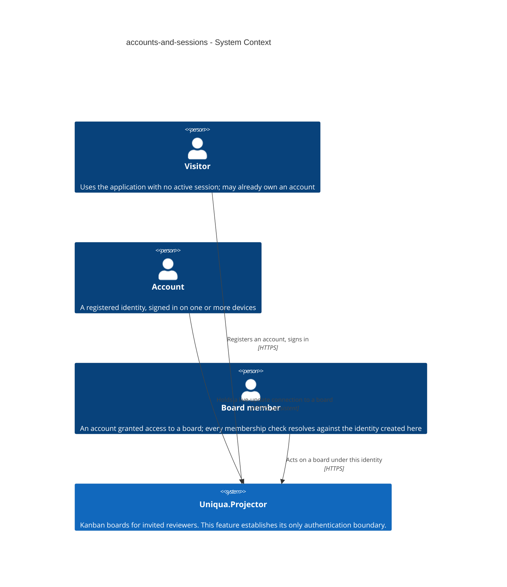
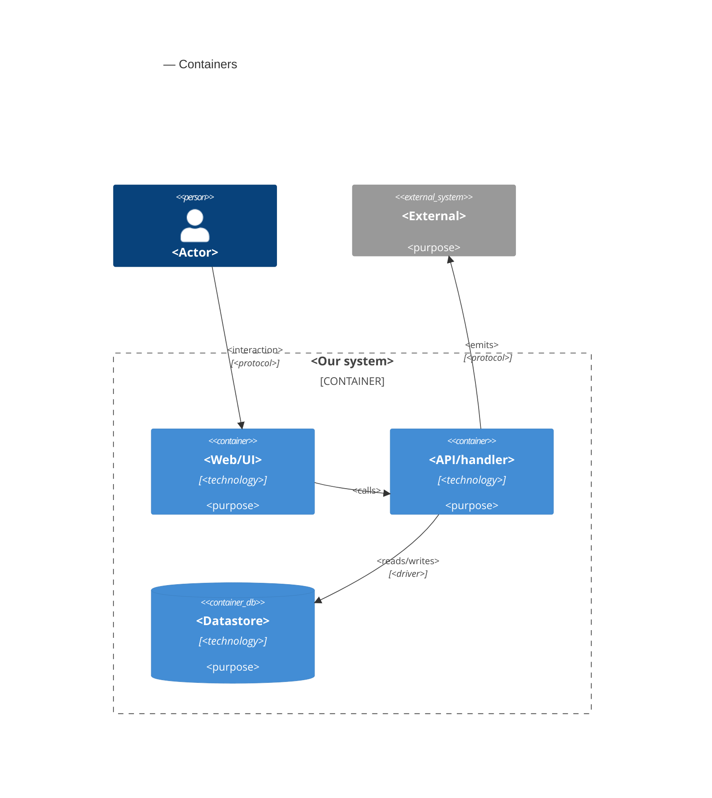

# Software Architecture Document — accounts-and-sessions

<!-- 12 Arc42 sections. Empty section → <!-- N/A: <one-line reason> -->. -->
<!-- C4 Context (L1) lives inline in §3. C4 Container (L2) lives inline in §5. -->
<!-- Numbers in §10 come VERBATIM from spec.md §6 NFR — no inventing, no rounding. -->

## 1. Introduction and goals

**Intent.** Establish the product's single authentication boundary: a stranger who opens the public link creates an account unaided, is signed in immediately, and is recognised again across days and devices — so that every later feature (boards, membership, invitations, the live-update connection) resolves against exactly one notion of who someone is. The rules that govern a session are stated in the repository and observable from outside it, because the spec's primary reader probes authentication and access control first.

**Top-3 quality goals (1-liners; full scenarios in §10):**

1. **Security of the single authentication boundary** — credentials never recoverable from the store, password guessing made progressively futile, and no enumeration channel beyond the two the spec deliberately accepts.
2. **Session continuity with a bounded lifetime** — a session survives a browser close and a redeploy of the instance, yet ends on a stated schedule: 14 days idle, 90 days absolute.
3. **Unattended reachability within the latency budget** — a visitor gets from the public link to a signed-in state with no intervention from the owner, inside the spec's p95 targets.

When these three conflict, security wins: this feature is the one the fifteen-minute read examines first.

**Stakeholders.**

| Role | Interest | Sign-off owner? |
|---|---|---|
| visitor | Registers and signs in unaided | No |
| account | Holds sessions; expects continuity and protection from guessing | No |
| board member | Downstream consumer — every membership check resolves against the account established here | No |
| reviewing engineer | Reads how authentication and access control are done, in fifteen minutes; spec §1's primary user | No |
| Tech Lead | SAD approval | Yes |
| Security Lead | §6.1 controls and the authentication boundary | Yes |

<!-- `reviewing engineer` is not a CONTEXT.md glossary role; it is kept because spec §1 names it the
     primary user. Candidate for `/sdd:glossary` rather than an invented definition here. -->

<!-- Decision overrides (¶4) — populated by the critic resolution loop, empty otherwise. -->

## 2. Constraints

**Technical.**
- C# on **.NET 10 (LTS)** — the target framework of the foundation. Unverified at this commit; see the §11 row, which carries the fallback to .NET 8 (LTS).
- **ASP.NET Core 10** — HTTP API, and it also serves the built client (one origin, per ADR 0003).
- **ASP.NET Core Identity** — the account store, password hashing and sign-in primitives.
- **ASP.NET Core SignalR** — the live-update connection (ADR 0004); authorised by the same cookie.
- **Entity Framework Core 10** — the only persistence mechanism; `DbContext` never reaches Api or Domain.
- **SQL Server** — the single relational store (ADR 0002).
- **TypeScript 5 / React 19** with Vite, Tailwind CSS, shadcn/ui (vendored as source) and TanStack Query.
- **Four-project layering:** `Api → Application → Domain` and `Infrastructure → Application → Domain`; Domain references nothing. Api references Infrastructure only to register implementations at startup.
- **One origin for client and API** (ADR 0003) — splitting them across two hosts is off the table, which also constrains §7.

**Organisational.**
- One developer (the owner); no second reviewer is available in-team.
- First public deployment is fixed at **week 2**; the overall schedule is 8–10 weeks (ADR 0004).
- This feature is sized **M**; it is the first feature after the skeleton and blocks every later one.
- A **security review is required** before it ships (spec §6.1) — it introduces the product's only authentication boundary and its first personal data.

**Conventions.**
- `docs/architecture-map.md` §Conventions is the convention file until `/sdd:scaffold` turns its target paths into real anchors.
- **IDs:** application-generated GUID version 7 (`Guid.CreateVersion7()`) — time-ordered, and it does not leak record counts.
- **Errors:** every failure response is an RFC 9457 `ProblemDetails` from one exception handler; endpoints never build an ad-hoc error shape.
- **Migrations:** EF Core migrations generated from the model, one per schema change, reviewed as SQL before they are applied.
- **Domain rules live in Domain** — an invariant is enforced by the entity, not by a use case or an endpoint.
- **Tests:** integration through `WebApplicationFactory` against a SQL Server container, plus unit tests on Domain invariants.
- **ADR numbering is one sequence across the whole repository.** This feature's ADRs live in `docs/features/accounts-and-sessions/adr/` but continue the numbering of `docs/adr/0001`–`0005`, starting at **0006**. This deliberately departs from the per-feature-from-0001 default, because the spec already cites «ADR 0003» and a second document with that number would make every bare reference ambiguous. Later features and `decide-adr` follow the same rule.
- **Licensing:** every dependency must be permissively licensed (MIT / Apache-2.0 / BSD-style). No copyleft (GPL / LGPL / AGPL) component is part of this foundation, and none may be introduced without replacing it.

**Regulatory / external.**
- **Data classification: confidential** — credentials plus the real email addresses of real people (spec §6.1).
- **Email address retained indefinitely** — spec §3 rules out an account-removal path, so there is no deletion route by design; recorded as accepted debt in §11.
- **Password never stored in a recoverable form**; **display name** is deliberately visible to other board members.
- **No password recovery, no address verification, no third-party identity** (spec §3; ADR 0003 rejected delegating identity).
- No formal compliance regime applies — the audience is a small set of invited reviewers rather than a user base, and deletion-on-request is deliberately out of scope rather than overlooked.

## 3. Context and scope

This feature is the product's front door and its only authentication boundary. A person arrives at the public link as a **visitor**, becomes an **account** by registering unaided, and is recognised again on later visits and on other devices; every later capability — board membership, invitations, the live-update connection — resolves authorisation against the identity established here rather than inventing a second one. The trust boundary is the application process: everything the browser sends (the session cookie included) is untrusted input until the request has been authenticated, and the cookie is unreadable by page scripts so that a cross-site scripting hole does not hand over a session.

<!-- brownfield: N/A — greenfield repo (no source at this commit; the foundation is the target
     described in docs/architecture-map.md, mode greenfield-bootstrap). -->

**External systems (in / out):**

| Actor or system | Type | Interaction |
|---|---|---|
| visitor | Person | Registers an account from the public link; signs in on return |
| account | Person (a registered identity) | Is recognised across days and devices; signs out; holds live-update connections |
| board member | Person | Downstream consumer — acts on a board under the identity established here; no board exists yet at this feature's close |
| — none — | System (external) | **Deliberate.** No identity provider (ADR 0003 rejected delegating identity), no mail service (spec §3 rules out password recovery and address verification, both of which would require one), no third-party of any kind. The feature has no outbound integration at all. |

**C4 Context (L1):**



## 4. Solution strategy

<!-- 🎯 Why: the 3–4 STRATEGIC PILLARS every ADR grows from. Without §4 each ADR looks random —
     there's no umbrella. ⭐ The densest section — the blast-radius gate fires almost always here
     (decisions are irreversible + multi-module).
     📋 Write: 3–4 choices; each a heading + 2–3 sentences of rationale.
     📌 «Store content as a table of typed blocks» is a pillar — ADR-0001 grows from it. -->

**Top strategic choices (the seeds for ADRs):**

1. **<e.g. Module isolation through events>** — <2–3 sentences citing quality goals + constraints>.
2. **<e.g. Single-store persistence>** — <2–3 sentences>.
3. **<e.g. Server-rendered read side>** — <2–3 sentences>.

Each tactical decision in later sections should trace to one of these seeds. Tactical decisions that *contradict* a strategic choice are red flags — surface them in §11.

## 5. Building block view

<!-- 🎯 Why: INTERNAL DECOMPOSITION — modules, containers, datastores. The static topology: who
     may talk to whom. Without §5, §6 (the flows) has no vocabulary of participants.
     📋 Write: 1 ¶ on the style (layered / hexagonal / clean / event-driven) + a folder tree + a
     C4Container block.
     📌 Draw ONE Container per declared `target_surface` (frontmatter): a fullstack
     [backend-service, web-frontend] = a backend-API container + a web/SPA container; a
     [backend-service, mobile-app] = the API + the mobile app. The Container(web, …) line below is
     just one surface's container — swap/add per what was declared in §4. → _shared/surfaces.md
     📌 e.g. «web app, content API, media worker, datastore, object store, CDN». -->

<One paragraph: layered / hexagonal / clean / event-driven, and why.>

**Internal decomposition:**

```
<e.g. modules/<feature>/>
├── domain/       <entities + sentinel errors>
├── app/          <use cases / services>
├── infra/        <repository + integration impl>
├── ports/        <handlers, DTOs, error mapping>
└── wiring        <self-wiring entry point>
```

**C4 Container (L2):** <!-- syntax → references/c4-mermaid-syntax.md. Real names, no <placeholder> stubs. ONE Container per declared target_surface (frontmatter); the web container below is one example surface. -->



## 6. Runtime view

<!-- 🎯 Why: the RUNTIME FLOW of 1–2 critical scenarios — who talks to whom, when, in what order.
     Without §6, §5 is just boxes with no life.
     📋 Write: a Mermaid sequenceDiagram. Participants are names from §5 (don't invent new ones).
     Messages are semantic («saves a draft»), NO HTTP verbs / paths / status codes — endpoint-level
     sequences arrive at the `api` stage.
     📌 e.g. «author → web: composes draft → web → content API: save». Seed the primary flow(s) here;
     the `sequences` stage then covers every §5 AC (no cap). Never N/A for M+; XS/S keeps ≥1 happy-path flow. -->

**Critical flow 1: <flow name>**

```mermaid
sequenceDiagram
    actor Actor
    participant Web
    participant Service
    participant Store
    Actor->>Web: <action>
    Web->>Service: <call>
    Service->>Store: <write>
    Store-->>Service: ok
    Service-->>Web: result
    Web-->>Actor: confirmation
```

**Critical flow 2: <e.g. async event propagation>** — <if applicable, otherwise N/A>.

## 7. Deployment view

<!-- 🎯 Why: the TOPOLOGY DevOps must know without reading the deploy charts — how many replicas,
     where the background worker lives, AT WHAT NUMBERS we scale.
     📋 Write: 2–3 sentences on topology + monitoring + concrete threshold numbers.
     📌 e.g. «500 authors → partition by quarter» (not «we'll think about scale later»).
     🎯 N/A allowed for XS/S that reuses an existing deployment unit with no change.
     Deployment-diagram scaffold → templates/deployment.md. -->

<Topology in 2–3 sentences. Where it runs, replicas, scaling thresholds.>

**Monitoring:**
- <Metrics — e.g. `<metric_name>`>
- <Alerts — e.g. «worker lag > 10 min → page on-call»>
- <Tracing — e.g. spans on the request boundary>

**Scaling thresholds:**
- <e.g. comfortable in one table up to N rows/year>
- <e.g. partition by quarter above N rows/year>

<!-- For XS/S with no deployment change: <!-- N/A: reuses existing deployment unit, no infra change --> -->

## 8. Crosscutting concepts

<!-- 🎯 Why: CROSS-CUTTING PATTERNS spanning several modules: logging, errors, authorization, ID
     strategy, events, caching. ⭐ The second-densest section. A pattern inside one module is NOT
     here; a project-wide convention belongs in the convention file.
     📋 Write: a table — concept / convention / where defined. One row per concept.
     📌 e.g. «sortable time-based IDs generated in the app layer» as a default from the convention file. -->

| Concept | Convention | Where defined |
|---|---|---|
| Logging | <e.g. structured, fields `module=<name>`> | <convention file §X or here> |
| Authentication | <e.g. token-based via middleware> | <convention file §X> |
| Error handling | <e.g. domain sentinel → ports error mapping → JSON> | <convention file §X> |
| ID strategy | <e.g. sortable time-based ID in the app layer> | <convention file §X> |
| Internationalisation | <e.g. N/A, single language> | — |
| Observability | <e.g. tracing on the request boundary> | — |
| Events | <module-specific patterns, if any> | <here> |

## 9. Architecture decisions

<!-- 🎯 Why: the REVERSE INDEX onto the adr/ folder. `ls adr/` gives the files; §9 gives the
     semantics — why they exist, which SAD section they attach to, what status.
     📋 Write: a 4-column table, one row per ADR. Mixed status is fine.
     📌 e.g. «0001 | Store content as a table of typed blocks | Accepted | §4». -->

| # | Title | Status | Section |
|---|---|---|---|
| <NNNN> | <imperative — e.g. "Use a sliding-window counter for rate limiting"> | Accepted | §<N> |
| <NNNN> | <imperative — e.g. "Co-locate the worker in the API process"> | Accepted | §<N> |

ADR files live under `docs/features/<slug>/adr/NNNN-<title>.md`.

## 10. Quality requirements

<!-- 🎯 Why: the QUALITY TREE — take a goal from §1 and break it into concrete leaves: tests,
     metrics, configs, drills. ⭐ Without §10, §1 is a manifesto. With §10 each declaration maps
     to something PROVABLE.
     📋 Write: per §1 goal — When / Then / How-verify. Numbers from spec §6 NFR VERBATIM (don't
     round ≤250ms to ≤300ms — that's a critic F6 hit).
     📌 e.g. «p95 ≤ 500 ms on a block update, verified by a 100 req/s load test». -->

Each top-3 goal from §1 expanded into a full scenario:

**QG-1. <quality attribute>**
- **When:** <trigger condition>
- **Then:** <expected behaviour with numbers from spec §6 NFR>
- **How verify:** <test / chaos drill / load test / metric>

**QG-2. <quality attribute>**
- **When:** <trigger>
- **Then:** <expected>
- **How verify:** <how>

**QG-3. <quality attribute>**
- **When:** <trigger>
- **Then:** <expected>
- **How verify:** <how>

## 11. Risks and technical debt

<!-- 🎯 Why: ⭐ collects EVERYTHING that can break — not only the technical. Without §11 risks get
     discussed at standups and lost; debt lives only in the head of whoever accepted it.
     📋 Write: a risk/debt table — severity — mitigation — owner. Accepted debt in its own block.
     📌 The first risk is often a product risk, not a technical one. That's normal. -->

<!-- Severity literals: Low / Medium / High for regular risks; "Open question" for rows created by
     a Save-as-OQ resolution during the Socratic walk (see references/socratic.md). -->

| Risk / debt | Severity | Mitigation | Owner |
|---|---|---|---|
| <e.g. Worker lag may reach hours during a downstream outage> | Medium | <alert >10 min, on-call playbook, retry backoff> | <DevOps> |
| <e.g. No event-schema versioning in v1> | Medium | <ADR-NNNN planned for v2, tolerate unknown fields> | <Backend> |
| Open architectural decision: <decision-headline> | Open question | Resolve before <stage trigger or YYYY-MM-DD>; <inline rationale from the Save-as-OQ> | <owner> |

**Accepted debt (acceptable in v1, plan to fix later):**
- <e.g. the entity is immutable / unversioned — OK for v1, may need audit versioning in v2>

## 12. Glossary

<!-- 🎯 Why: ⭐ the DOMAIN GLOSSARY that ends arguments a year later («checkpoint — weekly or
     biweekly? quarter — calendar or fiscal?»).
     📋 Write: a term / meaning table. Business + technical terms mixed.
     📌 e.g. «Lesson | a unit inside a course made of blocks (text, video)». -->

| Term | Meaning |
|---|---|
| <e.g. domain object A> | <its meaning in this domain> |
| <e.g. domain object B> | <its meaning> |
| <e.g. domain invariant name> | <the rule, in plain language> |
