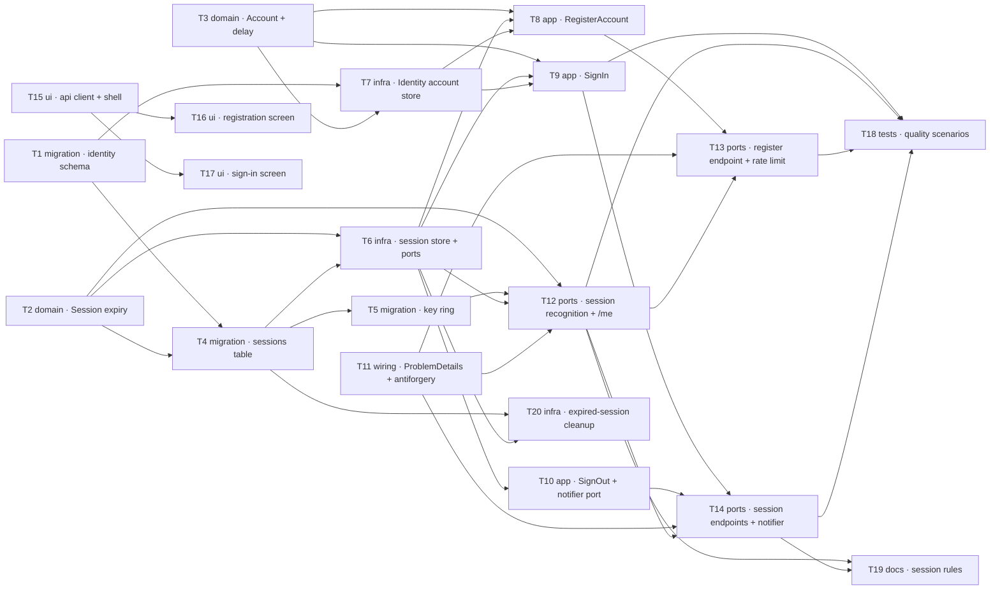

# Epic — accounts-and-sessions

> **Spec:** [spec.md](../spec.md) · **Design:** [sad.md](../sad.md) · **Data model:** [data-model.md](../data-model.md) · **API:** [openapi.yaml](../contracts/openapi.yaml) · **ADRs:** [adr/](../adr/)

## Goal

Shipping this epic gives the product its single authentication boundary: a stranger reaches a signed-in state from the public link with no help from the owner, is recognised again across days and devices, and can end that recognition deliberately. Every later feature — boards, membership, invitations, the live-update connection — resolves against the one account identity created here (spec §2). The four rules governing a session are also written into the repository where the fifteen-minute read finds them, which is the committed approach's own success measure (spec §7 KPI 4).

## Scope

- **In:** the three schemas (Identity, `Sessions`, the data-protection key ring), the `Account` and `Session` domain entities and their rules, the session and account ports plus their EF Core and Identity implementations, the register / sign-in / sign-out / recognise-session paths, the Api session-authentication handler and cookie, the registration rate limit, the antiforgery and `ProblemDetails` crosscutting, the expired-session cleanup service, the React registration / sign-in screens and the signed-in shell, the three quality-scenario test suites, and the written session rules.
- **Out:** password recovery, address verification, account removal, profile editing, third-party sign-in, account-level roles, and any general owned-object abstraction (spec §3). The SignalR hub itself is not built here — T14 supplies the revocation notifier that sits where it will be (AC-09's verification is deferred to roadmap step 8).

## Task map

**Waves and parallelism.** Wave 1 starts five tasks at once: the first migration (T1), both pure-domain tasks (T2, T3), the Api crosscutting (T11), and the head of the UI branch (T15). The **UI branch (T15 → T16, T17) runs parallel to the entire backend branch** — it is built against `contracts/openapi.yaml` and tested against a mocked transport, so it never waits on an endpoint. Two lanes are serialized: the **migration lane** (T1 → T4 → T5, as `implement` always serializes `layer: migration`) and the **endpoint lane** (T13 and T14 share `AccountEndpoints.cs`; `implement` may close them under one gate with both `SDD-Task` trailers). T11, T12, T13 and T20 share `Program.cs`, which their dependency order already sequences.

## Tasks

See [tracker.md](./tracker.md) for status. Machine contract: [tasks.json](../tasks.json).

| # | Task | Layer | Blocked by | DoD (short) |
|---|---|---|---|---|
| T1 | [Identity account model + identity-schema migration](./01-identity-schema-and-account-model.md) | migration | — | Generated SQL diffed against staged `01_*`; both unique indexes refuse a collision in a test |
| T2 | [Session entity owning the 14-day and 90-day rules](./02-session-entity-and-expiry-rules.md) | domain | — | Unit tests pass on both sides of both boundaries; `IsExpired` is the only place 14/90 appears |
| T3 | [Account entity, sentinel errors, progressive-delay rule](./03-account-invariants-and-guessing-delay.md) | domain | — | Delay floors (≥ 2 s at 6th, ≥ 30 s at 10th) and the 15-minute reset pass as unit tests |
| T4 | [Sessions table migration with its three indexes](./04-sessions-table-migration.md) | migration | T1, T2 | Generated SQL diffed against staged `02_*`; applies and reverts; no index on `LastSeenAt` |
| T5 | [Data-protection key-ring migration](./05-data-protection-key-ring-migration.md) | migration | T4 | Two instances over one database share a key ring in a test — redeploy survival without a deploy |
| T6 | [Session ports + EF Core implementation](./06-session-store-and-ports.md) | infra | T2, T4 | Find is one primary-key query; the activity stamp writes at most once an hour |
| T7 | [Identity behind IAccountStore, lockout off, hashing tuned](./07-identity-account-store.md) | infra | T1, T3 | Hashing-parameter test holds the ≥ 100 ms floor; lockout asserted off; dummy verification comparable |
| T8 | [RegisterAccount use case](./08-register-account-use-case.md) | app | T3, T6, T7 | Happy path writes one account + one session; every refusal writes nothing |
| T9 | [SignIn use case with the delay](./09-sign-in-use-case.md) | app | T3, T6, T7 | AC-05 and AC-05b responses identical and comparably timed; delay curve holds on a controllable clock |
| T10 | [SignOut use case + revocation port](./10-sign-out-use-case-and-revocation-port.md) | app | T6 | Notifier called once per revocation; the account's other sessions stay live |
| T11 | [ProblemDetails handler + antiforgery](./11-problem-details-and-antiforgery.md) | wiring | — | All eight `accounts.*` codes produced with the contract's status and wording; no endpoint builds its own body |
| T12 | [Session recognition handler, cookie, key ring, `/me`](./12-session-authentication-handler.md) | ports | T2, T5, T6, T11 | Every flow-5 branch tested; no 14/90 literal in `Api`; cookie httpOnly + secure + same-site |
| T13 | [`POST /api/v1/accounts` + registration rate limit](./13-registration-endpoint-and-rate-limit.md) | ports | T8, T11, T12 | AC-01 end to end; the 6th registration in a minute refused `429` with a usable `Retry-After` |
| T14 | [Sign-in / sign-out endpoints + hub notifier](./14-session-endpoints-and-hub-notifier.md) | ports | T9, T10, T11, T12 | Sign-out clears the cookie, revokes exactly one session, calls the notifier once |
| T15 | [Web API client, session bootstrap, signed-in shell](./15-web-session-bootstrap-and-shell.md) | ui | — | Four shell states tested; a `401` lands on the sign-in form with no reload; display name never the address |
| T16 | [Registration screen, all six states](./16-registration-screen.md) | ui | T15 | Every field keeps its value after each refusal; the `429` names the wait in seconds |
| T17 | [Sign-in screen, one indistinguishable refusal](./17-sign-in-screen.md) | ui | T15 | Refusal renders identically for a wrong password and an unknown address; no format/length pre-check |
| T18 | [Three quality-scenario suites + anti-lockout regression](./18-quality-scenario-tests.md) | tests | T9, T12, T13, T14 | QG-1/2/3 pass; the anti-lockout regression fails when lockout is flipped on; redeploy row explicitly skipped |
| T19 | [The four session rules, written down](./19-write-down-the-session-rules.md) | docs | T12, T14 | `docs/session-rules.md` states all four rules, each linking its enforcing file and proving test |
| T20 | [Expired-session cleanup hosted service](./20-expired-session-cleanup-service.md) | infra | T4, T6 | Aged and long-revoked rows removed, live ones kept; a failing sweep never stops the host |

## Risks / Hard rules

Constraints a task must not violate — each is inlined verbatim in the tasks it binds:

- **Domain rules live in Domain** (sad §2, architecture-map §Conventions). The 14-day / 90-day rules live on `Session`, the delay curve on the `GuessingDelay` rule — never in a handler, a use case or an endpoint. T12's DoD enforces this with a `grep` for `14`/`90` in `Api`.
- **No `DbContext` reaches Api or Domain** (architecture-map §Conventions). Persistence is only ever behind an Application-declared port.
- **One error shape** (sad §8): RFC 9457 `ProblemDetails` from one handler; a refusal carries exactly the reason its AC specifies and no more — AC-05 must not reveal which of address or password was wrong.
- **No lockout, ever** (ADR 0010, sad §11). The framework's lockout stays off; the sad §11 risk row predicts someone re-enabling it, and T18's regression test is the mitigation.
- **Never log an email address on a sign-in failure**, nor the cookie, the session reference or any credential (sad §8) — otherwise the log becomes the enumeration oracle AC-05b exists to close.
- **One styling mechanism** (architecture-map §Frontend): Tailwind utilities, composing the vendored shadcn/ui primitives. A second mechanism or a re-invented primitive is a review finding, not a preference.
- **Migrations are staged, not live** (data-model §Promotion): `implement` declares the model, generates the EF Core migration, and **diffs it against the staged SQL**. A difference is a finding to reconcile, never a file to overwrite.
- **`Guid.CreateVersion7()` for every identifier** (sad §2) — except `DataProtectionKeys.Id`, whose shape the framework owns (a divergence recorded in data-model, not invented here).
- **Antiforgery on every state-changing request** (sad §8, ADR 0003, ADR 0007) — the cookie alone is never proof of intent.

Open items these tasks carry rather than close:

- **OQ-API-1** — the antiforgery token has no drawn acquisition path; owner `sequences`. T11 implements the framework's standard path and records the choice; `openapi.yaml` is left unedited so `/sdd:api --reconcile` can bind it.
- **AC-09** and **redeploy survival** are binding commitments whose verification is deferred to roadmap steps 8 and 4 (spec §5). T14 builds the notifier and tests the call; T18 records the redeploy row as an explicitly skipped test.
- **Spec §8 open question 2** — whether traffic on a live-update connection counts as activity for the 14-day window. Standing default: it does not. Nothing in these tasks depends on it, and T2's `ShouldStampActivity` is where it would land.
- **The skeleton does not exist yet.** Every `src/` and `tests/` path above is a target path from `architecture-map.md` (`mode: greenfield-bootstrap`). `/sdd:scaffold` must materialize it before `/sdd:implement` runs T1.
