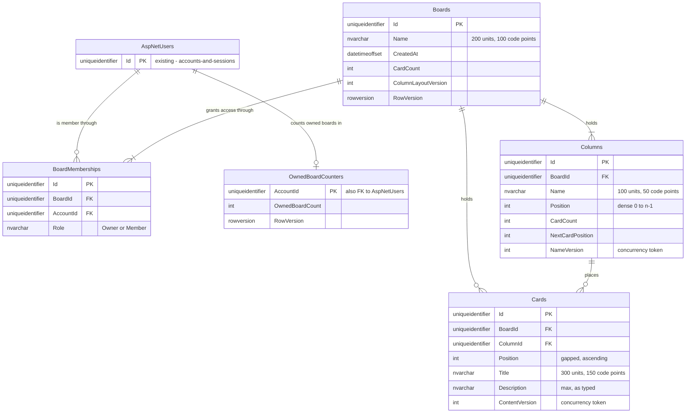

# Data model — boards-columns-cards

> **Sources:** spec §5 (AC-01…AC-28, the Text rule, the stale-change rule), §6 (content ceilings);
> sad §4–§8 and flows 1–13; ADRs 0013 (membership records), 0015 (board concurrency token),
> 0016 (version counters), 0017 (dense column / gapped card positions), 0018 (card summaries);
> `CLAUDE.md` (GUID v7 ids, EF Core migrations); the live schema in
> `src/Uniqua.Projector.Infrastructure/Migrations/` and `Accounts/*Configuration.cs`.

**Conventions followed, all detected from the repository rather than chosen here:**
SQL Server; PascalCase plural table names and PascalCase columns (`Sessions`, `AccountId`); key
and index names `PK_<Table>`, `FK_<Table>_<Principal>_<Column>`, `IX_<Table>_<Cols>`; primary
keys `uniqueidentifier`, generated by the application with `Ids.New()`
(`ValueGeneratedNever`); `datetimeoffset` for instants, set by the application from `IClock` and
never by a database `DEFAULT`; no `UpdatedAt` columns, and a timestamp only where a rule or query
reads it; hard delete; **no `CHECK` constraints**, because `SessionConfiguration` records the rule
that restating a domain rule in the store puts one rule in two places. **Uniqueness promises are
database facts** (`ProjectorUserConfiguration`: unique email and display name).

**Text sizing: code points, stored as UTF-16.** The spec's Text rule counts length in Unicode
code points, but SQL Server's `nvarchar(N)` counts UTF-16 code units, and a code point outside the
BMP (most emoji) takes two. So every text column is sized at **2 × the spec limit**. That lets a
name of 100 emoji fit, and the domain's `BoardText` stays the only thing that enforces the real
limit. A description of 10,000 code points can take up to 20,000 units, which is more than
`nvarchar(4000)` allows, so it is `nvarchar(max)`.

## ER diagram

## Entities

Two aggregates, both set by the SAD rather than chosen here. **`Board`** is the root of `Columns`
and `BoardMemberships`, and the consistency record for `Cards` (ADR 0015). A card is a separate
entity read and written one at a time (sad §5), but the Board admits and removes cards through its
counters. **`OwnedBoardCounter`** is a root of its own, one per account (ADR 0015, Consequences).

### `Boards`

| Column | Type | Constraints | Notes |
|---|---|---|---|
| `Id` | `uniqueidentifier` | PK, app-generated (GUID v7) | |
| `Name` | `nvarchar(200)` | NOT NULL | Trimmed by `BoardText`; 1–100 code points (AC-01, AC-02, AC-19). Not unique (AC-01) |
| `CreatedAt` | `datetimeoffset` | NOT NULL | From `IClock`. The board list is ordered by it, newest first (AC-04) |
| `CardCount` | `int` | NOT NULL | Cards on the board. The Board refuses the 1,001st (AC-15) |
| `ColumnLayoutVersion` | `int` | NOT NULL | ADR 0016: moves when a column is added, moved or deleted, and never on a rename (AC-24, AC-24b). Starts at 1 |
| `RowVersion` | `rowversion` | NOT NULL, concurrency token | ADR 0015: every structural change updates this row, so simultaneous ones collide. It is internal and never sent to the client |

**Aggregate root:** root.
**Access patterns:** member-scoped load (flows 2, 5–11) → seek on `PK_Boards`, reached through
`IX_BoardMemberships_BoardId_AccountId`. The board list (flow 4) joins from the account's
memberships to `PK_Boards`.
**Constraints:** PK only. There is **no owner column**: ADR 0013 puts ownership in the membership
record's role, so it has one source of truth.
**Deletion (AC-20):** hard. It cascades in the store to `Columns`, `Cards` and `BoardMemberships`
in one statement (flow 11). The owner's `OwnedBoardCounters` row is decremented in the same
transaction by the use case.

### `Columns`

| Column | Type | Constraints | Notes |
|---|---|---|---|
| `Id` | `uniqueidentifier` | PK, app-generated (GUID v7) | |
| `BoardId` | `uniqueidentifier` | NOT NULL, FK → `Boards(Id)` ON DELETE CASCADE | |
| `Name` | `nvarchar(100)` | NOT NULL | Trimmed; 1–50 code points (AC-05, AC-08). Not unique on its board (AC-05) |
| `Position` | `int` | NOT NULL | Dense 0..n-1, renumbered by the Board on every add, move and delete (ADR 0017). **Not unique in the store** (see Indexes) |
| `CardCount` | `int` | NOT NULL | The Board refuses to delete a column whose count is above 0 (AC-09, AC-10b) |
| `NextCardPosition` | `int` | NOT NULL | One past the highest card position ever used in this column (ADR 0017). Read and advanced under the board guard |
| `NameVersion` | `int` | NOT NULL, EF concurrency token | ADR 0016: moves only on a rename (AC-06b), and is the write condition on this row. Starts at 1 |

**Aggregate root:** `Boards`. At most 20 per board (AC-11), always at least 1 (AC-10). New boards
get To do / In progress / Done at positions 0, 1, 2 (AC-01). The domain creates them; they are not
seed data.
**Access patterns:** the board's columns in position order (flows 2, 5–9, loaded with the board)
→ `IX_Columns_BoardId_Position`.
**Constraints:** FK → `Boards(Id)`. There is no `CHECK` on `Position`, `CardCount` or
`NextCardPosition`, per the repository's rule.

### `Cards`

| Column | Type | Constraints | Notes |
|---|---|---|---|
| `Id` | `uniqueidentifier` | PK, app-generated (GUID v7) | |
| `BoardId` | `uniqueidentifier` | NOT NULL, FK → `Boards(Id)` ON DELETE CASCADE | Stored so that "the card through this board" (flows 2, 5, 10) is one predicate on one row: `Id = @card AND BoardId = @board` |
| `ColumnId` | `uniqueidentifier` | NOT NULL, FK → `Columns(Id)` ON DELETE NO ACTION | A plain FK. The Board aggregate decides that the column is on the card's board (AC-26); this was a design decision, not a restatement in the store. It is NO ACTION because SQL Server refuses a second cascade path into `Cards`, and because the store then backs up AC-09: a column row that still has cards cannot be deleted |
| `Position` | `int` | NOT NULL | Gapped and ascending: set from the column's `NextCardPosition` (ADR 0017). A deletion leaves a gap (AC-18) |
| `Title` | `nvarchar(300)` | NOT NULL | Trimmed; 1–150 code points (AC-12, AC-14) |
| `Description` | `nvarchar(max)` | NOT NULL | Stored exactly as typed, never trimmed; ≤ 10,000 code points. **An empty string means no description**, so there is one representation of "none" and no NULL |
| `ContentVersion` | `int` | NOT NULL, EF concurrency token | ADR 0016: moves when the title or description changes (AC-23), and is the write condition for an edit or delete. Starts at 1 |

**Aggregate root:** not inside the Board aggregate's object graph, but admitted, counted and
removed through it (sad §5, ADR 0015). At most 1,000 per board (AC-15).
**Access patterns:** card summaries for one board (flow 5, ADR 0018) →
`IX_Cards_BoardId_ColumnId_Position`, which covers the query. A single card through its board
(flows 2, 5, 10) → `PK_Cards` seek plus a residual `BoardId` predicate.
**Constraints:** FK → `Boards(Id)`, FK → `Columns(Id)`. Position is unique within a column by
construction (ADR 0017, Neutral) and not by an index, because roadmap step 5's reorder technique
would have to drop one.

### `BoardMemberships`

| Column | Type | Constraints | Notes |
|---|---|---|---|
| `Id` | `uniqueidentifier` | PK, app-generated (GUID v7) | sad §8: memberships take `Ids.New()` like every entity |
| `BoardId` | `uniqueidentifier` | NOT NULL, FK → `Boards(Id)` ON DELETE CASCADE | |
| `AccountId` | `uniqueidentifier` | NOT NULL, FK → `AspNetUsers(Id)` ON DELETE NO ACTION | See the deletion note below |
| `Role` | `nvarchar(10)` | NOT NULL | `Owner` or `Member` (ADR 0013), stored as the enum name through `HasConversion<string>()` so the reviewed SQL reads as words |

**Aggregate root:** `Boards`. Board creation writes one `Owner` record (AC-01). In this feature,
`Member` records are inserted only by integration-test setup (spec §3).
**Access patterns:** the member-scoped load (ADR 0014; flows 2, 5–11): `BoardId = @b AND
AccountId = @a` → `IX_BoardMemberships_BoardId_AccountId`. The board list (flow 4):
`AccountId = @a` → `IX_BoardMemberships_AccountId_BoardId`.
**Constraints:** UNIQUE (`BoardId`, `AccountId`), one record per board and account (ADR 0013).
UNIQUE (`BoardId`) filtered `WHERE [Role] = N'Owner'` enforces exactly one owner per board,
following the precedent that uniqueness promises are database facts (confirmed 2026-09-24).
**Deletion:** the record cascades with its board. Deleting an account is **refused** while it holds
a membership (NO ACTION): a cascade would leave a board with no owner, invisible to everyone and
still stored. No feature deletes accounts today. <!-- TBD: the feature that first deletes an account decides what happens to its boards -->

### `OwnedBoardCounters`

| Column | Type | Constraints | Notes |
|---|---|---|---|
| `AccountId` | `uniqueidentifier` | PK, FK → `AspNetUsers(Id)` ON DELETE CASCADE | The key is the account's id and is not generated. There is one row per account that has ever created a board |
| `OwnedBoardCount` | `int` | NOT NULL | Boards this account owns. Creation refuses the 51st (AC-03); a board deletion decrements it (flow 11) |
| `RowVersion` | `rowversion` | NOT NULL, concurrency token | ADR 0015: two simultaneous creations by one account collide here and are re-decided |

**Aggregate root:** root (per account). The account's Identity row is not used, because its
`ConcurrencyStamp` belongs to Identity (ADR 0015).
**Access patterns:** read and update by account on every board creation and deletion (flows 1,
11) → `PK_OwnedBoardCounters`.
**Row creation:** the row is inserted **lazily**, on the account's first board creation. If two
first creations race, both try to insert the row, and the loser's primary-key violation is treated
exactly like a token conflict: reload and re-decide (ADR 0015's bounded retry). This keeps the
accounts-and-sessions registration path untouched.

## Indexes

Every foreign key is covered by the leading column(s) of an index below, and every index serves a
query from sad §6.

| Index | Columns | Query it serves |
|---|---|---|
| `PK_Boards` | `Id` | Member-scoped board load after the membership seek (flows 2, 5–11); the flow 4 join |
| `IX_Columns_BoardId_Position` | `BoardId`, `Position` | The board's columns in position order, loaded with the board (flows 2, 5–9); FK `Columns.BoardId`, including the cascade from a board deletion. **Deliberately not unique**: EF Core writes a renumber as one `UPDATE` per row, and SQL Server checks uniqueness per statement, so swapping two positions would collide in the middle of a legal move. "Exactly 0..n-1" is the Board's invariant, checked by the spec §6 column-order test (ADR 0017, Negative; confirmed here) |
| `PK_Cards` | `Id` | One card through its board: open (flow 5), edit (flow 2), delete (flow 10), with a residual `BoardId` predicate |
| `IX_Cards_BoardId_ColumnId_Position` | `BoardId`, `ColumnId`, `Position` INCLUDE `Title`, `ContentVersion` | Card summaries for opening a board (flow 5, ADR 0018): up to 1,000 rows, returned in column and position order with no key lookups. The `INCLUDE` is what keeps the 300 ms p95 at the ceiling, because GUID v7 keys scatter one board's cards across the clustered index. Also serves FK `Cards.BoardId` and the cascade from a board deletion |
| `IX_Cards_ColumnId` | `ColumnId` | FK `Cards.ColumnId`: without it, every column deletion (flow 8) scans `Cards` to check the NO ACTION reference |
| `PK_BoardMemberships` | `Id` | Row identity only. No query reads a membership by `Id`, but the repository gives every entity a GUID v7 key |
| `IX_BoardMemberships_BoardId_AccountId` | `BoardId`, `AccountId` — UNIQUE | The member-scoped load (ADR 0014; flows 2, 5–11); ADR 0013's one-record-per-pair rule; FK `BoardMemberships.BoardId` and its cascade |
| `IX_BoardMemberships_AccountId_BoardId` | `AccountId`, `BoardId` INCLUDE `Role` | "My boards", with the owned flag, newest first (flow 4, AC-04), covered. FK `BoardMemberships.AccountId`. The join then seeks `PK_Boards` for `Name` and `CreatedAt`, and the sort runs over at most a few dozen rows, so `Boards.CreatedAt` gets no index of its own |
| `IX_BoardMemberships_BoardId_Owner` | `BoardId` — UNIQUE, filtered `[Role] = N'Owner'` | No read. It enforces exactly one `Owner` per board (ADR 0013), as a database fact |
| `PK_OwnedBoardCounters` | `AccountId` | The 50-board ceiling on creation and the decrement on deletion (flows 1, 11); FK `OwnedBoardCounters.AccountId` and its cascade |

**Considered and not added:** an index on `Boards.CreatedAt`, because the sort covers only the
caller's own few dozen boards; unique (`ColumnId`, `Position`) on cards (see `Cards`); an
alternate key (`BoardId`, `Id`) on columns for a composite card FK (declined 2026-09-24, because
the Board aggregate decides it).

## Staged migrations

| Ordinal | Files | What it does |
|---|---|---|
| 01 | `migrations/01_create_boards.up.sql` / `.down.sql` | Creates the five tables, their keys and indexes, in one transaction. The down script drops them in reverse FK order |

This is **one migration**, because the SAD asks for one (§5 and §7: "one EF Core migration for
the boards schema") and `CLAUDE.md` asks for one per schema change. The five tables are one new
aggregate on an empty slice, so all-or-nothing rollback is what a failed deploy wants. **The SQL is
the review target, not the artifact that gets applied.** `implement` writes the EF Fluent
configurations and runs `dotnet ef migrations add CreateBoards`, then checks that
`dotnet ef migrations script <previous> CreateBoards` matches `01_create_boards.up.sql` in
substance: same tables, types, nullability, keys, delete behaviours and index definitions. The
idempotence guards and the explicit transaction here are for a hand review or hand application;
EF's generated script has its own.

**No seed data.** The three default columns are created per board by the domain (AC-01), not
seeded. There is no bootstrap or lookup data: `Role` is an enum mapped to a string, not a lookup
table.

## Notes for `implement` (EF Core mapping)

- **Board deletion must not let EF delete tracked columns before their cards.** The member-scoped
  load tracks the board's columns but not its cards. If `Columns` is configured with an EF cascade
  and the board is `Remove`d, EF issues `DELETE FROM Columns …` before `DELETE FROM Boards`, and
  the `Cards.ColumnId` NO ACTION reference refuses it. Either delete the board with
  `ExecuteDeleteAsync` and let the store's cascade run (the store checks the NO ACTION reference
  only after the cascades of that single statement), or delete `Cards` for the board first in the
  same transaction. The AC-20 integration test must delete a board that **holds cards**, so this
  path is exercised.
- **A column row carries `NameVersion` as its concurrency token, and card add and delete also
  update that row** (`CardCount`, `NextCardPosition`). A concurrency exception on a column row
  during a *structural* change is therefore a retry under ADR 0015, not a stale refusal. Only a
  rename or delete of the column itself answers "renamed since you last saw it".
- **`Role`** is mapped as `HasConversion<string>().HasMaxLength(10)`. The filtered index is
  `.HasFilter("[Role] = N'Owner'")`, which must match the converted value exactly.
- **Text columns** use `HasMaxLength(2 × limit)`, and `Description` has no max length.
  Put the doubling in one place (for example `BoardText.StorageLength(limit)`), so that an
  `nvarchar` length never becomes a second statement of the rule.
- `ContentionForcer` has to learn to match `UPDATE [Boards]`, `UPDATE [Columns]`,
  `UPDATE [Cards]` and `UPDATE [OwnedBoardCounters]` (sad §2).

## Test fixtures

These follow the repository's form: extension methods on `ApiFactory` in
`tests/Uniqua.Projector.Api.IntegrationTests/Fixtures/`, alongside `AccountFixtures`, with
`example.test` addresses and no real-looking names. None of them go in migrations.

- `BoardFixtures.ABoardAsync(this ApiFactory, TestAccount owner, string name = "Test board")`:
  creates a board through the API, so the owner record, the three default columns and the owned
  counter are written by production code.
- `BoardFixtures.AMemberOfAsync(this ApiFactory, Guid boardId, TestAccount account)`: inserts a
  `BoardMemberships` row with `Role = Member` **directly through `AppDbContext`**. This is the only
  way a non-owner member exists in this feature (spec §3, ADR 0013), and it is how AC-21 and AC-22
  run on the production path.
- `BoardFixtures.ABoardWithColumnsAsync(…, int columnCount)` and `ABoardWithCardsAsync(…, int
  cardCount)` seed the board up to one short of each ceiling (19 columns, 999 cards) for AC-11,
  AC-15 and the spec §6 race pairs. They insert directly, because 999 API calls would run into the
  120-per-minute limit, and they keep `Boards.CardCount`, `Columns.CardCount` and
  `NextCardPosition` consistent with the rows they insert.
- `BoardFixtures.AnAccountOwningBoardsAsync(…, int count)` owns 49 or 50 boards for AC-03. It
  inserts directly and sets `OwnedBoardCounters.OwnedBoardCount` to match.
- Domain unit tests (`tests/Uniqua.Projector.Domain.Tests/Boards/`) build `Board`, `Column` and
  `Card` in memory through their factory methods and need no store fixture.
