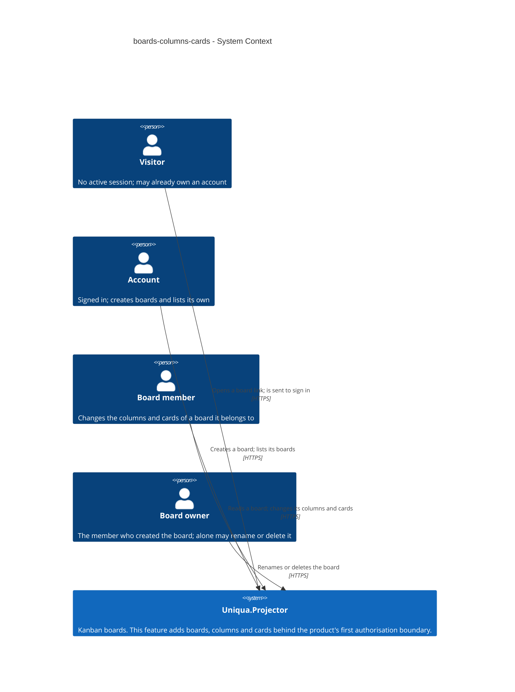
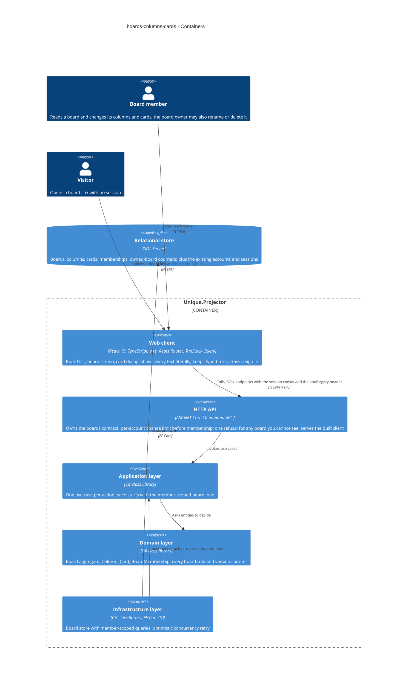

# Software Architecture Document — boards-columns-cards

<!-- 12 Arc42 sections. Empty section → <!-- N/A: <one-line reason> -->. -->
<!-- C4 Context (L1) lives inline in §3. C4 Container (L2) lives inline in §5. -->
<!-- Numbers in §10 come VERBATIM from spec.md §6 NFR — no inventing, no rounding. -->

## 1. Introduction and goals

**Intent.** Give a signed-in account a board of its own — create it, shape its columns, capture work as cards — so that a first-time visitor reaches a board holding a card, unaided and in one session: the thin path the first public deployment ships (spec §2). The same feature introduces the product's **first authorisation boundary**. Every read and change is answered only after the board-membership check; an account that is not a member cannot tell a board it does not belong to from one that never existed; and the four board rules of spec §1 — one identical refusal for non-members, every named column and card belonging to the board that was checked, no deleting a non-empty or the last column, no change applied over a newer one — are enforced by the board itself and stated where a reviewer can find them. Every later roadmap step (card move, checklist, invitations, live updates) hangs off the board, column and card introduced here.

**Top-3 quality goals (1-liners; full scenarios in §10):**

1. **An indistinguishable membership boundary** — a non-member receives one refusal, field for field identical to the refusal for a board that does not exist, whatever else is wrong with the request; a column or card of another board is treated as nonexistent; no refusal ever carries board content.
2. **No silent loss under simultaneous changes** — the content ceilings and the column rules hold under races, and a change made from an outdated view is refused and explained rather than applied over a newer one.
3. **The thin path within the latency budget** — opening a full board and making a single change stay inside the spec §6 p95 targets on the reference machine.

When these conflict, they win in that order: the boundary first, because this feature is the first authorisation boundary the fifteen-minute read examines; latency is the goal that gives way.

**Stakeholders.**

| Role | Interest | Sign-off owner? |
|---|---|---|
| account | Creates boards; finds every board it is a member of, and only those | No |
| board member | Adds, renames, reorders and deletes columns; adds, edits and deletes cards | No |
| board owner | Additionally the only one who may rename or delete the board | No |
| visitor | Follows a board link to the sign-in form without learning anything about the board | No |
| reviewing engineer | Probes access control from outside with two accounts and reads how it is enforced; spec §1's primary user | No |
| Tech Lead | SAD approval | Yes |
| Security Lead | The authorisation boundary and the spec §6.1 abuse cases; a security review is required | Yes |

<!-- `reviewing engineer` is not a CONTEXT.md glossary role; it is kept because spec §1 names it the
     primary user, exactly as the accounts-and-sessions SAD did. Candidate for `/sdd:glossary`. -->

<!-- Decision overrides (¶4) — populated by the critic resolution loop, empty otherwise. -->

## 2. Constraints

**Technical** (from the code at `c5326d2`, not from the pre-scaffold map).
- C# on **.NET 10** (`net10.0`; ASP.NET Core, EF Core and Identity packages at **10.0.12**, pinned in `Directory.Packages.props`).
- **ASP.NET Core minimal APIs** — endpoints are route handlers such as `src/Uniqua.Projector.Api/Accounts/AccountEndpoints.cs`; there are no controllers.
- **Entity Framework Core 10 on SQL Server** — `AppDbContext` (an `IdentityDbContext`) in `src/Uniqua.Projector.Infrastructure/`; Fluent configurations applied from the assembly; four migrations so far.
- **Custom session authentication** — `SessionAuthenticationHandler` recognises the `projector_session` cookie (httpOnly, Secure, `SameSite=Lax`) against a server-side session record (ADR 0008).
- **Antiforgery on every state-changing request** — `src/Uniqua.Projector.Api/Antiforgery/AntiforgerySetup.cs`; the client sends `X-XSRF-TOKEN`.
- **Use cases are plain classes returning `Result<T, TError>`** (`src/Uniqua.Projector.Domain/Result.cs`) — no mediator library; ports include `IUnitOfWork` and `IClock` (`src/Uniqua.Projector.Application/Accounts/Ports/`).
- **Rate limiting is the repository's own in-memory `SlidingWindowLimiter`** driven by `IClock` (`src/Uniqua.Projector.Api/Accounts/SlidingWindowLimiter.cs`); the framework's built-in rate limiter is not used.
- **Client:** TypeScript 5, **React 19**, Vite, Tailwind, vendored shadcn/ui (`button`, `card`, `input`, `label` so far), **TanStack Query v5**, a `request<T>()` fetch wrapper with a problem-document `ApiError` (`src/Uniqua.Projector.Web/src/api/accounts.ts`). `@dnd-kit/core` and `@dnd-kit/sortable` are already installed. **There is no client-side router yet** — the app is one shell that swaps between the visitor and the signed-in view.
- **Test fixture:** `tests/Uniqua.Projector.Api.IntegrationTests/ApiFactory.cs` boots the app against a SQL Server container and already provides `TestClock`, `ContentionForcer` (a command interceptor that forces concurrency collisions deterministically), `CommandRecorder` and `LogRecorder`.
- **Four-project layering:** `Api → Application → Domain` and `Infrastructure → Application → Domain`; Domain references nothing; Api references Infrastructure only to register implementations.
- **One origin for client and API** (ADR 0003).

**Organisational.**
- One developer (the owner); no second in-team reviewer.
- The first public deployment (roadmap step 4) ships exactly this thin path and is fixed at **week 2**; this feature is the last thing blocking it.
- Sized **M**; route `standard`.
- A **security review is required** before it ships (spec §6.1) — the product's first authorisation boundary.

**Conventions.**
- `CLAUDE.md` and `docs/architecture-map.md` §Conventions: domain rules live in Domain; every failure is an RFC 9457 problem document from `src/Uniqua.Projector.Api/ProblemDetailsSetup.cs`; each layer registers itself through one `AddXxx(IServiceCollection)` in its own `DependencyInjection.cs`.
- **IDs:** `Uniqua.Projector.Domain.Ids.New()` — GUID version 7, generated by the application, never by the database.
- **Migrations:** one EF Core migration per schema change, generated from the model, reviewed as SQL.
- **ADR numbering is one sequence across the whole repository.** This feature's ADRs live in `docs/features/boards-columns-cards/adr/` and continue from **0012** (0001–0005 and 0011 in `docs/adr/`, 0006–0010 in accounts-and-sessions), so a bare «ADR 0003» keeps meaning exactly one document.
- **Licensing:** every dependency MIT, Apache-2.0 or BSD-style; the only recorded exception is the build-time `lightningcss` (ADR 0011).

**Regulatory / external.**
- **Data classification: confidential** — a board holds whatever its members type and is shown to no one else (spec §6.1).
- **No new personal data** — the only personal datum shown is the display name established by accounts-and-sessions.
- **Deletion is final** — no archive, trash or undo (spec §3); deleting a board removes its columns and cards.
- No formal compliance regime applies.

<!-- Divergence: docs/architecture-map.md is still the pre-scaffold target (reflects_commit 16bba53,
     hosting "undecided", target paths such as src/features/board/). This SAD follows the code and the
     self-hosted host the accounts-and-sessions SAD already assumed; carried as a §11 row. -->

## 3. Context and scope

This feature turns an account into the owner of boards and a board member of them. An **account** creates a board and becomes its **board owner** and only **board member**; members shape the board's columns and cards; a **visitor** who follows a link to a board is sent to sign in and learns nothing about it. The trust boundary is the application process, and inside it a second, finer boundary begins here: **the board**. Every identifier a request carries — the board's, a column's, a card's — is untrusted until the membership check has passed for that board and the named column or card has been found *on that board*. Board, column and card text is untrusted content for display as well: it is stored as typed and always shown as literal text (spec AC-16).

<!-- brownfield: four-project .NET 10 solution with accounts-and-sessions shipped (Identity, custom
     session scheme, antiforgery, in-memory sliding-window limiter, SQL Server via EF Core); React 19
     client with no router yet. No board, column or card code exists. -->

**External systems (in / out):**

| Actor or system | Type | Interaction |
|---|---|---|
| account | Person | Creates boards; lists the boards it is a member of |
| board member | Person | Reads a board; adds, renames, reorders and deletes columns; adds, edits and deletes cards |
| board owner | Person | Additionally renames and deletes the board |
| visitor | Person | Opens a board link with no session; is shown the sign-in form and nothing about the board |
| — none — | System (external) | **Deliberate.** The feature has no outbound integration. Identity and sessions are the product's own (accounts-and-sessions), and live updates to other members are roadmap step 8, not this feature. |

**C4 Context (L1):**



## 4. Solution strategy

**Top strategic choices (the seeds for ADRs):**

1. **Build two surfaces — the backend service and the web front-end — as ADR 0006 already decided for the product.** Spec §2's first goal is a first-time visitor reaching a board holding a card unaided, which needs board screens; the API owns the contract, enforces membership, and serves the built client from one origin (ADR 0003). `target_surfaces: [backend-service, web-frontend]` is recorded in this document's frontmatter and is read — never re-derived — by `api`, `sequences`, `tasks`, `screens`, `plan-tests` and `review`. No new ADR: re-choosing the same pair has no legitimate alternative here (a backend-only feature fails spec §2's first goal), so a new record would only copy ADR 0006.
2. **Give the SPA real addresses with React Router in library mode** (ADR 0012). The SPA itself is inherited from ADR 0007; what is new is that `ux-flows.md` fixes two addressable places — the board list and one board — and AC-27 returns a visitor to the board address they came from after sign-in. The router does routing only; TanStack Query stays the sole owner of server state, and the return address is accepted only as an in-application path so it cannot become an open redirect.
3. **Grant access through one-level membership records with an owner role** (ADR 0013, closing roadmap D5 and spec §8's second open question). One record per (board, account), role `Owner` or `Member`; creating a board writes the creator's `Owner` record. The member check and the owner check read the same record, so integration tests that insert a `Member` record prove AC-21/22 on the production path — the answer to spec §6.1's *owner-only check posing as a membership check*.
4. **Enforce membership by loading the board scoped to the caller** (ADR 0014) — quality goal 1. Every use case begins with a port call that returns the board only if the caller is a member; "absent", "not a member", "deleted" and "a column or card not on this board" all become one `BoardNotAvailable` error that `ProblemDetailsSetup` maps to one refusal. Columns and cards are looked up *through* the loaded board, so cross-board substitution (AC-26) is refused by construction; the owner-only rule is a Board method. Order per spec §6.1: session → per-account change limit → member-scoped load → validation, stale check, invariants.
5. **Guard the board's invariants with an optimistic concurrency token and bounded retry** (ADR 0015) — quality goal 2, races. The board row is the consistency record for the column and card ceilings, the last-column rule and the non-empty-column rule; every structural change updates it under a `rowversion`, and a losing writer re-runs the domain rules against fresh state, up to 3 times. The 50-owned-boards cap uses the same pattern on a per-account owned-board counter.
6. **Detect stale changes with per-concern version counters in the domain** (ADR 0016) — quality goal 2, outdated views. `Card.ContentVersion`, `Column.NameVersion` and `Board.ColumnLayoutVersion` move on exactly the events spec §5's stale-change rule names; the client sends back the one it saw, and the entity refuses a mismatch — after the membership check, since the refusal carries current state.
7. **Keep column positions dense and card positions gapped** (ADR 0017). Columns hold 0..n-1, renumbered by the Board inside the concurrency guard; cards hold ascending integers appended at the column's maximum + 1, so a deletion touches no other card. How cards are reordered is left to roadmap step 5 and decision D2.

**UI architecture (web-frontend).** Client-side SPA per ADR 0007; routing per ADR 0012; server state in TanStack Query only, with a stale-change refusal patching the cached board from the current state the refusal carries (the step 8 push channel will later patch the same cache). The screens compose the vendored shadcn/ui primitives; the first board screen becomes the UI precedent `architecture-map.md` §Frontend says later screens are measured against. Screen-level design stays in `ux-flows.md` and the later `screens.md`.

Each tactical decision in later sections should trace to one of these seeds. Tactical decisions that *contradict* a strategic choice are red flags — surface them in §11.

## 5. Building block view

The style is the **clean / layered split the foundation fixes**, unchanged: `Api → Application → Domain` and `Infrastructure → Application → Domain`. This feature adds a `Boards/` slice to every layer, shaped exactly like the `Accounts/` slice accounts-and-sessions established — entities and their errors in Domain, one use-case class per action plus the ports it needs in Application, EF Core stores in Infrastructure, minimal-API endpoints in Api, and a feature folder in the client. Two of the containers below are the declared target surfaces (the HTTP API and the web client); the rest are the layers behind them and the store.

Three placements are not simply inherited:

- **The Board is the aggregate, the Card is not inside it.** The `Board` holds its columns (at most 20), its card count and each column's card count, and its version counters — everything a structural rule needs — so ADR 0015's token on one row guards every rule. Cards are a separate entity read and written one at a time, so a card change never loads 1,000 cards; the board decides whether a card may be added or a column deleted from its counts, and the `Card` decides whether its own edit is stale (ADR 0016).
- **The member-scoped load is a port method, the owner rule a domain method.** `IBoardStore.LoadForMemberAsync(boardId, accountId)` returns the board only for a member (ADR 0014); anything a request names on that board is looked up through it. `Board.EnsureOwner(accountId)` decides AC-22.
- **The per-account change limit is an Api endpoint filter.** It must run after the session is recognised and before the membership check (spec §6.1), and it depends only on the account, so it sits on the `/api/v1/boards` route group as `BoardChangeRateLimit`, reusing the existing in-memory `SlidingWindowLimiter` keyed by account id: 120 attempts per rolling minute, a slot reserved per attempt and kept whatever the outcome, an attempt it refuses not counted (AC-17). Reads are not counted.

**Internal decomposition:**

```
src/Uniqua.Projector.Domain/Boards/
├── Board.cs                 # aggregate: name, columns, card counters, ColumnLayoutVersion;
│                            # rename/delete (owner only), add/rename/move/delete column,
│                            # admit a card to a column; every structural rule of spec §5
├── Column.cs                # name, dense position (ADR 0017), NameVersion (ADR 0016)
├── Card.cs                  # title, description, gapped position, ContentVersion; edit/delete
│                            # with the stale check
├── BoardMembership.cs       # (board, account, role Owner | Member) — ADR 0013
├── BoardText.cs             # the spec §5 Text rule: Unicode-whitespace trim, code-point length
└── BoardError.cs            # not available, owner only, stale (with current state), limits

src/Uniqua.Projector.Application/Boards/
├── CreateBoard.cs  ListMyBoards.cs  OpenBoard.cs  OpenCard.cs
├── RenameBoard.cs  DeleteBoard.cs
├── AddColumn.cs  RenameColumn.cs  MoveColumn.cs  DeleteColumn.cs
├── AddCard.cs  EditCard.cs  DeleteCard.cs
└── Ports/                   # IBoardStore (LoadForMemberAsync, ListForAccountAsync, card reads),
                             # IOwnedBoardCounter; reuses IUnitOfWork and IClock

src/Uniqua.Projector.Infrastructure/Boards/
├── BoardStore.cs            # EF Core implementation; member-scoped queries
├── Configurations/          # Board (rowversion), Column, Card, BoardMembership, owned-board counter
└── (Migrations/)            # one migration for the boards schema

src/Uniqua.Projector.Api/Boards/
├── BoardEndpoints.cs        # /api/v1/boards route group; lenient binding (ADR 0014)
├── BoardChangeRateLimit.cs  # endpoint filter: AC-17, before membership
└── BoardProblems.cs         # wording of every board refusal; mapped by ProblemDetailsSetup

src/Uniqua.Projector.Web/src/
├── app/routes.tsx           # React Router routes, returnTo guard (ADR 0012)
├── api/boards.ts            # request<T>() calls; query keys for the board and the card
└── features/boards/         # BoardListScreen, CreateBoardDialog, BoardScreen, BoardColumn,
                             # CardDetailDialog, DeleteBoardDialog, BoardNotAvailable, draft keeping
```

**C4 Container (L2):**



The realtime hub of ADR 0004 is not drawn: it arrives at roadmap step 8 and plays no part in this feature.

## 6. Runtime view

<!-- 🎯 Why: the RUNTIME FLOW of 1–2 critical scenarios — who talks to whom, when, in what order.
     Without §6, §5 is just boxes with no life.
     📋 Write: a Mermaid sequenceDiagram. Participants are names from §5 (don't invent new ones).
     Messages are semantic («saves a draft»), NO HTTP verbs / paths / status codes — endpoint-level
     sequences arrive at the `api` stage.
     📌 e.g. «author → web: composes draft → web → content API: save». Seed the primary flow(s) here;
     the `sequences` stage then covers every §5 AC (no cap). Never N/A for M+; XS/S keeps ≥1 happy-path flow. -->

**Critical flow 1: <flow name>**

```mermaid
sequenceDiagram
    actor Actor
    participant Web
    participant Service
    participant Store
    Actor->>Web: <action>
    Web->>Service: <call>
    Service->>Store: <write>
    Store-->>Service: ok
    Service-->>Web: result
    Web-->>Actor: confirmation
```

**Critical flow 2: <e.g. async event propagation>** — <if applicable, otherwise N/A>.

## 7. Deployment view

<!-- 🎯 Why: the TOPOLOGY DevOps must know without reading the deploy charts — how many replicas,
     where the background worker lives, AT WHAT NUMBERS we scale.
     📋 Write: 2–3 sentences on topology + monitoring + concrete threshold numbers.
     📌 e.g. «500 authors → partition by quarter» (not «we'll think about scale later»).
     🎯 N/A allowed for XS/S that reuses an existing deployment unit with no change.
     Deployment-diagram scaffold → templates/deployment.md. -->

<Topology in 2–3 sentences. Where it runs, replicas, scaling thresholds.>

**Monitoring:**
- <Metrics — e.g. `<metric_name>`>
- <Alerts — e.g. «worker lag > 10 min → page on-call»>
- <Tracing — e.g. spans on the request boundary>

**Scaling thresholds:**
- <e.g. comfortable in one table up to N rows/year>
- <e.g. partition by quarter above N rows/year>

<!-- For XS/S with no deployment change: <!-- N/A: reuses existing deployment unit, no infra change --> -->

## 8. Crosscutting concepts

<!-- 🎯 Why: CROSS-CUTTING PATTERNS spanning several modules: logging, errors, authorization, ID
     strategy, events, caching. ⭐ The second-densest section. A pattern inside one module is NOT
     here; a project-wide convention belongs in the convention file.
     📋 Write: a table — concept / convention / where defined. One row per concept.
     📌 e.g. «sortable time-based IDs generated in the app layer» as a default from the convention file. -->

| Concept | Convention | Where defined |
|---|---|---|
| Logging | <e.g. structured, fields `module=<name>`> | <convention file §X or here> |
| Authentication | <e.g. token-based via middleware> | <convention file §X> |
| Error handling | <e.g. domain sentinel → ports error mapping → JSON> | <convention file §X> |
| ID strategy | <e.g. sortable time-based ID in the app layer> | <convention file §X> |
| Internationalisation | <e.g. N/A, single language> | — |
| Observability | <e.g. tracing on the request boundary> | — |
| Events | <module-specific patterns, if any> | <here> |

## 9. Architecture decisions

<!-- 🎯 Why: the REVERSE INDEX onto the adr/ folder. `ls adr/` gives the files; §9 gives the
     semantics — why they exist, which SAD section they attach to, what status.
     📋 Write: a 4-column table, one row per ADR. Mixed status is fine.
     📌 e.g. «0001 | Store content as a table of typed blocks | Accepted | §4». -->

| # | Title | Status | Section |
|---|---|---|---|
| <NNNN> | <imperative — e.g. "Use a sliding-window counter for rate limiting"> | Accepted | §<N> |
| <NNNN> | <imperative — e.g. "Co-locate the worker in the API process"> | Accepted | §<N> |

ADR files live under `docs/features/<slug>/adr/NNNN-<title>.md`.

## 10. Quality requirements

<!-- 🎯 Why: the QUALITY TREE — take a goal from §1 and break it into concrete leaves: tests,
     metrics, configs, drills. ⭐ Without §10, §1 is a manifesto. With §10 each declaration maps
     to something PROVABLE.
     📋 Write: per §1 goal — When / Then / How-verify. Numbers from spec §6 NFR VERBATIM (don't
     round ≤250ms to ≤300ms — that's a critic F6 hit).
     📌 e.g. «p95 ≤ 500 ms on a block update, verified by a 100 req/s load test». -->

Each top-3 goal from §1 expanded into a full scenario:

**QG-1. <quality attribute>**
- **When:** <trigger condition>
- **Then:** <expected behaviour with numbers from spec §6 NFR>
- **How verify:** <test / chaos drill / load test / metric>

**QG-2. <quality attribute>**
- **When:** <trigger>
- **Then:** <expected>
- **How verify:** <how>

**QG-3. <quality attribute>**
- **When:** <trigger>
- **Then:** <expected>
- **How verify:** <how>

## 11. Risks and technical debt

<!-- 🎯 Why: ⭐ collects EVERYTHING that can break — not only the technical. Without §11 risks get
     discussed at standups and lost; debt lives only in the head of whoever accepted it.
     📋 Write: a risk/debt table — severity — mitigation — owner. Accepted debt in its own block.
     📌 The first risk is often a product risk, not a technical one. That's normal. -->

<!-- Severity literals: Low / Medium / High for regular risks; "Open question" for rows created by
     a Save-as-OQ resolution during the Socratic walk (see references/socratic.md). -->

| Risk / debt | Severity | Mitigation | Owner |
|---|---|---|---|
| <e.g. Worker lag may reach hours during a downstream outage> | Medium | <alert >10 min, on-call playbook, retry backoff> | <DevOps> |
| <e.g. No event-schema versioning in v1> | Medium | <ADR-NNNN planned for v2, tolerate unknown fields> | <Backend> |
| Open architectural decision: <decision-headline> | Open question | Resolve before <stage trigger or YYYY-MM-DD>; <inline rationale from the Save-as-OQ> | <owner> |

**Accepted debt (acceptable in v1, plan to fix later):**
- <e.g. the entity is immutable / unversioned — OK for v1, may need audit versioning in v2>

## 12. Glossary

<!-- 🎯 Why: ⭐ the DOMAIN GLOSSARY that ends arguments a year later («checkpoint — weekly or
     biweekly? quarter — calendar or fiscal?»).
     📋 Write: a term / meaning table. Business + technical terms mixed.
     📌 e.g. «Lesson | a unit inside a course made of blocks (text, video)». -->

| Term | Meaning |
|---|---|
| <e.g. domain object A> | <its meaning in this domain> |
| <e.g. domain object B> | <its meaning> |
| <e.g. domain invariant name> | <the rule, in plain language> |
