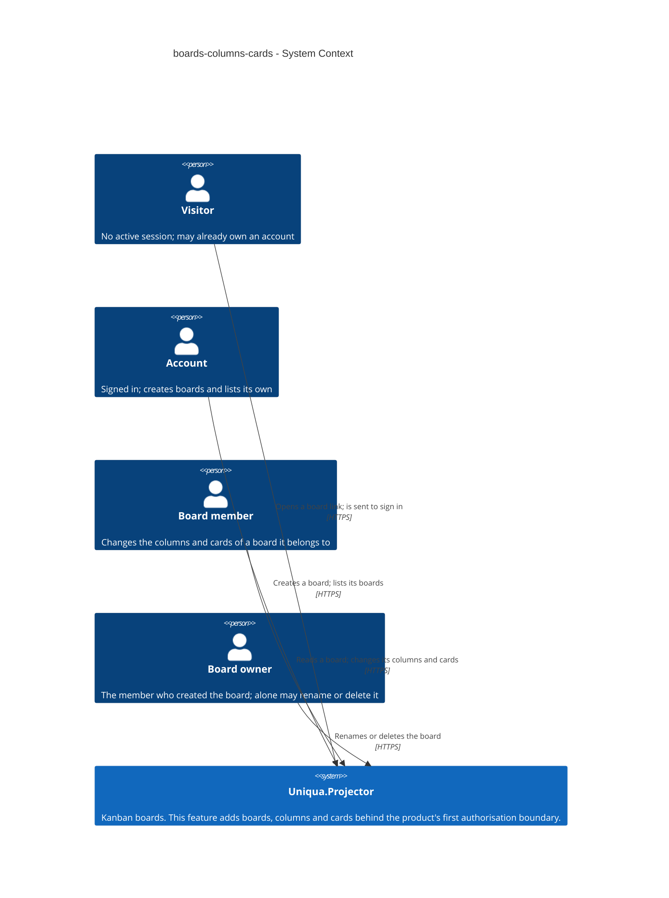
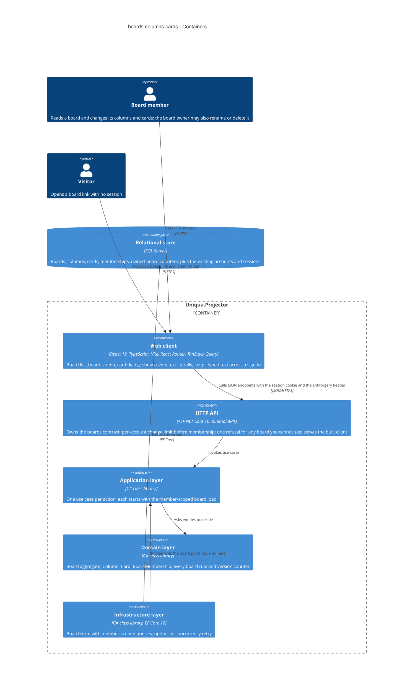
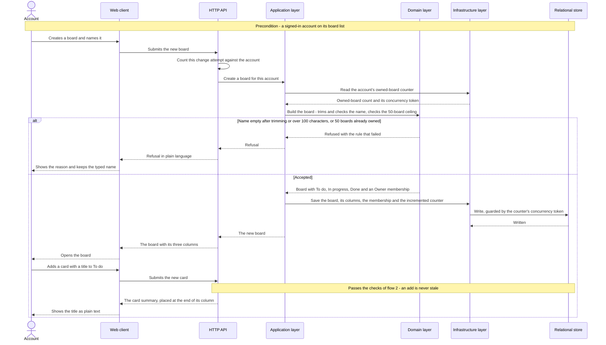
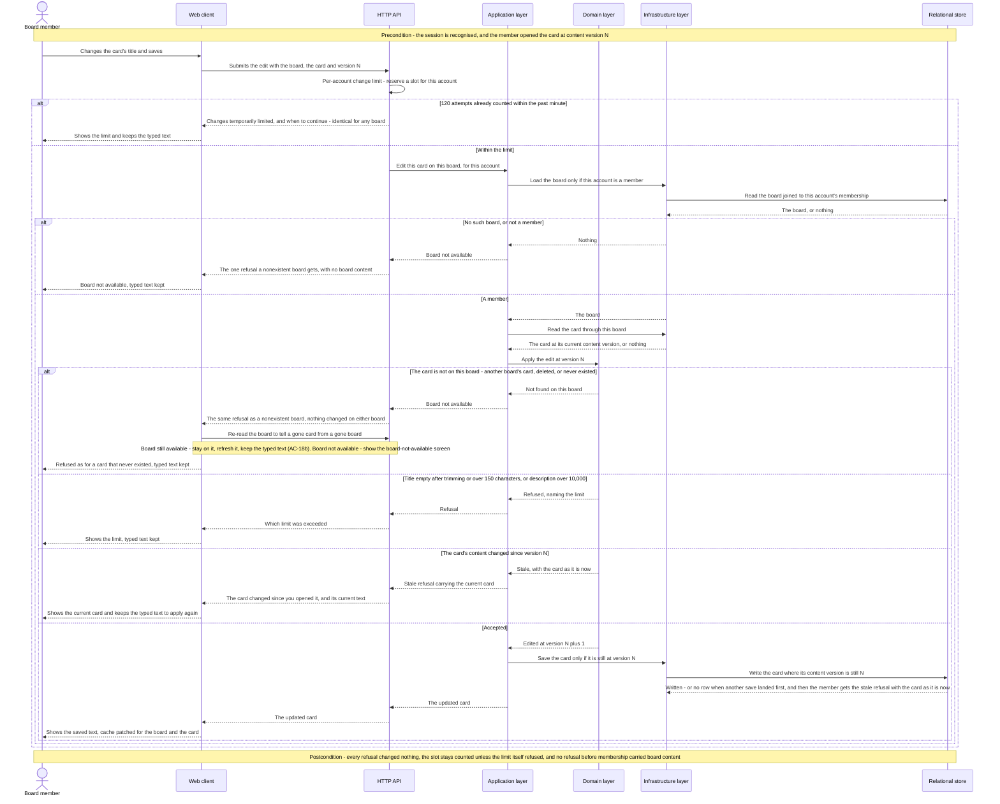
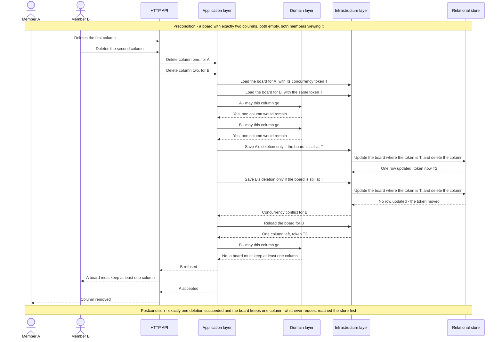

# Software Architecture Document — boards-columns-cards

<!-- 12 Arc42 sections. Empty section → <!-- N/A: <one-line reason> -->. -->
<!-- C4 Context (L1) lives inline in §3. C4 Container (L2) lives inline in §5. -->
<!-- Numbers in §10 come VERBATIM from spec.md §6 NFR — no inventing, no rounding. -->

## 1. Introduction and goals

**Intent.** Give a signed-in account a board of its own — create it, shape its columns, capture work as cards — so that a first-time visitor reaches a board holding a card, unaided and in one session: the thin path the first public deployment ships (spec §2). The same feature introduces the product's **first authorisation boundary**. Every read and change is answered only after the board-membership check; an account that is not a member cannot tell a board it does not belong to from one that never existed; and the four board rules of spec §1 — one identical refusal for non-members, every named column and card belonging to the board that was checked, no deleting a non-empty or the last column, no change applied over a newer one — are enforced by the board itself and stated where a reviewer can find them. Every later roadmap step (card move, checklist, invitations, live updates) hangs off the board, column and card introduced here.

**Top-3 quality goals (1-liners; full scenarios in §10):**

1. **An indistinguishable membership boundary** — a non-member receives one refusal, field for field identical to the refusal for a board that does not exist, whatever else is wrong with the request; a column or card of another board is treated as nonexistent; no refusal ever carries board content.
2. **No silent loss under simultaneous changes** — the content ceilings and the column rules hold under races, and a change made from an outdated view is refused and explained rather than applied over a newer one.
3. **The thin path within the latency budget** — opening a full board and making a single change stay inside the spec §6 p95 targets on the reference machine.

When these conflict, they win in that order: the boundary first, because this feature is the first authorisation boundary the fifteen-minute read examines; latency is the goal that gives way.

**Stakeholders.**

| Role | Interest | Sign-off owner? |
|---|---|---|
| account | Creates boards; finds every board it is a member of, and only those | No |
| board member | Adds, renames, reorders and deletes columns; adds, edits and deletes cards | No |
| board owner | Additionally the only one who may rename or delete the board | No |
| visitor | Follows a board link to the sign-in form without learning anything about the board | No |
| reviewing engineer | Probes access control from outside with two accounts and reads how it is enforced; spec §1's primary user | No |
| Tech Lead | SAD approval | Yes |
| Security Lead | The authorisation boundary and the spec §6.1 abuse cases; a security review is required | Yes |

<!-- `reviewing engineer` is not a CONTEXT.md glossary role; it is kept because spec §1 names it the
     primary user, exactly as the accounts-and-sessions SAD did. Candidate for `/sdd:glossary`. -->

<!-- Decision overrides (¶4) — populated by the critic resolution loop, empty otherwise. -->

## 2. Constraints

**Technical** (from the code at `c5326d2`, not from the pre-scaffold map).
- C# on **.NET 10** (`net10.0`; ASP.NET Core, EF Core and Identity packages at **10.0.12**, pinned in `Directory.Packages.props`).
- **ASP.NET Core minimal APIs** — endpoints are route handlers such as `src/Uniqua.Projector.Api/Accounts/AccountEndpoints.cs`; there are no controllers.
- **Entity Framework Core 10 on SQL Server** — `AppDbContext` (an `IdentityDbContext`) in `src/Uniqua.Projector.Infrastructure/`; Fluent configurations applied from the assembly; four migrations so far.
- **Custom session authentication** — `SessionAuthenticationHandler` recognises the `projector_session` cookie (httpOnly, Secure, `SameSite=Lax`) against a server-side session record (ADR 0008).
- **Antiforgery on every state-changing request** — `src/Uniqua.Projector.Api/Antiforgery/AntiforgerySetup.cs`; the client sends `X-XSRF-TOKEN`.
- **Use cases are plain classes returning `Result<T, TError>`** (`src/Uniqua.Projector.Domain/Result.cs`) — no mediator library; ports include `IUnitOfWork` and `IClock` (`src/Uniqua.Projector.Application/Accounts/Ports/`).
- **Rate limiting is the repository's own in-memory `SlidingWindowLimiter`** driven by `IClock` (`src/Uniqua.Projector.Api/Accounts/SlidingWindowLimiter.cs`); the framework's built-in rate limiter is not used.
- **Client:** TypeScript 6 (`~6.0.2`), **React 19**, Vite, Tailwind, vendored shadcn/ui (`button`, `card`, `input`, `label` so far), **TanStack Query v5**, a `request<T>()` fetch wrapper with a problem-document `ApiError` (`src/Uniqua.Projector.Web/src/api/accounts.ts`). `@dnd-kit/core` and `@dnd-kit/sortable` are already installed. **There is no client-side router yet** — the app is one shell that swaps between the visitor and the signed-in view.
- **Test fixture:** `tests/Uniqua.Projector.Api.IntegrationTests/ApiFactory.cs` boots the app against a SQL Server container and already provides `TestClock`, `ContentionForcer` (a command interceptor that forces a concurrency collision deterministically — today it matches only the `AspNetUsers` failed-attempt update, so it must be generalised to board, column and card updates for this feature's race tests), `CommandRecorder` and `LogRecorder`.
- **Four-project layering:** `Api → Application → Domain` and `Infrastructure → Application → Domain`; Domain references nothing; Api references Infrastructure only to register implementations.
- **One origin for client and API** (ADR 0003).

**Organisational.**
- One developer (the owner); no second in-team reviewer.
- The first public deployment (roadmap step 4) ships exactly this thin path and is fixed at **week 2**; this feature is the last thing blocking it.
- Sized **M**; route `standard`.
- A **security review is required** before it ships (spec §6.1) — the product's first authorisation boundary.

**Conventions.**
- `CLAUDE.md` and `docs/architecture-map.md` §Conventions: domain rules live in Domain; every failure is an RFC 9457 problem document from `src/Uniqua.Projector.Api/ProblemDetailsSetup.cs`; each layer registers itself through one `AddXxx(IServiceCollection)` in its own `DependencyInjection.cs`.
- **IDs:** `Uniqua.Projector.Domain.Ids.New()` — GUID version 7, generated by the application, never by the database.
- **Migrations:** one EF Core migration per schema change, generated from the model, reviewed as SQL.
- **ADR numbering is one sequence across the whole repository.** This feature's ADRs live in `docs/features/boards-columns-cards/adr/` and continue from **0012** (0001–0005 and 0011 in `docs/adr/`, 0006–0010 in accounts-and-sessions), so a bare «ADR 0003» keeps meaning exactly one document.
- **Licensing:** every dependency MIT, Apache-2.0 or BSD-style; the only recorded exception is the build-time `lightningcss` (ADR 0011).

**Regulatory / external.**
- **Data classification: confidential** — a board holds whatever its members type and is shown to no one else (spec §6.1).
- **No new personal data** — the only personal datum shown is the display name established by accounts-and-sessions.
- **Deletion is final** — no archive, trash or undo (spec §3); deleting a board removes its columns and cards.
- No formal compliance regime applies.

<!-- Divergence: docs/architecture-map.md is still the pre-scaffold target (reflects_commit 16bba53,
     hosting "undecided", target paths such as src/features/board/). This SAD follows the code and the
     self-hosted host the accounts-and-sessions SAD already assumed; carried as a §11 row. -->

## 3. Context and scope

This feature turns an account into the owner of boards and a board member of them. An **account** creates a board and becomes its **board owner** and only **board member**; members shape the board's columns and cards; a **visitor** who follows a link to a board is sent to sign in and learns nothing about it. The trust boundary is the application process, and inside it a second, finer boundary begins here: **the board**. Every identifier a request carries — the board's, a column's, a card's — is untrusted until the membership check has passed for that board and the named column or card has been found *on that board*. Board, column and card text is untrusted content for display as well: it is stored as typed and always shown as literal text (spec AC-16).

<!-- brownfield: four-project .NET 10 solution with accounts-and-sessions shipped (Identity, custom
     session scheme, antiforgery, in-memory sliding-window limiter, SQL Server via EF Core); React 19
     client with no router yet. No board, column or card code exists. -->

**External systems (in / out):**

| Actor or system | Type | Interaction |
|---|---|---|
| account | Person | Creates boards; lists the boards it is a member of |
| board member | Person | Reads a board; adds, renames, reorders and deletes columns; adds, edits and deletes cards |
| board owner | Person | Additionally renames and deletes the board |
| visitor | Person | Opens a board link with no session; is shown the sign-in form and nothing about the board |
| — none — | System (external) | **Deliberate.** The feature has no outbound integration. Identity and sessions are the product's own (accounts-and-sessions), and live updates to other members are roadmap step 8, not this feature. |

**C4 Context (L1):**



## 4. Solution strategy

**Top strategic choices (the seeds for ADRs):**

1. **Build two surfaces — the backend service and the web front-end — as ADR 0006 already decided for the product.** Spec §2's first goal is a first-time visitor reaching a board holding a card unaided, which needs board screens; the API owns the contract, enforces membership, and serves the built client from one origin (ADR 0003). `target_surfaces: [backend-service, web-frontend]` is recorded in this document's frontmatter and is read — never re-derived — by `api`, `sequences`, `tasks`, `screens`, `plan-tests` and `review`. No new ADR: re-choosing the same pair has no legitimate alternative here (a backend-only feature fails spec §2's first goal), so a new record would only copy ADR 0006.
2. **Give the SPA real addresses with React Router in library mode** (ADR 0012). The SPA itself is inherited from ADR 0007; what is new is that `ux-flows.md` fixes two addressable places — the board list and one board — and AC-27 returns a visitor to the board address they came from after sign-in. The router does routing only; TanStack Query stays the sole owner of server state, and the return address is accepted only as an in-application path so it cannot become an open redirect.
3. **Grant access through one-level membership records with an owner role** (ADR 0013, closing roadmap D5 and spec §8's second open question). One record per (board, account), role `Owner` or `Member`; creating a board writes the creator's `Owner` record. The member check and the owner check read the same record, so integration tests that insert a `Member` record prove AC-21/22 on the production path — the answer to spec §6.1's *owner-only check posing as a membership check*.
4. **Enforce membership by loading the board scoped to the caller** (ADR 0014) — quality goal 1. Every use case begins with a port call that returns the board only if the caller is a member; "absent", "not a member", "deleted" and "a column or card not on this board" all become one `BoardNotAvailable` error that `ProblemDetailsSetup` maps to one refusal. Columns and cards are looked up *through* the loaded board, so cross-board substitution (AC-26) is refused by construction; the owner-only rule is a Board method. Order per spec §6.1: session → per-account change limit → member-scoped load → validation, stale check, invariants.
5. **Guard the board's invariants with an optimistic concurrency token and bounded retry** (ADR 0015) — quality goal 2, races. The board row is the consistency record for the column and card ceilings, the last-column rule and the non-empty-column rule; every structural change updates it under a `rowversion`, and a losing writer re-runs the domain rules against fresh state, up to 3 times. The 50-owned-boards cap uses the same pattern on a per-account owned-board counter.
6. **Detect stale changes with per-concern version counters in the domain** (ADR 0016) — quality goal 2, outdated views. `Card.ContentVersion`, `Column.NameVersion` and `Board.ColumnLayoutVersion` move on exactly the events spec §5's stale-change rule names; the client sends back the one it saw, and the entity refuses a mismatch — after the membership check, since the refusal carries current state.
7. **Keep column positions dense and card positions gapped** (ADR 0017). Columns hold 0..n-1, renumbered by the Board inside the concurrency guard; cards hold ascending integers appended at the column's maximum + 1, so a deletion touches no other card. How cards are reordered is left to roadmap step 5 and decision D2.

**UI architecture (web-frontend).** Client-side SPA per ADR 0007; routing per ADR 0012; server state in TanStack Query only, with a stale-change refusal patching the cached board from the current state the refusal carries (the step 8 push channel will later patch the same cache). The screens compose the vendored shadcn/ui primitives; the first board screen becomes the UI precedent `architecture-map.md` §Frontend says later screens are measured against. Screen-level design stays in `ux-flows.md` and the later `screens.md`.

Each tactical decision in later sections should trace to one of these seeds. Tactical decisions that *contradict* a strategic choice are red flags — surface them in §11.

## 5. Building block view

The style is the **clean / layered split the foundation fixes**, unchanged: `Api → Application → Domain` and `Infrastructure → Application → Domain`. This feature adds a `Boards/` slice to every layer, shaped exactly like the `Accounts/` slice accounts-and-sessions established — entities and their errors in Domain, one use-case class per action plus the ports it needs in Application, EF Core stores in Infrastructure, minimal-API endpoints in Api, and a feature folder in the client. Two of the containers below are the declared target surfaces (the HTTP API and the web client); the rest are the layers behind them and the store.

Three placements are not simply inherited:

- **The Board is the aggregate, the Card is not inside it.** The `Board` holds its columns (at most 20), its card count, each column's card count and next card position, and its version counters — everything a structural rule needs — so ADR 0015's token on one row guards every rule. Cards are a separate entity read and written one at a time, so a card change never loads 1,000 cards; the board decides whether a card may be added or a column deleted from its counts, and the `Card` decides whether its own edit is stale (ADR 0016).
- **The member-scoped load is a port method, the owner rule a domain method.** `IBoardStore.LoadForMemberAsync(boardId, accountId)` returns the board only for a member (ADR 0014); anything a request names on that board is looked up through it. `Board.EnsureOwner(accountId)` decides AC-22.
- **The per-account change limit is an Api endpoint filter.** It must run after the session is recognised and before the membership check (spec §6.1), and it depends only on the account, so it sits on the `/api/v1/boards` route group as `BoardChangeRateLimit`, reusing the existing in-memory `SlidingWindowLimiter` keyed by account id: 120 attempts per rolling minute, a slot reserved per attempt and kept whatever the outcome, an attempt it refuses not counted (AC-17). Reads are not counted.

**Internal decomposition:**

```
src/Uniqua.Projector.Domain/Boards/
├── Board.cs                 # aggregate: name, columns, card counters, ColumnLayoutVersion;
│                            # rename/delete (owner only), add/rename/move/delete column,
│                            # admit a card to a column; every structural rule of spec §5
├── Column.cs                # name, dense position (ADR 0017), card count, next card position,
│                            # NameVersion (ADR 0016)
├── Card.cs                  # title, description, gapped position, ContentVersion; edit/delete
│                            # with the stale check
├── BoardMembership.cs       # (board, account, role Owner | Member) — ADR 0013
├── BoardText.cs             # the spec §5 Text rule: Unicode-whitespace trim, code-point length
└── BoardError.cs            # not available, owner only, stale (with current state), limits

src/Uniqua.Projector.Application/Boards/
├── CreateBoard.cs  ListMyBoards.cs  OpenBoard.cs  OpenCard.cs
├── RenameBoard.cs  DeleteBoard.cs
├── AddColumn.cs  RenameColumn.cs  MoveColumn.cs  DeleteColumn.cs
├── AddCard.cs  EditCard.cs  DeleteCard.cs
└── Ports/                   # IBoardStore (LoadForMemberAsync, ListForAccountAsync, card reads),
                             # IOwnedBoardCounter; reuses IUnitOfWork and IClock

src/Uniqua.Projector.Infrastructure/Boards/
├── BoardStore.cs            # EF Core implementation; member-scoped queries
├── Configurations/          # Board (rowversion), Column (NameVersion as concurrency token), Card
│                            # (ContentVersion as concurrency token), BoardMembership, owned-board counter
└── (Migrations/)            # one migration for the boards schema

src/Uniqua.Projector.Api/Boards/
├── BoardEndpoints.cs        # /api/v1/boards route group; lenient binding (ADR 0014)
├── BoardChangeRateLimit.cs  # endpoint filter: AC-17, before membership
└── BoardProblems.cs         # wording of every board refusal; mapped by ProblemDetailsSetup

src/Uniqua.Projector.Web/src/
├── app/routes.tsx           # React Router routes, returnTo guard (ADR 0012)
├── api/boards.ts            # request<T>() calls; query keys for the board and the card
└── features/boards/         # BoardListScreen, CreateBoardDialog, BoardScreen, BoardColumn,
                             # CardDetailDialog, DeleteBoardDialog, BoardNotAvailable, draft keeping
```

**C4 Container (L2):**



The realtime hub of ADR 0004 is not drawn: it arrives at roadmap step 8 and plays no part in this feature.

## 6. Runtime view

Three flows are seeded here: the thin path spec §2's first goal is judged by, the order of checks every change passes through (ADR 0014 and ADR 0016), and a race the board's concurrency guard settles (ADR 0015). `/sdd:sequences` then covers every §5 acceptance criterion; participants are §5 container names, and messages stay semantic — endpoints and status codes arrive at the `api` stage.

**Critical flow 1: the thin path — a new board, then a card (AC-01, AC-03, AC-12)**



**Critical flow 2: the order of checks on a change — a member edits a card (AC-13, AC-14, AC-17, AC-23, AC-25, AC-26)**



**Critical flow 3: two members delete the last two columns at once (AC-10, AC-10b)**



<!-- Further flows - the board list, column add, rename, move and delete with their stale and
     ceiling branches, card deletion, the owner-only rename and delete with typed confirmation, a
     non-member opening a board, a visitor following a board link, and a change submitted after the
     session ended (typed text kept across sign-in) - are covered by /sdd:sequences against the full
     AC list. -->

## 7. Deployment view

**No change to the deployment unit.** The feature runs in the same single instance on the owner's self-hosted host, behind the reverse proxy that terminates TLS, with SQL Server alongside — the topology the accounts-and-sessions SAD §7 describes. The one addition is **one EF Core migration** for the boards schema, applied on startup in development and as the explicit deployment step in production (`CLAUDE.md`).

**Exactly one instance is now a stated assumption, not only current practice.** The per-account change limiter (§5) keeps its counts in memory, like the registration and sign-in limits before it. A second replica would give each account 120 changes per minute *per replica*, and a restart gives every account a fresh minute; moving the counter into the store is the precondition for ever running two.

**Monitoring:**
- p95 of opening a board and of a single change — the two spec §6 latency budgets.
- Changes refused by the per-account change limit (`boards.change_rate_limited`), by account.
- Concurrency conflicts on the board row, and changes that failed after exhausting their 3 retries (ADR 0015).
- "Board not available" refusals per account per hour — a rising count from one account is probing (spec §6.1).
- Database size.

**Alerts:**
- Any change that fails after exhausting its retries — at this scale it should not happen, so one occurrence is worth a look.
- Opening-a-board p95 above 300 ms, or single-change p95 above 200 ms, sustained.
- Database size at **80% of the production edition's size ceiling** — 8 GB if roadmap D1 settles on SQL Server Express, whose ceiling is 10 GB per database. This is the operational watch spec §6.1 chose for the residual spam-creation risk; the threshold follows whatever D1 decides.

**Scaling thresholds:**
- The largest board is fixed by the content ceilings — 20 columns and 1,000 cards, roughly 150 KB for the summary read (ADR 0018).
- The board row is updated by every structural change on that board (ADR 0015); re-measure conflicts and retries once boards have more than a handful of simultaneous members, which is possible only from roadmap step 7.

## 8. Crosscutting concepts

Five rows are inherited unchanged from `architecture-map.md` §Conventions and the accounts-and-sessions SAD §8 — authentication, cross-site request forgery, the ID strategy, time, and the single error handler. The rest are this feature's own, most of them obligations spec §5 and §6.1 impose on every board, column and card path.

| Concept | Convention | Where defined |
|---|---|---|
| Authentication | Inherited: the `projector_session` cookie, recognised on every request against a server-side session record. A change arriving with no recognised session is refused before the change limit and does not count against it (AC-17, AC-28). The antiforgery check runs earlier still (`Program.cs`: `UseAntiforgeryGuard` before `UseAuthentication`) | ADR 0003, ADR 0008 |
| Cross-site request forgery | Inherited: an antiforgery token (`X-XSRF-TOKEN`) on every state-changing request, boards included (spec §6.1, last abuse case) | ADR 0007, `AntiforgerySetup.cs` |
| Authorization | Antiforgery → session → per-account change limit → member-scoped board load → validation, stale check, invariants. Two refusals are answered before the membership check and are identical for every board: a missing or wrong antiforgery token, and a body that is not JSON at all (ADR 0014). Columns and cards are found only through the loaded board. Renaming and deleting the board is `Board.EnsureOwner` | ADR 0013, ADR 0014, spec §6.1 |
| Error handling | RFC 9457 problem documents from `ProblemDetailsSetup`, wording in `BoardProblems.cs`. **One** `boards.not_available` refusal — same status, body and headers — for a board that is absent, not the caller's, deleted, or for a column or card not on the board named. A stale refusal carries the current state of just the thing that changed, and is produced only after the membership check | ADR 0014, ADR 0016, `CLAUDE.md` |
| ID strategy | Inherited: `Ids.New()` (GUID v7) for boards, columns, cards and memberships; the database generates none | `CLAUDE.md` |
| Time | Inherited: the `IClock` port, replaced by `TestClock` in integration tests — the rolling minute of the change limit is measured on it | `src/Uniqua.Projector.Application/Accounts/Ports/IClock.cs` |
| Text rule | `BoardText` in Domain trims every Unicode whitespace character from names and titles (never from descriptions) and counts length in code points; the client counts the same way — by code point, not by UTF-16 length — so the form and the server agree on every limit | spec §5 Text rule |
| Text rendering | Board, column and card text is rendered only as React text nodes — `dangerouslySetInnerHTML` is never used for it, nothing is turned into a link, and Tailwind `whitespace-pre-wrap` keeps line breaks and repeated spaces exactly as typed | spec AC-16, §6.1 |
| Rate limiting | At most 120 change attempts per account per rolling minute, counted by `BoardChangeRateLimit` before membership, whatever board is named; an attempt it refuses does not count; reads do not count. **Two refusals are not counted either**, although AC-17 literally counts every refusal other than the limit's own: a refused antiforgery token (answered before the session, so there is no account to count against — the reason AC-17 already exempts a missing session) and a body that is not JSON (answered by the framework before the route handler, identical for every board, so it reveals nothing). In memory, per instance (§7) | spec AC-17, §6 |
| Concurrency | Two kinds of version, never confused: the board row's `rowversion` (race control for structural changes, internal, ADR 0015) and the per-concern counters `ContentVersion`, `NameVersion`, `ColumnLayoutVersion` (the member's view, on the wire, ADR 0016). `ContentVersion` and `NameVersion` are **also** the write condition on their own rows — a card is saved or deleted, and a column renamed, only where the counter is still the value the member saw — so two simultaneous edits of one card, or two renames of one column, cannot both land: the loser gets the ordinary stale refusal | ADR 0015, ADR 0016 |
| Logging | Structured, `module=boards`. Board, column, card and account identifiers may be logged; **board names, column names, card titles and descriptions never are** — not on success and not on a refusal | spec §6.1 |
| Client state | TanStack Query owns the board summary and each card's detail; accepted changes and stale refusals patch both from the server's answer. React Router's loaders and actions are not used | ADR 0012, ADR 0018 |
| Typed text across sign-in | When a change is refused because the session ended, what the member typed is kept in `sessionStorage` under the id of the account that typed it; it is offered back only if that same account signs in again in this tab, and is removed when re-applied, when a different account signs in (never shown), or on sign-out. It never outlives the tab | spec AC-28, `ux-flows.md` §Platform decisions |
| Sign-in return address | `returnTo` is honoured only when it is a path inside the application — starts with a single `/`, not `//`, no scheme; anything else lands on the board list | spec AC-27, ADR 0012 |
| Internationalisation | N/A — single language | — |
| Observability | The §7 metrics; server-side timing on opening a board and on every change | §7 |

## 9. Architecture decisions

| # | Title | Status | Section |
|---|---|---|---|
| 0012 | Route the web client with React Router in library mode | Accepted | §4 |
| 0013 | Grant board access through one-level membership records with an owner role | Accepted | §4 |
| 0014 | Enforce membership by loading the board scoped to the caller | Accepted | §4 |
| 0015 | Guard board invariants with an optimistic concurrency token and bounded retry | Accepted | §4 |
| 0016 | Detect stale changes with per-concern version counters in the domain | Accepted | §4 |
| 0017 | Keep column positions dense and card positions gapped | Accepted | §4 |
| 0018 | Open a board with card summaries and load a card's text on demand | Accepted | §5 |

ADR files live under `docs/features/boards-columns-cards/adr/NNNN-<title>.md`. Numbering continues the repository-wide sequence (§2). The surface choice cites ADR 0006 and the SPA ADR 0007 (both in `docs/features/accounts-and-sessions/adr/`) rather than repeating them; ADR 0013 is the record roadmap decision D5 asked for.

## 10. Quality requirements

Each of the three §1 goals expanded into a scenario. **Every number is copied verbatim from spec §6** — none is invented and none is rounded.

**QG-1. An indistinguishable membership boundary**
- **When:** an account that is not a member of a board opens it or submits any change to it or to anything on it — including a change that is itself invalid or based on an outdated view — or a member names another board's column or card; or any account keeps changing boards past its limit.
- **Then:** "Indistinguishable refusal — 100% of read and change kinds, 0 differences: for each, the refusal for a board the caller is not a member of is identical, field for field, to the refusal for a board that does not exist". Per-account change rate: "at most 120 change attempts per account per rolling minute, counted as AC-17 defines (attempts refused by this limit do not count); the 121st is refused and nothing changes on any board".
- **How verify:** an integration test that, for every read and change kind, sends the same request to a board the caller is not a member of and to an identifier that never existed, and compares status, headers and body field for field — with invalid and stale bodies among the inputs, and cross-board column and card identifiers (AC-26); the non-owner cases run against a `Member` record inserted by test setup (ADR 0013). An integration test against `TestClock` for the rolling minute: 120 attempts accepted or refused for other reasons, the 121st refused, nothing written, admission again once earlier attempts leave the minute.

**QG-2. No silent loss under simultaneous changes**
- **When:** members change one board at the same moment — column deletes, column adds, card adds and board creations, including pairs made one short of each ceiling — or reorder, add and delete columns in any sequence; or a member saves from an outdated view.
- **Then:** "0 boards left with no column, 0 non-empty columns deleted, 0 boards above 20 columns or 1,000 cards, and 0 accounts owning more than 50 boards, across 1,000 randomised pairs of simultaneous changes"; "0 duplicated and 0 missing positions across 1,000 randomised sequences of accepted reorders, adds and deletes — every column of a board holds exactly one distinct position"; content ceilings of "50 owned boards per account; 20 columns and 1,000 cards per board; board name ≤ 100, column name ≤ 50, card title ≤ 150, description ≤ 10,000 characters"; a stale change is refused exactly as spec §5's stale-change rule defines, and a change to something else is accepted (AC-24b).
- **How verify:** an integration test issuing the 1,000 pairs concurrently against the SQL Server container, with `ContentionForcer` — generalised from its current `AspNetUsers`-only match to board, column and card updates — guaranteeing that the one-short-of-the-ceiling pairs actually collide on the board row rather than happening to serialise; an integration test over 1,000 randomised column sequences that checks positions after every step; domain unit tests at each ceiling boundary and for the Text rule; domain unit tests for each of the three version counters (ADR 0016) plus the AC-24b integration test.

**QG-3. The thin path within the latency budget**
- **When:** a member opens a board holding 20 columns and 1,000 cards, or makes a single change (add, rename, reorder, edit, delete), under load.
- **Then:** latency p95 "≤ 300 ms" opening that board; latency p95 "≤ 200 ms" for a single change; throughput "≥ 50 changes/s across boards".
- **How verify:** server-side timing sampled in the smoke run on the reference machine — the 2-vCPU virtual machine on the self-hosted host. **Workload (closes spec §8's fourth open question, during design, with its default):** at least 25 accounts, each on its own board — the per-account limit caps one account at 2 changes/s — an even mix of the change kinds in spec §6, 60 s per run. In CI the same smoke run is a regression check only, failing on a p95 more than 25% slower than the last recorded run; the first runs set the baseline.

## 11. Risks and technical debt

<!-- Severity literals: Low / Medium / High for regular risks; "Open question" for rows carried from an
     unresolved architectural decision. spec §8 carries four open questions: the second (the membership
     ADR) is closed by ADR 0013, the fourth (the smoke workload) is closed in §10, the third was
     resolved in ux-flows, and the first is the Open-question row below. No decision in this pass was
     saved as an open question. -->

| Risk / debt | Severity | Mitigation | Owner |
|---|---|---|---|
| A board use case that skips the member-scoped load (ADR 0014) opens a hole in the boundary — the check lives at the start of each use case, not in one choke point | High | The QG-1 comparison test runs over *every* read and change kind, so a use case that answers a non-member differently fails it; the `review` stage checks that every board use case begins with `LoadForMemberAsync` | Alex Korneiko |
| Framework request binding rejects an invalid value before the membership check, so the answer to a non-member depends on the board | Medium | Lenient binding (ADR 0014) — values taken as they arrive and validated by the domain after membership; the `api` stage fixes the exact binding; invalid bodies are among the QG-1 test inputs | Alex Korneiko |
| `docs/architecture-map.md` is stale — still the pre-scaffold target (`reflects_commit` 16bba53), hosting "undecided", target paths that differ from the code | Medium | Run `/sdd:survey` after this feature ships; this SAD's §2 follows the code instead | Alex Korneiko |
| Scripted accounts fill the production store — the residual spam-creation risk spec §6.1 accepted | Medium | The §7 size alert at 80% of the edition's ceiling; its threshold depends on roadmap D1, due before step 4 | Alex Korneiko |
| The declared size **M** is tight — two surfaces, the product's first router, 13 use cases, seven ADRs and a randomised race suite | Medium | If `/sdd:tasks` emits more than roughly 15 tasks or about 4 days of work, re-run `/sdd:classify-size boards-columns-cards`, which re-syncs `.size`, `.route` and both `feature_size` mirrors | Alex Korneiko |
| The per-account change limiter is in memory: a restart gives every account a fresh minute, and a second replica would multiply the limit | Low | Accepted at one instance (§7); the counter moves into the store before any second replica | Alex Korneiko |
| Contention on the board row — every structural change updates it, and a change fails after 3 conflicts (ADR 0015) | Low | The §7 alert on exhausted retries; re-measure once boards can have several simultaneous members (roadmap step 7) | Alex Korneiko |
| AC-28's "kept in this browser" is implemented as "kept in this tab" (`sessionStorage`, §8) — a member who closes the tab before signing in loses the typed text | Low | Stated in §8 so `review` checks it against the spec deliberately; chosen because board text is confidential | Alex Korneiko |
| React Router's loaders or actions creep in and become a second server-state cache beside TanStack Query | Low | The §8 client-state row; `review` checks it | Alex Korneiko |
| AC-17's wording counts every refusal except the limit's own, while the design does not count a refused antiforgery token or a non-JSON body (§8 Rate limiting) | Low | Align AC-17's wording with the two exemptions in a spec edit; neither exemption reveals anything about any board | Alex Korneiko |
| Open architectural decision: does roadmap step 5's card move inherit the stale-change rule of AC-23 and AC-24 (roadmap D2)? | Open question | Resolve before `/sdd:specify` of roadmap step 5; default now is yes — a move from an outdated view is refused and the current state shown. ADR 0016's counters extend to card position without reinterpreting the existing ones; spec §8, first open question | Alex Korneiko |

**Accepted debt (acceptable in v1, plan to fix later):**
- **Deletions are final** — no archive, trash or undo for a board, column or card (spec §3). A mistaken board deletion, even after typing the name, cannot be recovered without a database backup.
- **The card-reorder technique is deferred** to roadmap step 5 (ADR 0017): renumbering a column's cards or migrating to fractional keys is decided there, and the latter would mean a data migration.
- **The change-rate counter is not durable** (§7) — acceptable at invited-reviewer scale on one instance.

## 12. Glossary

Terms marked **[CONTEXT]** are canonical in the repository-root `CONTEXT.md` and are repeated here only for a reader of this document; the definitions there win on any conflict.

| Term | Meaning |
|---|---|
| account **[CONTEXT]** | A registered identity with an email, a password and a display name, which a person signs in as |
| board **[CONTEXT]** | A named workspace holding an ordered set of columns, created by one account who becomes its board owner, and visible only to its board members |
| board member **[CONTEXT]** | An account that has been granted access to one board and may read and change it — recorded as a membership record (ADR 0013) |
| board owner **[CONTEXT]** | The board member who created the board, and the only one who may rename it, delete it and invite others to it — the membership record with role `Owner` |
| card **[CONTEXT]** | A unit of work with a title and an optional plain-text description, at one position in exactly one column of one board |
| column **[CONTEXT]** | A named lane at one position on one board, holding that board's cards in order; a board always keeps at least one |
| visitor **[CONTEXT]** | A person using the application with no active session |
| session **[CONTEXT]** | The period during which a browser is recognised as a specific account, carried by a cookie that page scripts cannot read |
| member-scoped load | Loading a board only if the requesting account is a member of it, so that "absent" and "not a member" are one answer; every board use case begins with it (ADR 0014) |
| board not available | The single refusal for a board that is absent, not the caller's, deleted, or for a column or card not on the board named — identical field for field in every case |
| stale change | A change made from a view in which the very thing it changes has since changed, as spec §5's stale-change rule defines; refused with the current state |
| version counter | One of `ContentVersion` (a card's title or description), `NameVersion` (a column's name) and `ColumnLayoutVersion` (a board's set and order of columns) — the member-visible versions a stale change is detected by (ADR 0016). NOT the board row's concurrency token |
| concurrency token | The board row's `rowversion`, used internally to make simultaneous structural changes collide and be re-decided (ADR 0015); never shown to the client |
| per-account change limit | At most 120 change attempts per account per rolling minute, counted before the membership check and whatever board is named (spec AC-17) |
| card summary | A card as the board read returns it — identity, column, position, title, content version — without its description (ADR 0018) |
| Text rule | Spec §5's rule for names, titles and descriptions: surrounding Unicode whitespace trimmed from names and titles only, length counted in code points |
| reference machine | The machine the §10 latency and throughput figures are measured on — a 2-vCPU virtual machine on the self-hosted host; CI is not the reference machine |

<!-- Candidates for /sdd:glossary if they recur outside this feature: `member-scoped load`,
     `stale change`, `board not available`. Step 5 (card move) and step 8 (the hub) will reuse all
     three, which argues for promoting them to CONTEXT.md then. -->

