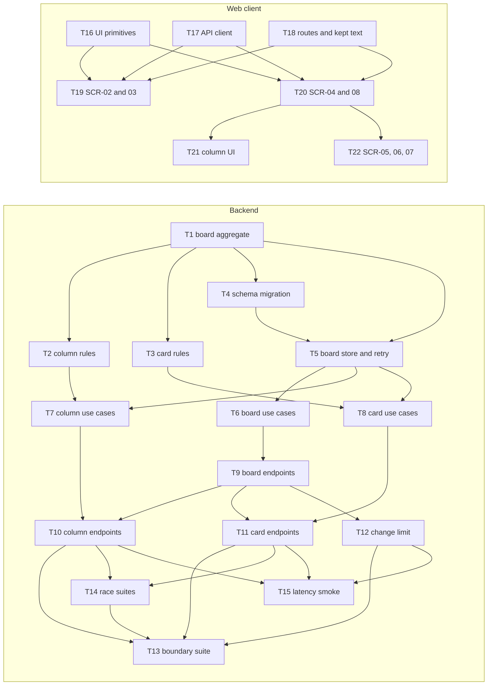

# Epic — boards-columns-cards

> **Spec:** [spec.md](../spec.md) · **Design:** [sad.md](../sad.md) · **Data model:** [data-model.md](../data-model.md) · **API:** [openapi.yaml](../contracts/openapi.yaml) · **Screens:** [screens.md](../screens.md) · **ADRs:** [adr/](../adr/)

## Goal

A first-time visitor gets from a fresh account to a board holding at least one card, unaided and in one session — the thin path the first public deployment ships at week 2 (spec §2). Shipping this epic also puts the product's first authorisation boundary in place: board membership is enforced on every read and change, a board is indistinguishable from one that does not exist to anyone outside it, and no change a member makes is lost silently under simultaneous or outdated edits.

## Scope

- **In:** a `Boards/` slice in every layer — the Board aggregate with its column and card rules (Domain), one EF Core migration for five tables (Infrastructure), 13 use cases behind a member-scoped board store (Application), the `/api/v1/boards` endpoints with the per-account change limit (Api), and the board list, board, card and deletion screens with client routing (Web). Two target surfaces: `backend-service`, `web-frontend`.
- **Out** (spec §3): moving a card (roadmap step 5, D2); live updates to other members (step 8); adding members or invitations (step 7 — `Member` records exist only in test setup); projects; archive, trash or undo; checklists, comments, labels, due dates, attachments, ownership transfer, leaving a board.

## Task map

The same DAG as [tasks.json](../tasks.json). The backend and client branches are independent: every client task builds against the contract with a mocked API, so the two run side by side from wave 1.

| Wave | Tasks |
|---|---|
| 1 | T1, T16, T17, T18 |
| 2 | T2, T3, T4, T19, T20 |
| 3 | T5, T21, T22 |
| 4 | T6, T7, T8 |
| 5 | T9 |
| 6 | T10, T11, T12 |
| 7 | T14, T15 |
| 8 | T13 |

**Serialized lanes** (shared `files_hint`, so `implement` runs them one at a time): T1, T2, T3 (`Board.cs`); T6, T7, T8 (`Application/DependencyInjection.cs`); T9, T10, T11, T12 (`BoardEndpoints.cs`, `BoardProblems.cs`, `BoardFixtures.cs`); T16, T18 (`package.json`); T4 as `layer: migration`.

## Tasks

See [tracker.md](./tracker.md) for status. Machine contract: [tasks.json](../tasks.json).

| # | Task | Layer | Blocked by | DoD (short) |
|---|---|---|---|---|
| T1 | Build the Board aggregate with the Text rule, board creation and the owner-only rules | domain | — | Text rule, creation, 50-board cap, owner-only rename/delete unit-tested |
| T2 | Give the Board its column rules: add, rename, move and delete with dense positions and version checks | domain | T1 | column rules, dense positions, NameVersion / ColumnLayoutVersion unit-tested |
| T3 | Admit, edit and delete cards through the Board's counters with the content-version check | domain | T1 | card ceiling, text limits, gapped positions, ContentVersion unit-tested |
| T4 | Map the boards entities in EF Core and generate the CreateBoards migration | migration | T1 | CreateBoards matches the staged SQL; applies and reverts |
| T5 | Declare the board ports and implement the member-scoped store with the bounded concurrency retry | infra | T1, T4 | member-scoped load, card through its board, forced collision retried at most 3 times |
| T6 | Write the board use cases: create, list, open, rename and delete | app | T5 | create / list / open / rename / delete integration-tested; Member refused owner_only |
| T7 | Write the column use cases: add, rename, move and delete, with races re-decided | app | T2, T5 | column use cases; the last-two-columns race leaves one |
| T8 | Write the card use cases: add, open, edit and delete through the board | app | T3, T5 | card use cases; two edits land once; the 999-card race lands one |
| T9 | Expose the board endpoints with lenient binding and map every board refusal to one problem document | ports | T6 | 5 board endpoints; one identical not_available; lenient binding |
| T10 | Expose the column endpoints: add, rename, move and delete | ports | T7, T9 | 4 column endpoints with every contract refusal |
| T11 | Expose the card endpoints: add, open, edit and delete | ports | T8, T9 | 4 card endpoints; markup round-trips byte for byte |
| T12 | Limit each account to 120 board change attempts per rolling minute, before the membership check | ports | T9 | 121st change attempt gets 429, nothing changed, reads not counted |
| T13 | Prove the membership boundary across every read and change kind, and map the four board rules to their tests | tests | T10, T11, T12, T14 | QG-1: non-member equals never-existed for all 13 operations; rules map |
| T14 | Prove the board invariants under 1,000 simultaneous pairs and the column order under 1,000 random sequences | tests | T10, T11 | QG-2: 0 violations over 1,000 pairs and 1,000 sequences |
| T15 | Measure opening a full board, a single change and change throughput against the §6 budgets | tests | T10, T11, T12 | QG-3: p95 open / change and changes/s recorded against the budgets |
| T16 | Vendor Dialog and Textarea, add the destructive Button variant, and build PlainText and KeptTextNotice | ui | — | PlainText proves AC-16; Dialog, Textarea, destructive variant vendored |
| T17 | Write the typed boards API client, its query keys and cache patches, and the board refusal wording | ui | — | 13 typed operations, cache patches, 404 then re-read resolution |
| T18 | Give the client board addresses with React Router, a guarded return address, and typed text kept across a sign-in | ui | — | board addresses, returnTo guard, kept text per account |
| T19 | Build the board list (SCR-02) and the create-board dialog (SCR-03) | ui | T16, T17, T18 | SCR-02 and SCR-03, every state |
| T20 | Build the board screen (SCR-04) with its owner header, card tiles and add-card form, and the not-available screen (SCR-08) | ui | T16, T17, T18 | SCR-04 board states, rename, add card; SCR-08 |
| T21 | Let members add, rename, drag and delete columns on the board, with every refusal shown in place | ui | T20 | column add / rename / drag / delete, every refusal in place |
| T22 | Build the card detail dialog with edit and delete (SCR-05, SCR-06) and the board deletion dialog (SCR-07) | ui | T20 | SCR-05, SCR-06, SCR-07; stale and mismatch keep typed text |

## Risks / Hard rules

- **Order of checks** (spec §6.1, sad §8): antiforgery → session → per-account change limit → member-scoped load → request shape → item on this board → owner check → text limits → stale → ceilings and column rules. Nothing after the load is ever answered to a non-member.
- **One refusal** — `boards.not_available` is identical, field for field except `instance` and `traceId`, for an absent, deleted or non-member board and for a column or card not on the board named (ADR 0014). T13 proves it over all 13 operations.
- **Every board use case begins with `LoadForMemberAsync`** — the sad §11 High risk; T13 proves it from outside, `review` checks it inside.
- **Domain rules live in Domain** (`CLAUDE.md`) — every ceiling, column rule and stale check is a Board, Column or Card method (T1–T3); use cases and endpoints only orchestrate.
- **Errors come from `ProblemDetailsSetup`**, worded once in `BoardProblems.cs`; ids from `Ids.New()`; one EF Core migration reviewed as SQL (T4); each layer registers itself in its own `DependencyInjection.cs`.
- **Board text is never logged and never rendered as markup** — sad §8 Logging and Text rendering; `PlainText` (T16) is the only way server text reaches the DOM.
- **Tailwind only, shadcn/ui vendored, TanStack Query owns server state, no React Router loaders or actions** (`CLAUDE.md`, ADR 0012).
- **Licensing** — the two new client dependencies, `react-router` (T18) and `@radix-ui/react-dialog` (T16), are MIT; nothing copyleft is added.
- **Size signal** — this breakdown is 22 tasks, about 16.5 person-days, which is past the sad §11 trigger of "more than roughly 15 tasks or about 4 days of work". Re-run `/sdd:classify-size boards-columns-cards` if the M sizing no longer holds.
