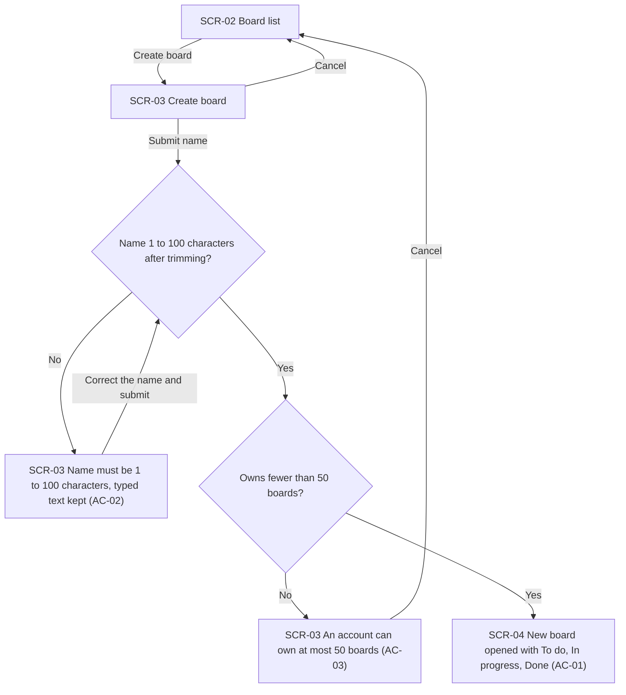
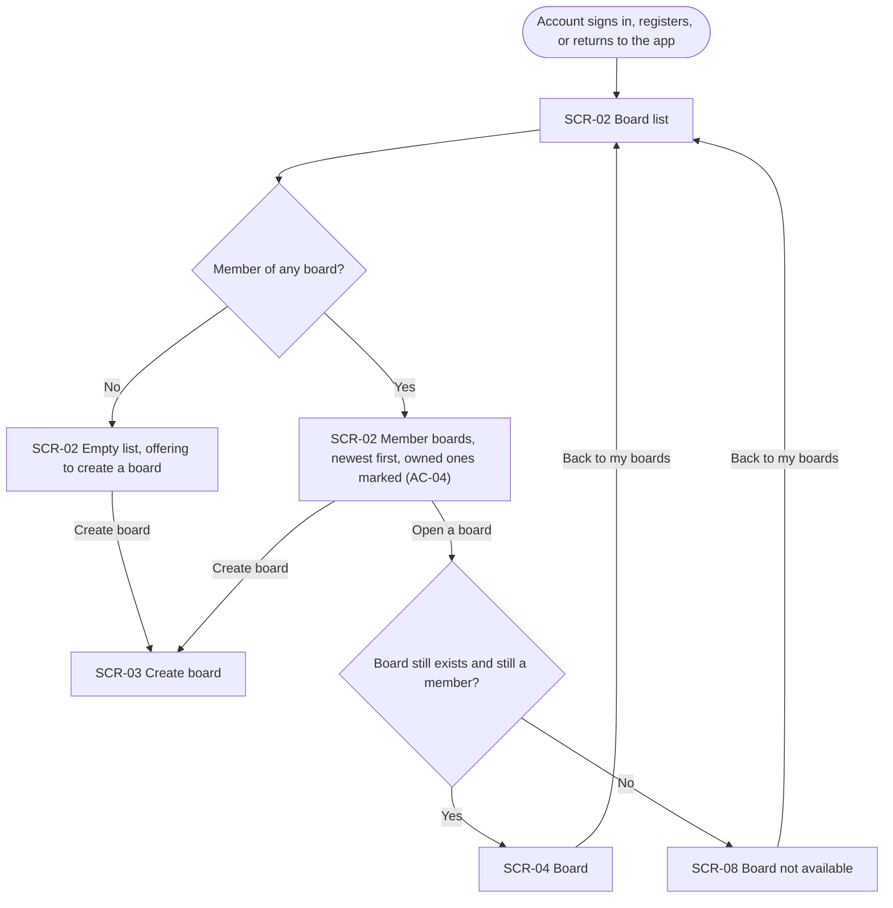
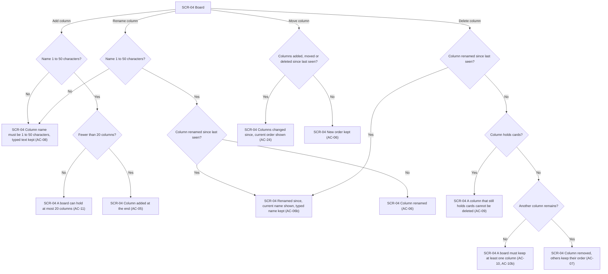
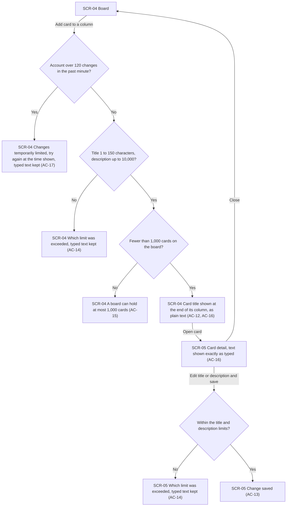
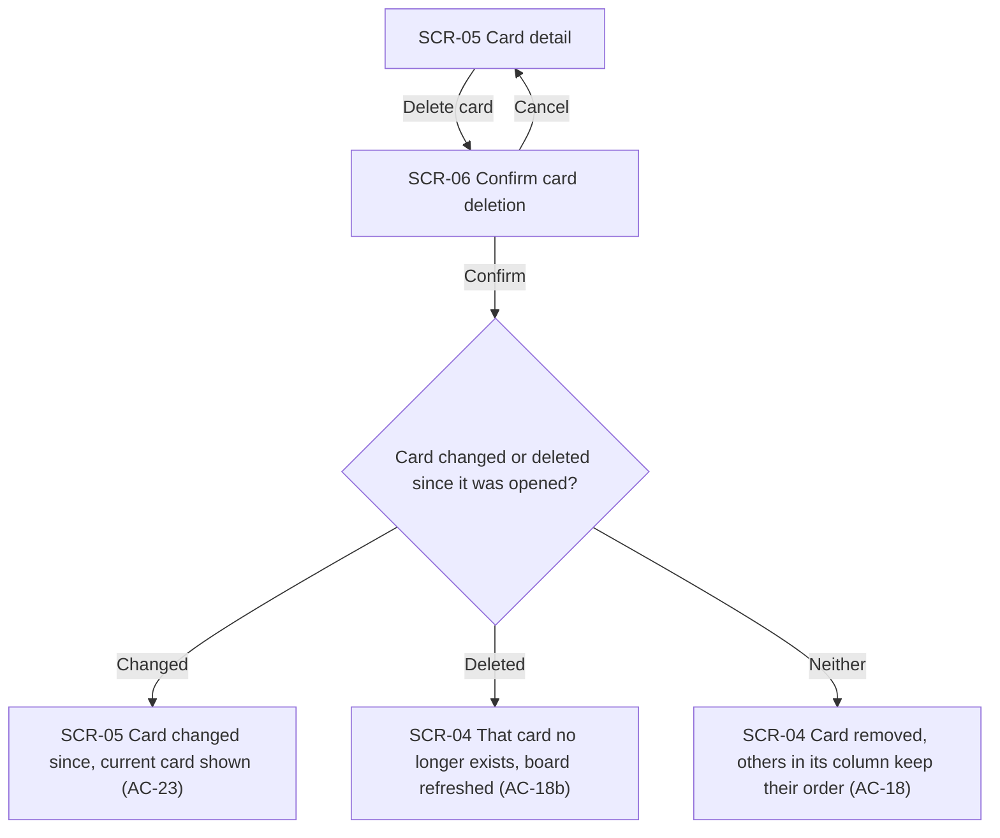
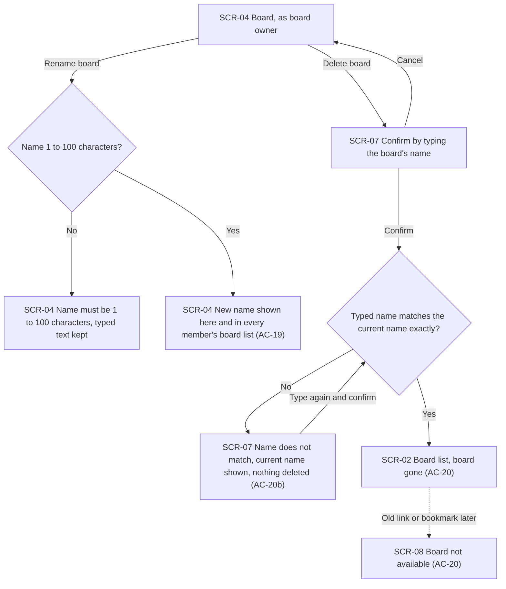
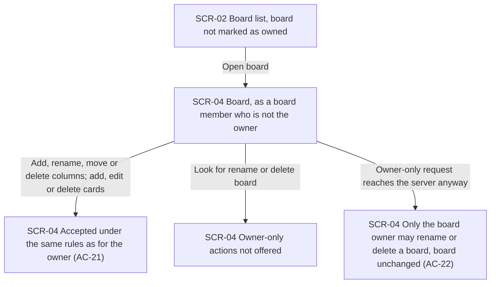
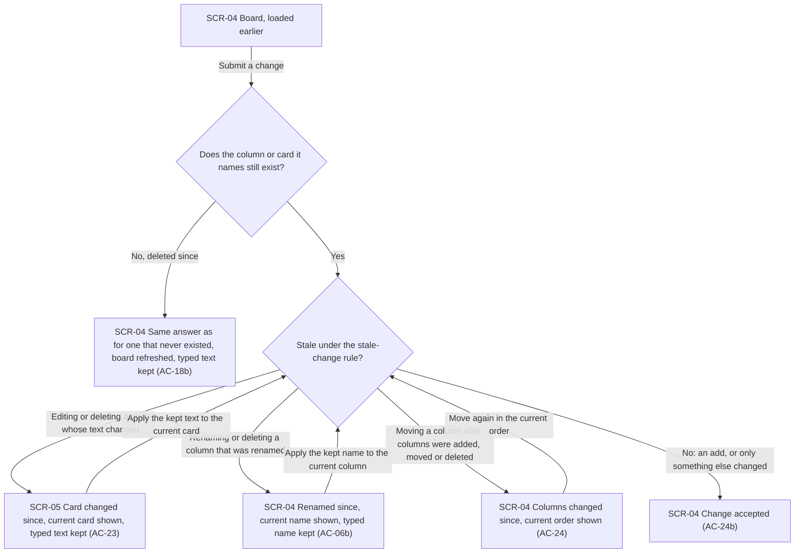
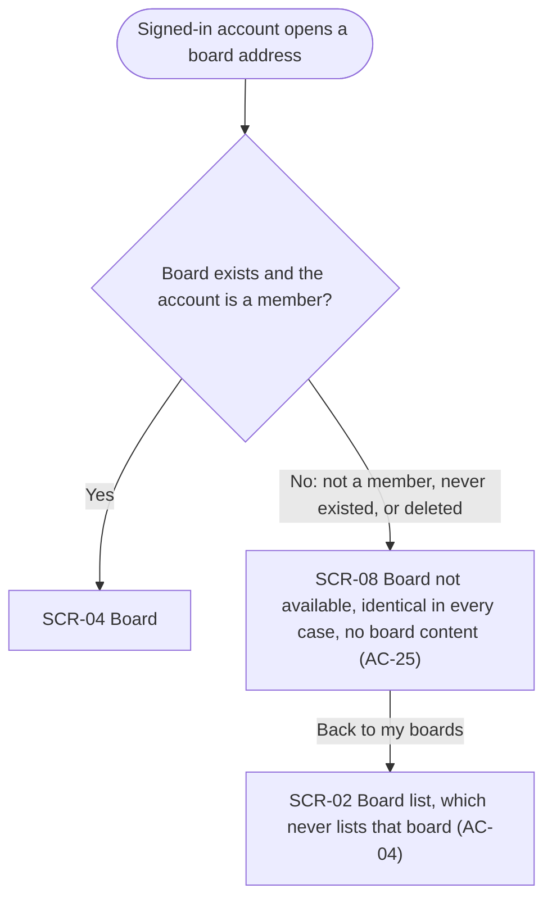
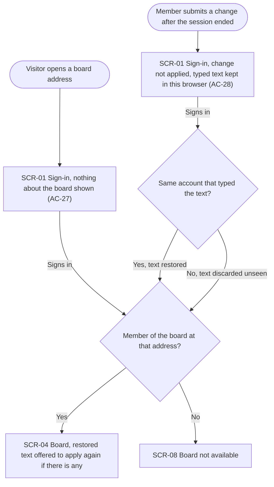

# UX flows — boards-columns-cards

> User flows for every UI-touching §4 user story, produced by `ux-flows` (after `clarify`, before
> `design`) and read by `design` (evidence for the target-surface + UI-architecture decisions),
> `sequences` (UI-driven flows align on SCR ids), `screens` (details every inventory row) and
> `plan-tests` (the e2e-through-UI paths). **Always markdown + mermaid `flowchart`**, whatever the
> design tool — this artifact is flow-altitude, not visual design.

## Platform decisions

- **Posture:** desktop-first — no `docs/design-system.md` exists yet, so there is no canon to follow. `idea-brief.md` §2 and `roadmap.md` §Out of scope both exclude a phone layout, and the reviewer opens the live link on a laptop. On a narrow screen the board may scroll sideways, and that is accepted.
- **Two places to be, each with its own address:** the list of boards and one board. A board has an address of its own because US-10 assumes a link to a board exists and can be shared or bookmarked. Card detail opens over the board, and closing it returns to the board as it was.
- **Where each action happens:** creating a board, deleting a card and deleting a board open as dialogs over the current screen. Adding, renaming, moving and deleting a column, and adding a card, all happen in place on the board. Deleting a column asks for no confirmation, because only an empty column can be deleted and nothing is lost.
- **Refusals stay where the change was made:** every refusal for a change (a validation error, a limit, a stale change or a target that no longer exists) is shown on the screen where the member acted, and whatever they typed stays in place. Only two things take the member elsewhere: opening a board they cannot see (SCR-08) and a session that has ended (SCR-01).
- **After sign-in, back to where the visitor came from:** a visitor who signs in from a board link, or a member signing in again after AC-28, returns to that address, and the membership rule answers it there (US-10). This closes spec §8's landing question, and AC-27 now states it.
- **Cross-cutting branches are drawn once:** the per-account change limit (AC-17, drawn in US-04) and the ended-session branch (AC-28, drawn in US-10) can happen on every change, on SCR-03 through SCR-07, whichever flow the change belongs to.
- **Owner-only actions are not offered to other members:** a board member who is not the board owner sees no control to rename or delete the board. The server still refuses such a request if one reaches it, and the client shows that refusal (AC-22).
- **Other members' changes appear on reopen, or after a refusal:** live updates are roadmap step 8. Until then the member sees the board as it was when they loaded it. A stale-change refusal refreshes the part it concerns (the card, the column name or the column order) to its current state.
- **Design input, not decided here:** (1) the sign-in return address (US-10) has to be limited to addresses inside the application, so it cannot become an open redirect; (2) keeping typed text across a sign-in (AC-28) needs browser-side storage tied to the account that typed it, with its form and lifetime left to `design`; (3) the order in which the flows below check a change (for example stale-before-non-empty when a column is deleted) shows each branch, but it does not fix precedence. Precedence is set by `design` and the §6.1 check order.

## Screen inventory

| ID | Screen | Purpose | Entry | Exit |
|---|---|---|---|---|
| SCR-01 | Visitor sign-in (existing, from accounts-and-sessions) | Sign in or register; reveals nothing about any board | Any board address opened with no active session; a change submitted after the session ended | After sign-in: the address the visitor came from (SCR-04 or SCR-08), otherwise SCR-02 |
| SCR-02 | Board list | Every board the account is a member of, newest first, owned ones marked; starting a new board | After sign-in or registration; "back to my boards" from SCR-04 or SCR-08; after a board is deleted | SCR-03 (create); SCR-04 (open); SCR-08 (the board is gone since the list was loaded) |
| SCR-03 | Create board | Naming a new board | SCR-02 | SCR-04 on success; SCR-02 on cancel |
| SCR-04 | Board | The board's columns and cards; every column change and card add; the owner's rename and delete | SCR-02; SCR-03; SCR-01 return after sign-in; closing SCR-05, SCR-06 or SCR-07 | SCR-05 (open a card); SCR-07 (owner deletes the board); SCR-02 (back to my boards) |
| SCR-05 | Card detail | Reading and editing one card's title and description; starting its deletion | Opening a card on SCR-04 | SCR-04 (close); SCR-06 (delete) |
| SCR-06 | Confirm card deletion | Confirming that a card is deleted for good | SCR-05 | SCR-04 on confirm; SCR-05 on cancel or when the card changed since it was opened |
| SCR-07 | Confirm board deletion | The owner types the board's current name to confirm deleting it with everything on it | SCR-04, as board owner | SCR-02 on success; SCR-04 on cancel |
| SCR-08 | Board not available | One identical answer for a board the account is not a member of, a board that never existed, and a deleted board | Opening a board address from SCR-02 (stale list), a link or a bookmark | SCR-02 |

## Flows

All ten §4 user stories touch the UI, so none is out of scope here. Two parts of them are server-only: a non-member submitting a change (part of AC-25) and cross-board substitution (AC-26). The UI cannot produce either one, because it names only the items of the board that is open. Both are listed in the AC coverage table with the reason.

### Flow: US-01 — Start a board

From the board list, the account chooses to create a board and the create-board dialog opens. Cancel returns to the list. If the name is empty after trimming or longer than 100 characters, the dialog says the name must be 1 to 100 characters and keeps what was typed, so it can be corrected and submitted again. If the account already owns 50 boards, the dialog says so and the only way on is to cancel. Otherwise the new board opens straight away, holding its three starting columns.

### Flow: US-02 — Find my boards

After signing in or registering, an account lands on its board list. With no boards, the list is empty and offers to create one, and this is where a first-time visitor starts the thin path. Otherwise the list shows every board the account is a member of and no other board, newest first, with owned boards marked. Opening a board shows it. If the board was deleted after the list was loaded, the not-available screen appears instead, the same one used for any board the account cannot see. Both the board and that screen lead back to the list.

### Flow: US-03 — Shape the columns

Everything here happens in place on the board. **Add:** a bad name gets the 1-to-50 message with the text kept. A board that already has 20 columns gets the column-limit message. Otherwise the column appears at the end. **Rename:** the same name check applies. If someone renamed that column after the member last saw it, the change is refused, the current name is shown and the member's typed name is kept. Otherwise the new name is saved. **Move:** if any column was added, moved or deleted after the member last saw the board, the move is refused and the current order is shown. Otherwise the new order is kept. **Delete:** a column renamed since is refused the same way as a stale rename. A column that holds cards cannot be deleted, and nothing is touched. The last remaining column cannot be deleted. This includes the case where two members each delete one of the last two columns at the same moment, which leaves one of them with this refusal. Otherwise the column goes and the others keep their order.

### Flow: US-04 — Capture work as cards

A member adds a card in place at the end of a column, with a title and an optional description. The first check is the per-account change limit. This check sits on every change in every flow, and it is drawn only here. An account over 120 attempted changes in the past minute is told that changes are temporarily limited and when it may continue, and its text is kept. Next, a title or description outside its limit is refused with a message naming the limit, and the text stays in place. A board that already holds 1,000 cards refuses the add. Otherwise the card's title appears at the end of the column. Opening the card shows its title and description exactly as typed: markup, scripts and web addresses appear as plain text, and line breaks and repeated spaces are kept. Editing and saving either passes the same length checks and is saved, or is refused with the text kept. Close returns to the board.

### Flow: US-05 — Remove a card

From card detail, the member chooses delete and a confirmation dialog opens. Cancel goes back to the card. On confirm there are three outcomes. If the card's title or description changed after the member opened it, the deletion is refused and the card is shown as it is now, so they can decide again. If the card was already deleted, they are told it no longer exists, with the same answer as for a card that never existed, and the board refreshes. Otherwise the card is removed and the rest of its column keeps its order.

### Flow: US-06 — Rename and delete my board

Only the board owner reaches this flow. **Rename** happens in place on the board. A bad name gets the 1-to-100 message with the text kept. Otherwise the new name shows on the board and in the board list of every member. **Delete** opens a dialog that asks the owner to type the board's current name. Cancel returns to the board. If the typed name does not match exactly (same letters, same case, after trimming), nothing is deleted and the current name is shown. That covers the case where the board was renamed after the dialog opened. The owner can type again. A match deletes the board with everything on it and returns the owner to the board list. From then on, an old link or bookmark to that board lands on the not-available screen, the same as for a board that never existed.

### Flow: US-07 — Work on a board I do not own

A board member who is not the owner opens the board from their list, where it is not marked as owned. Every column and card change follows exactly the US-03, US-04 and US-05 flows, with the same checks and the same outcomes as for the owner. The board's rename and delete actions are not offered to them. If such a request reaches the server anyway, for example sent outside the UI, the server refuses it and leaves the board unchanged, and the client shows the "only the board owner" message. Until invitations arrive (roadmap step 7), only integration-test setup can create this member.

### Flow: US-08 — Not overwrite a newer change

A member working from a board they loaded earlier submits a change. If the column or card it names has been deleted since, the answer is exactly what a never-existing item would get, nothing changes, the board refreshes and their text is kept. Otherwise the stale-change rule decides. A card edit or delete fails if that card's title or description changed. A column rename or delete fails if that column was renamed. A column move fails if any column was added, moved or deleted. Each refusal shows the current state and keeps what they typed, and applying it again goes through the same check against the fresh view. An add is never stale. A change to a different card or column from the one someone else changed is accepted, even though the member never reopened the board. It makes no difference whether the earlier change came from another member or from the same account in another tab.

### Flow: US-09 — Keep my board invisible to others

A signed-in account opens a board address from a link, a bookmark or a typed address. A member sees the board. In every other case (not a member, a board that never existed, a board since deleted) the account gets the same not-available screen, with no name, no content and no hint of which case applies. From there it can go back to its own board list, which never shows the board either.

### Flow: US-10 — Be asked to sign in first

A visitor with no session who opens a board address sees only the sign-in form. It looks the same whether the board is real or not, and it shows nothing about the board. A member whose session ended (signed out on this browser, or expired) while the board was open, and who then submits a change, gets the sign-in form as well. The change is not applied, and what they typed is kept in this browser. After signing in, the account returns to the address it came from, and the membership rule answers it: a member sees the board, and anyone else sees the not-available screen. What they see there is exactly what they would see by opening the link while already signed in, so the return reveals nothing new. If the account that signs in is the one that typed the kept text, the text is offered back on the board so it can be applied again. If a different account signs in, the text is discarded without ever being shown.

## AC coverage

| AC | Shown by | Notes |
|---|---|---|
| AC-01 | Flow US-01 → G | Opens the new board straight away |
| AC-02 | Flow US-01 → D | Also the message for a bad name on board rename (Flow US-06 → R1) |
| AC-03 | Flow US-01 → F | Holding the limit under simultaneous creates is server-side; the UI shows the same refusal |
| AC-04 | Flow US-02 → E; Flow US-09 → E | |
| AC-05 | Flow US-03 → B4 | |
| AC-06 | Flow US-03 → R4, M2 | |
| AC-06b | Flow US-03 → R3; Flow US-08 → S2 | Rename and delete both reach R3 |
| AC-07 | Flow US-03 → D5 | No confirmation, because only an empty column can be deleted |
| AC-08 | Flow US-03 → B1 | Add and rename share the branch |
| AC-09 | Flow US-03 → D2 | |
| AC-10 | Flow US-03 → D4 | |
| AC-10b | Flow US-03 → D4 | The losing member of the simultaneous pair sees the same last-column refusal; the race itself is server-side |
| AC-11 | Flow US-03 → B3 | Holding the limit under simultaneous adds is server-side |
| AC-12 | Flow US-04 → C2 | |
| AC-13 | Flow US-04 → E2 | |
| AC-14 | Flow US-04 → V1, E1 | |
| AC-15 | Flow US-04 → C1 | Holding the limit under simultaneous adds is server-side |
| AC-16 | Flow US-04 → C2, D | A rule for how text is shown, not a branch; `screens` details it |
| AC-17 | Flow US-04 → L1 | Cross-cutting: applies to every change on SCR-03 through SCR-07 |
| AC-18 | Flow US-05 → D | |
| AC-18b | Flow US-08 → N; Flow US-05 → C2 | |
| AC-19 | Flow US-06 → R2 | |
| AC-20 | Flow US-06 → G, X | |
| AC-20b | Flow US-06 → M1 | |
| AC-21 | Flow US-07 → C | Follows the US-03, US-04 and US-05 flows unchanged |
| AC-22 | Flow US-07 → D, E | Controls are hidden; the server refusal is still shown if a request reaches it |
| AC-23 | Flow US-08 → S1; Flow US-05 → C1 | |
| AC-24 | Flow US-03 → M1; Flow US-08 → S3 | |
| AC-24b | Flow US-08 → OK | |
| AC-25 | Flow US-09 → D | The "submit a change" half is N/A in the UI: a non-member never reaches a board screen to change it. Enforced and proved at the API |
| AC-26 | N/A: not reachable from the UI | The client only names columns and cards of the board that is open; cross-board substitution needs a hand-crafted request. Enforced and proved at the API |
| AC-27 | Flow US-10 → S | |
| AC-28 | Flow US-10 → K, A, B | Cross-cutting: applies to every change on SCR-03 through SCR-07 |
