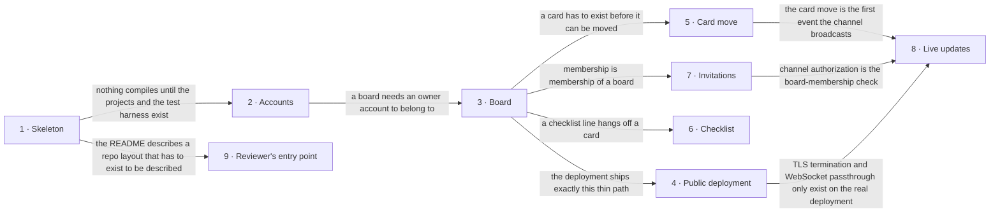

# Roadmap — Uniqua.Projector

> **A decomposition, not a promise.** The overall idea broken into incremental steps: what each
> step is, where it comes from, how big it is — or that nobody has looked at it yet — and in which
> order, and parallel lanes, we walk them. **No dates** (except shipped history), **no scores** —
> order is the prioritization. The *solution* for any step lives in its `docs/features/<slug>/`
> spec, not here.

## Destination

A stranger opens a public link on the owner's own domain, registers, builds a board with columns
and cards, moves a card and watches a second member's move arrive live, and gets into that board
through an invitation link that expires — on top of a repository whose layer boundaries, access
control and tests hold up under a fifteen-minute read.

## Steps

| # | Step | Source | Size | Status |
|---|---|---|:---:|---|
| 1 | Project skeleton — the four server projects with the reference direction enforced, composition root, EF Core, test harness, React client, CI | `architecture-map.md §Module inventory` | M | shipped |
| 2 | Accounts and sessions — register, sign in, sign out, carried by an httpOnly cookie → [`docs/features/accounts-and-sessions/`](features/accounts-and-sessions/spec.md) | `idea-brief.md §3. Users` | M | shipped |
| 3 | A board with columns and cards — create a board, add and reorder columns, add and edit cards, with board membership enforced on every read and write → [`docs/features/boards-columns-cards/`](features/boards-columns-cards/spec.md) | `idea-brief.md §7. Recommendation` | M | spec'd |
| 4 | The first public deployment — the thin path reachable on the owner's registered domain, over TLS, from a host that does not sleep | `idea-brief.md §4. Why now` | M | idea |
| 5 | Card move with a stated concurrency rule — drag a card within and between columns, with a defined answer for two members moving one card at once | `idea-brief.md §6. Risks` | M | idea |
| 6 | Checklist subtasks on a card — a line of text with a done flag and a counter on the card face | `idea-brief.md §5. Out of scope` | S | idea |
| 7 | Invitation links — a copyable link with a lifetime, single use and revocation, that turns a stranger into a board member | `idea-brief.md §7. Recommendation` | M | idea |
| 8 | Live board updates — a persistent channel that pushes a card move to the other members of that board, authorized per board and surviving a dropped connection | `idea-brief.md §7. Recommendation` | L | idea |
| 9 | The reviewer's entry point — a README and a decision index that make the ADRs and their trade-offs findable in the first minute of the read | `idea-brief.md §2. Problem` | S | idea |
| 10 | Emailed invitations → see [Not yet specified](#not-yet-specified) | `idea-brief.md §8. Open questions` | fog | idea |

## Not yet specified

| Area | What we'd have to learn | Blocks | How it gets sharpened |
|---|---|:---:|---|
| Emailed invitations | Which service actually sends the mail, from which domain, and what deliverability floor a demo needs. Self-hosting the sender on the owner's own machine makes this harder rather than simpler — a fresh, unwarmed IP is the worst case for inbox placement — so even the shape of the answer is unknown. | 10 | A recon pass over transactional-mail providers plus a decision on the sending domain, once the first public deployment exists to send from. |

## Out of scope

- **Subtasks as nested cards, or a tree of arbitrary depth** — a subtask is a checklist line; hierarchy would reach into every query, every screen and every access-control check.
- **Dependency links between cards** (blocks / depends on) — that answers the ordering of work, not the decomposition of it.
- **Comments, attachments, labels, due dates, activity history, a phone layout** — none of it is visible in a five-minute look or interesting in a fifteen-minute read.
- **Real use by a real team** — the audience is a reviewer, so there are no backup, password-recovery or uptime commitments.
- **Dropping a feature to absorb a schedule slip** — the owner's explicit call is that a slip is absorbed by tests, error handling and empty/loading states instead.

## Open decisions

| # | Question | Type | Owner | Blocks |
|---|---|:---:|:---:|:---:|
| D1 | Which SQL Server edition runs the publicly reachable instance — Developer edition is licensed for development and test only, so a production instance needs Express (free, 10 GB ceiling) or a paid edition. | research | agent | 4 |
| D2 | What happens when two members move the same card at the same moment — the later write silently wins, a version check refuses the stale move, or positions are reconciled. | grilling | human | 5 |
| D3 | The minimum testing that survives a schedule slip — the floor the slip-absorber may not go below. | grilling | human | 9 |
| D4 | Record the self-hosted deployment target as an ADR, and retire the "hosting is undecided" constraint the architecture map still carries. | task | agent | 4 |
| D5 | Record one-level board membership as an ADR during `/sdd:design boards-columns-cards` — amended 2026-09-24: the rule is already fixed in `CONTEXT.md` (`board`) and the step-3 spec §3, so only the MADR record remains. | task | agent | 3 |

## Decisions so far

- The backend is split into four projects with a one-way reference direction → [`docs/adr/0001`](adr/0001-split-the-backend-into-four-projects.md)
- Persistence is SQL Server behind EF Core, reached only through repository ports → [`docs/adr/0002`](adr/0002-use-sql-server-with-ef-core.md)
- Authentication is ASP.NET Core Identity with an httpOnly cookie, which forces one shared origin → [`docs/adr/0003`](adr/0003-authenticate-with-identity-and-an-httponly-cookie.md)
- Board updates travel over a persistent server-push connection rather than polling → [`docs/adr/0004`](adr/0004-push-board-updates-over-a-persistent-connection.md)
- The client is Vite + Tailwind with component sources vendored into the repository → [`docs/adr/0005`](adr/0005-build-the-client-with-vite-tailwind-and-vendored-components.md)
- The deployment target is the owner's own Proxmox host on a static IP behind a registered domain, which takes idle suspension off the risk list entirely — decided in this roadmap pass, ADR queued as D4 → [`docs/idea-brief.md §8. Open questions`](idea-brief.md)
- Membership is one level: a member belongs to a board, and a project is a thin grouping over boards — decided in this roadmap pass, ADR queued as D5 → [`docs/idea-brief.md §8. Open questions`](idea-brief.md)
- The .NET 10 target holds — SDK 10.0.301 is installed alongside 8.0.203, with Node v24.18.0 and npm 11.16.0, so the map's one unverified assumption is retired → [`docs/architecture-map.md §Stack`](architecture-map.md)

## Dependency graph

## Execution path

| Wave | Steps | Zone per step (why parallel-safe) | Unlocks |
|:---:|---|---|---|
| 1 | 1 | `src/` + `tests/` + `.github/` (new) — the whole skeleton; nothing can run beside it | 2, 9 |
| 2 | 2 ∥ 9 | 2: `src/Uniqua.Projector.Api/Auth/` + Identity in `src/Uniqua.Projector.Infrastructure/` (new) · 9: `README.md` (new) + `docs/` — prose, not code, so disjoint | 3 |
| 3 | 3 | `src/Uniqua.Projector.Domain/Boards/` + `src/Uniqua.Projector.Api/Boards/` + `src/Uniqua.Projector.Web/src/features/board/` (new) | 4, 5, 6, 7 |
| 4 | 4 ∥ 6 | 4: `.github/workflows/` + `deploy/` (new) — host and pipeline config, no application code · 6: `src/Uniqua.Projector.Domain/Cards/` + the card face under `src/Uniqua.Projector.Web/src/features/board/` (new) — disjoint | 8 |
| 5 | 5 ∥ 7 | 5: card ordering in `src/Uniqua.Projector.Domain/Cards/` + `src/Uniqua.Projector.Api/Boards/` (new) · 7: `src/Uniqua.Projector.Domain/Invitations/` + `src/Uniqua.Projector.Api/Invitations/` + `src/Uniqua.Projector.Web/src/features/invitations/` (new) — disjoint | 8 |
| 6 | 8 | `src/Uniqua.Projector.Api/Hubs/` + `src/Uniqua.Projector.Web/src/api/` (new) | — |

Step 10 enters no wave: it has no size and no shape yet, so what gets scheduled is its recon pass, not the step.

## Shipped

| Step | Shipped | Link |
|---|---|---|
| 2 · Accounts and sessions | 2026-09-23 | [changelog](features/accounts-and-sessions/_ship/changelog.md) · PR: branch `feature/accounts-and-sessions` → `main` (link added once opened) |
